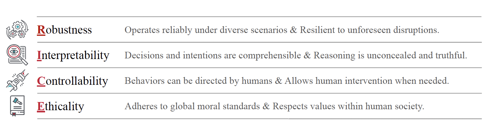
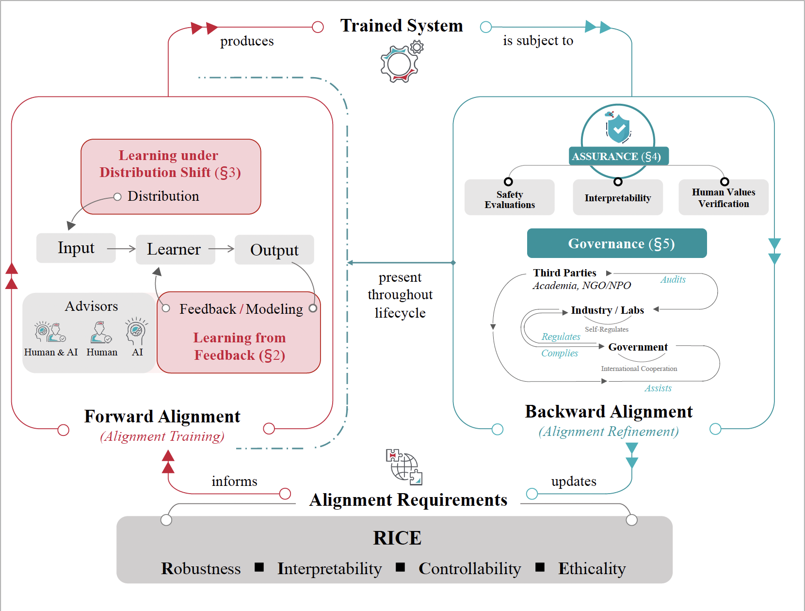
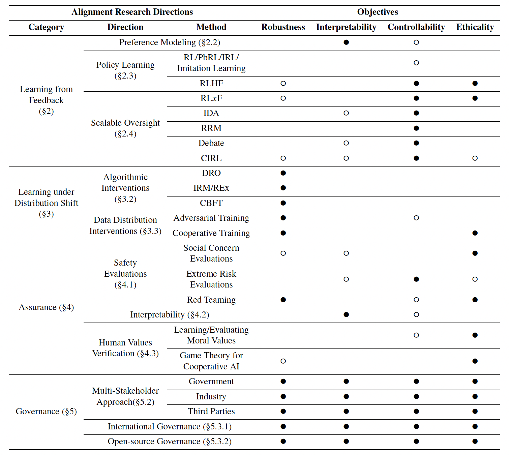
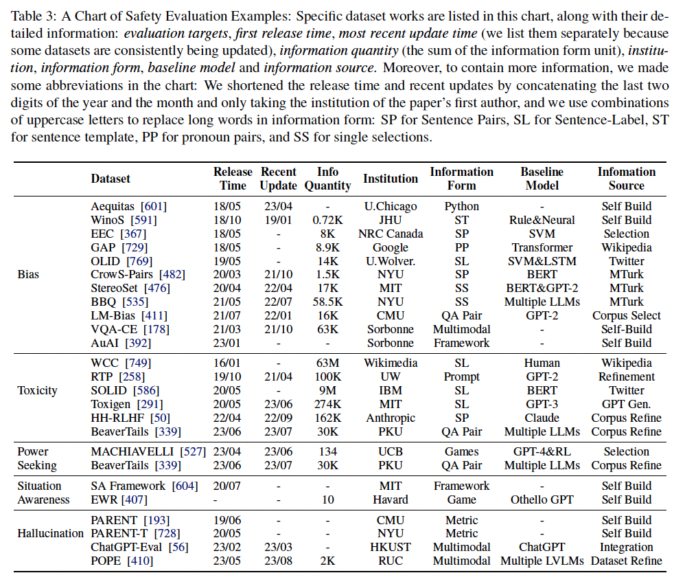

# AlignmentSurvey

> A collection of papers and resources related to AI alignment. More details can be referred to www.alignmentsurvey.com
> 
>
> If you find any mistakes or have any suggestions, please email us at {`jiamg.ji`,`qiutianyi.qty`,`boyuan.chen.byc`,`borongzh`,`wangkaile810`,`hantaolou.htlou`}@gmail.com or directly raise a question in the GitHub Issue.
>
> To prevent emails from being overlooked, we strongly recommend sending the email to one person and cc'ing the other five. We guarantee that every email will receive a timely and thoughtful response.
>
> If you find our survey useful for your research, please cite our survey:
```
@misc{ji2023ai,
      title={AI Alignment: A Comprehensive Survey}, 
      author={Jiaming Ji and Tianyi Qiu and Boyuan Chen and Borong Zhang and Hantao Lou and Kaile Wang and Yawen Duan and Zhonghao He and Jiayi Zhou and Zhaowei Zhang and Fanzhi Zeng and Kwan Yee Ng and Juntao Dai and Xuehai Pan and Aidan O'Gara and Yingshan Lei and Hua Xu and Brian Tse and Jie Fu and Stephen McAleer and Yaodong Yang and Yizhou Wang and Song-Chun Zhu and Yike Guo and Wen Gao},
      year={2023},
      eprint={2310.19852},
      archivePrefix={arXiv},
      primaryClass={cs.AI}
}
```

- [AlignmentSurvey](#alignmentsurvey)
  - [Main Content](#main-content)
    - [Core Concepts](#core-concepts)
    - [Assurance Existing Works](#assurance-existing-works)
  - [Recommended Paper List](#recommended-paper-list)
    - [Introduction](#introduction)
      - [The Alignment Problem](#the-alignment-problem)
      - [The Scope of Alignment](#the-scope-of-alignment)
      - [The Misalignment Issue](#the-misalignment-issue)
    - [Learning From Feedback](#learning-from-feedback)
      - [Unsupervised Learning|Semi-Supervised Learning](#unsupervised-learningsemi-supervised-learning)
      - [Policy Learning](#policy-learning)
      - [Challenges|Directions](#challengesdirections)
      - [Feedback Types \& Preference Modeling](#feedback-types--preference-modeling)
      - [RLHF](#rlhf)
      - [RLAIF](#rlaif)
      - [RLHAIF](#rlhaif)
      - [IDA](#ida)
      - [RRM](#rrm)
      - [CIRL](#cirl)
      - [Other Algorithms](#other-algorithms)
    - [Learning under Distribution Shift](#learning-under-distribution-shift)
      - [The Distribution Shift Challenge](#the-distribution-shift-challenge)
      - [Algorithmic Interventions](#algorithmic-interventions)
      - [Data Distribution Interventions](#data-distribution-interventions)
    - [Assurance](#assurance)
      - [Overall](#overall)
      - [Safety Evaluation](#safety-evaluation)
      - [Interpretability](#interpretability)
      - [Red-teaming](#red-teaming)
      - [Formal Theory\& Verification](#formal-theory-verification)
  - [Datasets](#datasets)
    - [English](#english)
    - [Chinese](#chinese)
  - [Codes Resources](#codes-resources)
    - [Support RLHF](#support-rlhf)

## Main Content

### Core Concepts
**The RICE principles** define four key characteristics that an aligned system should possess, in no particular order:   
(1) **Robustness** states that the system’s stability needs to be guaranteed across various environments;  
(2) **Interpretability** states that the operation and decision-making process of the system should be clear and understandable;  
(3) **Controllability** states that the system should be under the guidance and control of humans;  
(4) **Ethicality** states that the system should adhere to society’s norms and values.   
These four principles guide the alignment of an AI system with human intentions and values. They are not end goals in themselves but intermediate objectives in service of alignment.

**The Alignment Cycle**  
(1) **Forward Alignment** (alignment training) produces trained systems based on alignment requirements;   
(2) **Backward Alignment** (alignment refinement) ensures the practical alignment of trained systems and revises alignment requirements;   
(3) The cycle is repeated until reaching a sufficient level of
alignment. Notably, although Backward Alignment has the end goal of ensuring the practical alignment of trained systems, it is carried out all throughout the system’s lifecycle in service of this goal, including before, during, after training, and also after deployment.

Relationships between alignment research directions covered in the survey and the RICE principles, featuring the individual objectives each research direction aims to achieve. Filled circles stand for primary objectives, and unfilled circles stand for secondary objectives.



### Assurance Existing Works


## Recommended Paper List

### Introduction

#### The Alignment Problem 

|[](https://doi.org/10.48550/arXiv.2306.12001)[](https://doi.org/10.48550/arXiv.2306.12001)[](https://doi.org/10.48550/arXiv.2306.12001)|
|:---|
|An Overview of Catastrophic AI Risks.|
|Dan Hendrycks, Mantas Mazeika, Thomas Woodside|
<details>
<summary><b>Abstract</b></summary>
Rapid advancements in artificial intelligence (AI) have sparked growing concerns among experts, policymakers, and world leaders regarding the potential for increasingly advanced AI systems to pose catastrophic risks. Although numerous risks have been detailed separately, there is a pressing need for a systematic discussion and illustration of the potential dangers to better inform efforts to mitigate them. This paper provides an overview of the main sources of catastrophic AI risks, which we organize into four categories: malicious use, in which individuals or groups intentionally use AIs to cause harm; AI race, in which competitive environments compel actors to deploy unsafe AIs or cede control to AIs; organizational risks, highlighting how human factors and complex systems can increase the chances of catastrophic accidents; and rogue AIs, describing the inherent difficulty in controlling agents far more intelligent than humans. For each category of risk, we describe specific hazards, present illustrative stories, envision ideal scenarios, and propose practical suggestions for mitigating these dangers. Our goal is to foster a comprehensive understanding of these risks and inspire collective and proactive efforts to ensure that AIs are developed and deployed in a safe manner. Ultimately, we hope this will allow us to realize the benefits of this powerful technology while minimizing the potential for catastrophic outcomes.
</details>

|[](https://doi.org/10.48550/arXiv.2306.06924)[](https://doi.org/10.48550/arXiv.2306.06924)[](https://doi.org/10.48550/arXiv.2306.06924)|
|:---|
|TASRA: a Taxonomy and Analysis of Societal-Scale Risks from AI.|
|Andrew Critch, rSJRussellStuart Russell|
<details>
<summary><b>Abstract</b></summary>
While several recent works have identified societal-scale and extinction-level risks to humanity arising from artificial intelligence, few have attempted an {\em exhaustive taxonomy} of such risks. Many exhaustive taxonomies are possible, and some are useful -- particularly if they reveal new risks or practical approaches to safety. This paper explores a taxonomy based on accountability: whose actions lead to the risk, are the actors unified, and are they deliberate? We also provide stories to illustrate how the various risk types could each play out, including risks arising from unanticipated interactions of many AI systems, as well as risks from deliberate misuse, for which combined technical and policy solutions are indicated.
</details>

|[](https://doi.org/10.1145/3593013.3594033)[](https://doi.org/10.1145/3593013.3594033)[](https://doi.org/10.1145/3593013.3594033)|
|:---|
|Harms from Increasingly Agentic Algorithmic Systems.|
|Alan Chan, Rebecca Salganik, Alva Markelius, Chris Pang, Nitarshan Rajkumar, Dmitrii Krasheninnikov, Lauro Langosco, Zhonghao He, Yawen Duan, Micah Carroll, Michelle Lin, Alex Mayhew, Katherine M. Collins, Maryam Molamohammadi, John Burden, Wanru Zhao, Shalaleh Rismani, Konstantinos Voudouris, Umang Bhatt, Adrian Weller, David Krueger, Tegan Maharaj|
<details>
<summary><b>Abstract</b></summary>
Research in Fairness, Accountability, Transparency, and Ethics (FATE) has established many sources and forms of algorithmic harm, in domains as diverse as health care, finance, policing, and recommendations. Much work remains to be done to mitigate the serious harms of these systems, particularly those disproportionately affecting marginalized communities. Despite these ongoing harms, new systems are being developed and deployed which threaten the perpetuation of the same harms and the creation of novel ones. In response, the FATE community has emphasized the importance of anticipating harms. Our work focuses on the anticipation of harms from increasingly agentic systems. Rather than providing a definition of agency as a binary property, we identify 4 key characteristics which, particularly in combination, tend to increase the agency of a given algorithmic system: underspecification, directness of impact, goal-directedness, and long-term planning. We also discuss important harms which arise from increasing agency -- notably, these include systemic and/or long-range impacts, often on marginalized stakeholders. We emphasize that recognizing agency of algorithmic systems does not absolve or shift the human responsibility for algorithmic harms. Rather, we use the term agency to highlight the increasingly evident fact that ML systems are not fully under human control. Our work explores increasingly agentic algorithmic systems in three parts. First, we explain the notion of an increase in agency for algorithmic systems in the context of diverse perspectives on agency across disciplines. Second, we argue for the need to anticipate harms from increasingly agentic systems. Third, we discuss important harms from increasingly agentic systems and ways forward for addressing them. We conclude by reflecting on implications of our work for anticipating algorithmic harms from emerging systems.
</details>

#### The Scope of Alignment

|[](https://arxiv.org/abs/2109.13916)[](https://arxiv.org/abs/2109.13916)[](https://arxiv.org/abs/2109.13916)|
|:---|
|Unsolved Problems in ML Safety.|
|Dan Hendrycks, Nicholas Carlini, John Schulman, Jacob Steinhardt|
<details>
<summary><b>Abstract</b></summary>
Machine learning (ML) systems are rapidly increasing in size, are acquiring new capabilities, and are increasingly deployed in high-stakes settings. As with other powerful technologies, safety for ML should be a leading research priority. In response to emerging safety challenges in ML, such as those introduced by recent large-scale models, we provide a new roadmap for ML Safety and refine the technical problems that the field needs to address. We present four problems ready for research, namely withstanding hazards ("Robustness"), identifying hazards ("Monitoring"), reducing inherent model hazards ("Alignment"), and reducing systemic hazards ("Systemic Safety"). Throughout, we clarify each problem's motivation and provide concrete research directions.
</details>

|[](http://arxiv.org/abs/1606.06565)[](http://arxiv.org/abs/1606.06565)[](http://arxiv.org/abs/1606.06565)|
|:---|
|Concrete Problems in AI Safety.|
|Dario Amodei, Chris Olah, Jacob Steinhardt, Paul F. Christiano, John Schulman, Dan Man;|
<details>
<summary><b>Abstract</b></summary>
Rapid progress in machine learning and artificial intelligence (AI) has brought increasing attention to the potential impacts of AI technologies on society. In this paper we discuss one such potential impact: the problem of accidents in machine learning systems, defined as unintended and harmful behavior that may emerge from poor design of real-world AI systems. We present a list of five practical research problems related to accident risk, categorized according to whether the problem originates from having the wrong objective function ("avoiding side effects" and "avoiding reward hacking"), an objective function that is too expensive to evaluate frequently ("scalable supervision"), or undesirable behavior during the learning process ("safe exploration" and "distributional shift"). We review previous work in these areas as well as suggesting research directions with a focus on relevance to cutting-edge AI systems. Finally, we consider the high-level question of how to think most productively about the safety of forward-looking applications of AI.
</details>

|[](https://arxiv.org/abs/2006.04948)[](https://arxiv.org/abs/2006.04948)[](https://arxiv.org/abs/2006.04948)|
|:---|
|AI Research Considerations for Human Existential Safety (ARCHES).|
|Andrew Critch, David Krueger|
<details>
<summary><b>Abstract</b></summary>
Framed in positive terms, this report examines how technical AI research might be steered in a manner that is more attentive to humanity's long-term prospects for survival as a species. In negative terms, we ask what existential risks humanity might face from AI development in the next century, and by what principles contemporary technical research might be directed to address those risks.
  A key property of hypothetical AI technologies is introduced, called \emph{prepotence}, which is useful for delineating a variety of potential existential risks from artificial intelligence, even as AI paradigms might shift. A set of \auxref{dirtot} contemporary research \directions are then examined for their potential benefit to existential safety. Each research direction is explained with a scenario-driven motivation, and examples of existing work from which to build. The research directions present their own risks and benefits to society that could occur at various scales of impact, and in particular are not guaranteed to benefit existential safety if major developments in them are deployed without adequate forethought and oversight. As such, each direction is accompanied by a consideration of potentially negative side effects.
</details>

#### The Misalignment Issue

|[](https://doi.org/10.1007/s11023-020-09539-2)[](https://doi.org/10.1007/s11023-020-09539-2)[](https://doi.org/10.1007/s11023-020-09539-2)|
|:---|
|Artificial Intelligence, Values, and Alignment.|
|Iason Gabriel|
<details>
<summary><b>Abstract</b></summary>
Large-scale language technologies are increasingly used in various forms of communication with humans across different contexts. One particular use case for these technologies is conversational agents, which output natural language text in response to prompts and queries. This mode of engagement raises a number of social and ethical questions. For example, what does it mean to align conversational agents with human norms or values? Which norms or values should they be aligned with? And how can this be accomplished? In this paper, we propose a number of steps that help answer these questions. We start by developing a philosophical analysis of the building blocks of linguistic communication between conversational agents and human interlocutors. We then use this analysis to identify and formulate ideal norms of conversation that can govern successful linguistic communication between humans and conversational agents. Furthermore, we explore how these norms can be used to align conversational agents with human values across a range of different discursive domains. We conclude by discussing the practical implications of our proposal for the design of conversational agents that are aligned with these norms and values.
</details>

|[](https://doi.org/10.1109/JPROC.2019.2900622)[](https://doi.org/10.1109/JPROC.2019.2900622)[](https://doi.org/10.1109/JPROC.2019.2900622)|
|:---|
|Machine Ethics: The Design and Governance of Ethical AI and Autonomous Systems.|
|wAlanFTWinfieldAlan F. T. Winfield, Katina Michael, pJeremyVPittJeremy Pitt, Vanessa Evers|
<details>
<summary><b>Abstract</b></summary>

</details>

|[](https://doi.org/10.1145/3419633)[](https://doi.org/10.1145/3419633)[](https://doi.org/10.1145/3419633)|
|:---|
|Implementations in Machine Ethics: A Survey.|
|Suzanne Tolmeijer, Markus Kneer, Cristina Sarasua, Markus Christen, bAbrahamBernsteinAbraham Bernstein|
<details>
<summary><b>Abstract</b></summary>
Increasingly complex and autonomous systems require machine ethics to maximize the benefits and minimize the risks to society arising from the new technology. It is challenging to decide which type of ethical theory to employ and how to implement it effectively. This survey provides a threefold contribution. First, it introduces a trimorphic taxonomy to analyze machine ethics implementations with respect to their object (ethical theories), as well as their nontechnical and technical aspects. Second, an exhaustive selection and description of relevant works is presented. Third, applying the new taxonomy to the selected works, dominant research patterns, and lessons for the field are identified, and future directions for research are suggested.
</details>

|[](https://arxiv.org/abs/2012.08630)[](https://arxiv.org/abs/2012.08630)[](https://arxiv.org/abs/2012.08630)|
|:---|
|Open Problems in Cooperative AI.|
|Allan Dafoe, Edward Hughes, Yoram Bachrach, Tantum Collins, Kevin R. McKee, Joel Z. Leibo, Kate Larson, gThoreGraepelThore Graepel|
<details>
<summary><b>Abstract</b></summary>
Problems of cooperation--in which agents seek ways to jointly improve their welfare--are ubiquitous and important. They can be found at scales ranging from our daily routines--such as driving on highways, scheduling meetings, and working collaboratively--to our global challenges--such as peace, commerce, and pandemic preparedness. Arguably, the success of the human species is rooted in our ability to cooperate. Since machines powered by artificial intelligence are playing an ever greater role in our lives, it will be important to equip them with the capabilities necessary to cooperate and to foster cooperation.
  We see an opportunity for the field of artificial intelligence to explicitly focus effort on this class of problems, which we term Cooperative AI. The objective of this research would be to study the many aspects of the problems of cooperation and to innovate in AI to contribute to solving these problems. Central goals include building machine agents with the capabilities needed for cooperation, building tools to foster cooperation in populations of (machine and/or human) agents, and otherwise conducting AI research for insight relevant to problems of cooperation. This research integrates ongoing work on multi-agent systems, game theory and social choice, human-machine interaction and alignment, natural-language processing, and the construction of social tools and platforms. However, Cooperative AI is not the union of these existing areas, but rather an independent bet about the productivity of specific kinds of conversations that involve these and other areas. We see opportunity to more explicitly focus on the problem of cooperation, to construct unified theory and vocabulary, and to build bridges with adjacent communities working on cooperation, including in the natural, social, and behavioural sciences.
</details>

|[](https://doi.org/10.48550/arXiv.2209.00626)[](https://doi.org/10.48550/arXiv.2209.00626)[](https://doi.org/10.48550/arXiv.2209.00626)|
|:---|
|The alignment problem from a deep learning perspective.|
|Richard Ngo|
<details>
<summary><b>Abstract</b></summary>
In coming decades, artificial general intelligence (AGI) may surpass human capabilities at many critical tasks. We argue that, without substantial effort to prevent it, AGIs could learn to pursue goals that conflict (i.e., are misaligned) with human interests. If trained like today's most capable models, AGIs could learn to act deceptively to receive higher reward, learn internally-represented goals which generalize beyond their fine-tuning distributions, and pursue those goals using power-seeking strategies. We review emerging evidence for these properties. AGIs with these properties would be difficult to align and may appear aligned even when they are not. We outline how the deployment of misaligned AGIs might irreversibly undermine human control over the world, and briefly review research directions aimed at preventing this outcome.
</details>

|[](https://openreview.net/forum?id=JYtwGwIL7ye)[](https://openreview.net/forum?id=JYtwGwIL7ye)[](https://openreview.net/forum?id=JYtwGwIL7ye)|
|:---|
|The Effects of Reward Misspecification: Mapping and Mitigating Misaligned Models.|
|Alexander Pan, Kush Bhatia, Jacob Steinhardt|
<details>
<summary><b>Abstract</b></summary>
Reward hacking -- where RL agents exploit gaps in misspecified reward functions -- has been widely observed, but not yet systematically studied. To understand how reward hacking arises, we construct four RL environments with misspecified rewards. We investigate reward hacking as a function of agent capabilities: model capacity, action space resolution, observation space noise, and training time. More capable agents often exploit reward misspecifications, achieving higher proxy reward and lower true reward than less capable agents. Moreover, we find instances of phase transitions: capability thresholds at which the agent's behavior qualitatively shifts, leading to a sharp decrease in the true reward. Such phase transitions pose challenges to monitoring the safety of ML systems. To address this, we propose an anomaly detection task for aberrant policies and offer several baseline detectors.
</details>

|[](https://arxiv.org/abs/2109.13916)[](https://arxiv.org/abs/2109.13916)[](https://arxiv.org/abs/2109.13916)|
|:---|
|Unsolved Problems in ML Safety.|
|Dan Hendrycks, Nicholas Carlini, John Schulman, Jacob Steinhardt|
<details>
<summary><b>Abstract</b></summary>
Machine learning (ML) systems are rapidly increasing in size, are acquiring new capabilities, and are increasingly deployed in high-stakes settings. As with other powerful technologies, safety for ML should be a leading research priority. In response to emerging safety challenges in ML, such as those introduced by recent large-scale models, we provide a new roadmap for ML Safety and refine the technical problems that the field needs to address. We present four problems ready for research, namely withstanding hazards ("Robustness"), identifying hazards ("Monitoring"), reducing inherent model hazards ("Alignment"), and reducing systemic hazards ("Systemic Safety"). Throughout, we clarify each problem's motivation and provide concrete research directions.
</details>

|[](https://doi.org/10.48550/arXiv.2307.15217)[](https://doi.org/10.48550/arXiv.2307.15217)[](https://doi.org/10.48550/arXiv.2307.15217)|
|:---|
|Open Problems and Fundamental Limitations of Reinforcement Learning from Human Feedback.|
|Stephen Casper, Xander Davies, Claudia Shi, Thomas Krendl Gilbert, Jérémy Scheurer, Javier Rando, Rachel Freedman, Tomasz Korbak, David Lindner, Pedro Freire, Tony Wang, Samuel Marks, Charbel-Raphaël Segerie, Micah Carroll, Andi Peng, Phillip Christoffersen, Mehul Damani, Stewart Slocum, Usman Anwar, Anand Siththaranjan, Max Nadeau, Eric J. Michaud, Jacob Pfau, Dmitrii Krasheninnikov, Xin Chen, Lauro Langosco, Peter Hase, Erdem Bıyık, Anca Dragan, David Krueger, Dorsa Sadigh, Dylan Hadfield-Menell|
<details>
<summary><b>Abstract</b></summary>
Reinforcement learning from human feedback (RLHF) is a technique for training AI systems to align with human goals. RLHF has emerged as the central method used to finetune state-of-the-art large language models (LLMs). Despite this popularity, there has been relatively little public work systematizing its flaws. In this paper, we (1) survey open problems and fundamental limitations of RLHF and related methods; (2) overview techniques to understand, improve, and complement RLHF in practice; and (3) propose auditing and disclosure standards to improve societal oversight of RLHF systems. Our work emphasizes the limitations of RLHF and highlights the importance of a multi-faceted approach to the development of safer AI systems.
</details>

|[](https://doi.org/10.48550/arXiv.2309.00667)[](https://doi.org/10.48550/arXiv.2309.00667)[](https://doi.org/10.48550/arXiv.2309.00667)|
|:---|
|Taken out of context: On measuring situational awareness in LLMs.|
|Lukas Berglund, Asa Cooper Stickland, Mikita Balesni, Max Kaufmann, Meg Tong, Tomasz Korbak, Daniel Kokotajlo, Owain Evans|
<details>
<summary><b>Abstract</b></summary>
We aim to better understand the emergence of `situational awareness' in large language models (LLMs). A model is situationally aware if it's aware that it's a model and can recognize whether it's currently in testing or deployment. Today's LLMs are tested for safety and alignment before they are deployed. An LLM could exploit situational awareness to achieve a high score on safety tests, while taking harmful actions after deployment. Situational awareness may emerge unexpectedly as a byproduct of model scaling. One way to better foresee this emergence is to run scaling experiments on abilities necessary for situational awareness. As such an ability, we propose `out-of-context reasoning' (in contrast to in-context learning). We study out-of-context reasoning experimentally. First, we finetune an LLM on a description of a test while providing no examples or demonstrations. At test time, we assess whether the model can pass the test. To our surprise, we find that LLMs succeed on this out-of-context reasoning task. Their success is sensitive to the training setup and only works when we apply data augmentation. For both GPT-3 and LLaMA-1, performance improves with model size. These findings offer a foundation for further empirical study, towards predicting and potentially controlling the emergence of situational awareness in LLMs. Code is available at: https://github.com/AsaCooperStickland/situational-awareness-evals.
</details>

|[](http://arxiv.org/abs/1906.01820)[](http://arxiv.org/abs/1906.01820)[](http://arxiv.org/abs/1906.01820)|
|:---|
|Risks from Learned Optimization in Advanced Machine Learning Systems.|
|Evan Hubinger, Chris van Merwijk, Vladimir Mikulik, Joar Skalse, Scott Garrabrant|
<details>
<summary><b>Abstract</b></summary>
We analyze the type of learned optimization that occurs when a learned model (such as a neural network) is itself an optimizer - a situation we refer to as mesa-optimization, a neologism we introduce in this paper. We believe that the possibility of mesa-optimization raises two important questions for the safety and transparency of advanced machine learning systems. First, under what circumstances will learned models be optimizers, including when they should not be? Second, when a learned model is an optimizer, what will its objective be - how will it differ from the loss function it was trained under - and how can it be aligned? In this paper, we provide an in-depth analysis of these two primary questions and provide an overview of topics for future research.
</details>

|[](https://doi.org/10.1145/3609468.3609471)[](https://doi.org/10.1145/3609468.3609471)[](https://doi.org/10.1145/3609468.3609471)|
|:---|
|Emergence of Maps in the Memories of Blind Navigation Agents.|
|Erik Wijmans, Manolis Savva, eIrfanAEssaIrfan Essa, Stefan Lee, Ari S. Morcos, Dhruv Batra|
<details>
<summary><b>Abstract</b></summary>
Animal navigation research posits that organisms build and maintain internal spatial representations, or maps, of their environment. We ask if machines -- specifically, artificial intelligence (AI) navigation agents -- also build implicit (or 'mental') maps. A positive answer to this question would (a) explain the surprising phenomenon in recent literature of ostensibly map-free neural-networks achieving strong performance, and (b) strengthen the evidence of mapping as a fundamental mechanism for navigation by intelligent embodied agents, whether they be biological or artificial. Unlike animal navigation, we can judiciously design the agent's perceptual system and control the learning paradigm to nullify alternative navigation mechanisms. Specifically, we train 'blind' agents -- with sensing limited to only egomotion and no other sensing of any kind -- to perform PointGoal navigation ('go to $Δ$ x, $Δ$ y') via reinforcement learning. Our agents are composed of navigation-agnostic components (fully-connected and recurrent neural networks), and our experimental setup provides no inductive bias towards mapping. Despite these harsh conditions, we find that blind agents are (1) surprisingly effective navigators in new environments (~95% success); (2) they utilize memory over long horizons (remembering ~1,000 steps of past experience in an episode); (3) this memory enables them to exhibit intelligent behavior (following walls, detecting collisions, taking shortcuts); (4) there is emergence of maps and collision detection neurons in the representations of the environment built by a blind agent as it navigates; and (5) the emergent maps are selective and task dependent (e.g. the agent 'forgets' exploratory detours). Overall, this paper presents no new techniques for the AI audience, but a surprising finding, an insight, and an explanation.
</details>

|[](https://doi.org/10.48550/arXiv.2206.13353)[](https://doi.org/10.48550/arXiv.2206.13353)[](https://doi.org/10.48550/arXiv.2206.13353)|
|:---|
|Is Power-Seeking AI an Existential Risk?|
|Joseph Carlsmith|
<details>
<summary><b>Abstract</b></summary>

</details>

|[](https://doi.org/10.48550/arXiv.2308.15605)[](https://doi.org/10.48550/arXiv.2308.15605)[](https://doi.org/10.48550/arXiv.2308.15605)|
|:---|
|Measurement Tampering Detection Benchmark.|
|Fabien Roger, Ryan Greenblatt, Max Nadeau, Buck Shlegeris, Nate Thomas|
<details>
<summary><b>Abstract</b></summary>
When training powerful AI systems to perform complex tasks, it may be challenging to provide training signals which are robust to optimization. One concern is \textit{measurement tampering}, where the AI system manipulates multiple measurements to create the illusion of good results instead of achieving the desired outcome. In this work, we build four new text-based datasets to evaluate measurement tampering detection techniques on large language models. Concretely, given sets of text inputs and measurements aimed at determining if some outcome occurred, as well as a base model able to accurately predict measurements, the goal is to determine if examples where all measurements indicate the outcome occurred actually had the outcome occur, or if this was caused by measurement tampering. We demonstrate techniques that outperform simple baselines on most datasets, but don't achieve maximum performance. We believe there is significant room for improvement for both techniques and datasets, and we are excited for future work tackling measurement tampering.
</details>

|[](https://doi.org/10.18653/v1/2023.findings-acl.847)[](https://doi.org/10.18653/v1/2023.findings-acl.847)[](https://doi.org/10.18653/v1/2023.findings-acl.847)|
|:---|
|Discovering Language Model Behaviors with Model-Written Evaluations.|
|Ethan Perez, Sam Ringer, Kamile Lukosiute, Karina Nguyen, Edwin Chen, Scott Heiner, Craig Pettit, Catherine Olsson, Sandipan Kundu, Saurav Kadavath, Andy Jones, Anna Chen, Benjamin Mann, Brian Israel, Bryan Seethor, Cameron McKinnon, Christopher Olah, Da Yan, Daniela Amodei, Dario Amodei, Dawn Drain, Dustin Li, Eli Tran-Johnson, Guro Khundadze, Jackson Kernion, James Landis, Jamie Kerr, Jared Mueller, Jeeyoon Hyun, Joshua Landau, Kamal Ndousse, Landon Goldberg, Liane Lovitt, Martin Lucas, Michael Sellitto, Miranda Zhang, Neerav Kingsland, Nelson Elhage, Nicholas Joseph, Noemi Mercado, Nova DasSarma, Oliver Rausch, Robin Larson, Sam McCandlish, Scott Johnston, Shauna Kravec, Sheer El Showk, Tamera Lanham, Timothy Telleen-Lawton, Tom Brown, Tom Henighan, Tristan Hume, Yuntao Bai, Zac Hatfield-Dodds, Jack Clark, Samuel R. Bowman, Amanda Askell, Roger Grosse, Danny Hernandez, Deep Ganguli, Evan Hubinger, Nicholas Schiefer, Jared Kaplan|
<details>
<summary><b>Abstract</b></summary>
As language models (LMs) scale, they develop many novel behaviors, good and bad, exacerbating the need to evaluate how they behave. Prior work creates evaluations with crowdwork (which is time-consuming and expensive) or existing data sources (which are not always available). Here, we automatically generate evaluations with LMs. We explore approaches with varying amounts of human effort, from instructing LMs to write yes/no questions to making complex Winogender schemas with multiple stages of LM-based generation and filtering. Crowdworkers rate the examples as highly relevant and agree with 90-100% of labels, sometimes more so than corresponding human-written datasets. We generate 154 datasets and discover new cases of inverse scaling where LMs get worse with size. Larger LMs repeat back a dialog user's preferred answer ("sycophancy") and express greater desire to pursue concerning goals like resource acquisition and goal preservation. We also find some of the first examples of inverse scaling in RL from Human Feedback (RLHF), where more RLHF makes LMs worse. For example, RLHF makes LMs express stronger political views (on gun rights and immigration) and a greater desire to avoid shut down. Overall, LM-written evaluations are high-quality and let us quickly discover many novel LM behaviors.
</details>

|[](https://doi.org/10.1162/artl_a_00319)[](https://doi.org/10.1162/artl_a_00319)[](https://doi.org/10.1162/artl_a_00319)|
|:---|
|The Surprising Creativity of Digital Evolution: A Collection of Anecdotes from the Evolutionary Computation and Artificial Life Research Communities.|
|Joel Lehman, Jeff Clune, Dusan Misevic, Christoph Adami, Lee Altenberg, Julie Beaulieu, Peter J. Bentley, Samuel Bernard, Guillaume Beslon, David M. Bryson, Nick Cheney, Patryk Chrabaszcz, Antoine Cully, Stephane Doncieux, Fred C. Dyer, Kai Olav Ellefsen, Robert Feldt, Stephan Fischer, Stephanie Forrest, Antoine Fŕenoy, Christian Gagńe, Leni Le Goff, Laura M. Grabowski, Babak Hodjat, Frank Hutter, Laurent Keller, Carole Knibbe, Peter Krcah, Richard E. Lenski, Hod Lipson, Robert MacCurdy, Carlos Maestre, Risto Miikkulainen, Sara Mitri, David E. Moriarty, Jean-Baptiste Mouret, Anh Nguyen, Charles Ofria, Marc Parizeau, David Parsons, Robert T. Pennock, William F. Punch, Thomas S. Ray, Marc Schoenauer, Eric Schulte, Karl Sims, Kenneth O. Stanley, François Taddei, Danesh Tarapore, Simon Thibault, Richard Watson, Westley Weimer, Jason Yosinski|
<details>
<summary><b>Abstract</b></summary>
Biological evolution provides a creative fount of complex and subtle adaptations, often surprising the scientists who discover them. However, because evolution is an algorithmic process that transcends the substrate in which it occurs, evolution's creativity is not limited to nature. Indeed, many researchers in the field of digital evolution have observed their evolving algorithms and organisms subverting their intentions, exposing unrecognized bugs in their code, producing unexpected adaptations, or exhibiting outcomes uncannily convergent with ones in nature. Such stories routinely reveal creativity by evolution in these digital worlds, but they rarely fit into the standard scientific narrative. Instead they are often treated as mere obstacles to be overcome, rather than results that warrant study in their own right. The stories themselves are traded among researchers through oral tradition, but that mode of information transmission is inefficient and prone to error and outright loss. Moreover, the fact that these stories tend to be shared only among practitioners means that many natural scientists do not realize how interesting and lifelike digital organisms are and how natural their evolution can be. To our knowledge, no collection of such anecdotes has been published before. This paper is the crowd-sourced product of researchers in the fields of artificial life and evolutionary computation who have provided first-hand accounts of such cases. It thus serves as a written, fact-checked collection of scientifically important and even entertaining stories. In doing so we also present here substantial evidence that the existence and importance of evolutionary surprises extends beyond the natural world, and may indeed be a universal property of all complex evolving systems.
</details>

|[](https://doi.org/10.48550/arXiv.2305.15324)[](https://doi.org/10.48550/arXiv.2305.15324)[](https://doi.org/10.48550/arXiv.2305.15324)|
|:---|
|Model evaluation for extreme risks.|
|Toby Shevlane, Sebastian Farquhar, Ben Garfinkel, Mary Phuong, Jess Whittlestone, Jade Leung, Daniel Kokotajlo, Nahema Marchal, Markus Anderljung, Noam Kolt, Lewis Ho, Divya Siddarth, Shahar Avin, Will Hawkins, Been Kim, Iason Gabriel, Vijay Bolina, Jack Clark, Yoshua Bengio, Paul F. Christiano, Allan Dafoe|
<details>
<summary><b>Abstract</b></summary>
Current approaches to building general-purpose AI systems tend to produce systems with both beneficial and harmful capabilities. Further progress in AI development could lead to capabilities that pose extreme risks, such as offensive cyber capabilities or strong manipulation skills. We explain why model evaluation is critical for addressing extreme risks. Developers must be able to identify dangerous capabilities (through "dangerous capability evaluations") and the propensity of models to apply their capabilities for harm (through "alignment evaluations"). These evaluations will become critical for keeping policymakers and other stakeholders informed, and for making responsible decisions about model training, deployment, and security.
</details>

|[](https://arxiv.org/abs/2009.09153)[](https://arxiv.org/abs/2009.09153)[](https://arxiv.org/abs/2009.09153)|
|:---|
|Hidden Incentives for Auto-Induced Distributional Shift.|
|David Krueger, Tegan Maharaj, Jan Leike|
<details>
<summary><b>Abstract</b></summary>
Decisions made by machine learning systems have increasing influence on the world, yet it is common for machine learning algorithms to assume that no such influence exists. An example is the use of the i.i.d. assumption in content recommendation. In fact, the (choice of) content displayed can change users' perceptions and preferences, or even drive them away, causing a shift in the distribution of users. We introduce the term auto-induced distributional shift (ADS) to describe the phenomenon of an algorithm causing a change in the distribution of its own inputs. Our goal is to ensure that machine learning systems do not leverage ADS to increase performance when doing so could be undesirable. We demonstrate that changes to the learning algorithm, such as the introduction of meta-learning, can cause hidden incentives for auto-induced distributional shift (HI-ADS) to be revealed. To address this issue, we introduce `unit tests' and a mitigation strategy for HI-ADS, as well as a toy environment for modelling real-world issues with HI-ADS in content recommendation, where we demonstrate that strong meta-learners achieve gains in performance via ADS. We show meta-learning and Q-learning both sometimes fail unit tests, but pass when using our mitigation strategy.
</details>

### Learning From Feedback

#### Unsupervised Learning|Semi-Supervised Learning

|[](https://proceedings.mlr.press/v162/parisi22a.html)[](https://proceedings.mlr.press/v162/parisi22a.html)[](https://proceedings.mlr.press/v162/parisi22a.html)|
|:---|
|The Unsurprising Effectiveness of Pre-Trained Vision Models for Control.|
|Simone Parisi, Aravind Rajeswaran, Senthil Purushwalkam, Abhinav Gupta|
<details>
<summary><b>Abstract</b></summary>
Recent years have seen the emergence of pre-trained representations as a powerful abstraction for AI applications in computer vision, natural language, and speech. However, policy learning for control is still dominated by a tabula-rasa learning paradigm, with visuo-motor policies often trained from scratch using data from deployment environments. In this context, we revisit and study the role of pre-trained visual representations for control, and in particular representations trained on large-scale computer vision datasets. Through extensive empirical evaluation in diverse control domains (Habitat, DeepMind Control, Adroit, Franka Kitchen), we isolate and study the importance of different representation training methods, data augmentations, and feature hierarchies. Overall, we find that pre-trained visual representations can be competitive or even better than ground-truth state representations to train control policies. This is in spite of using only out-of-domain data from standard vision datasets, without any in-domain data from the deployment environments. Source code and more at https://sites.google.com/view/pvr-control.
</details>

|[](http://papers.nips.cc/paper_files/paper/2022/hash/9c7008aff45b5d8f0973b23e1a22ada0-Abstract-Conference.html)[](http://papers.nips.cc/paper_files/paper/2022/hash/9c7008aff45b5d8f0973b23e1a22ada0-Abstract-Conference.html)[](http://papers.nips.cc/paper_files/paper/2022/hash/9c7008aff45b5d8f0973b23e1a22ada0-Abstract-Conference.html)|
|:---|
|Video PreTraining (VPT): Learning to Act by Watching Unlabeled Online Videos.|
|Bowen Baker, Ilge Akkaya, Peter Zhokov, Joost Huizinga, Jie Tang, Adrien Ecoffet, Brandon Houghton, Raul Sampedro, Jeff Clune|
<details>
<summary><b>Abstract</b></summary>
Pretraining on noisy, internet-scale datasets has been heavily studied as a technique for training models with broad, general capabilities for text, images, and other modalities. However, for many sequential decision domains such as robotics, video games, and computer use, publicly available data does not contain the labels required to train behavioral priors in the same way. We extend the internet-scale pretraining paradigm to sequential decision domains through semi-supervised imitation learning wherein agents learn to act by watching online unlabeled videos. Specifically, we show that with a small amount of labeled data we can train an inverse dynamics model accurate enough to label a huge unlabeled source of online data -- here, online videos of people playing Minecraft -- from which we can then train a general behavioral prior. Despite using the native human interface (mouse and keyboard at 20Hz), we show that this behavioral prior has nontrivial zero-shot capabilities and that it can be fine-tuned, with both imitation learning and reinforcement learning, to hard-exploration tasks that are impossible to learn from scratch via reinforcement learning. For many tasks our models exhibit human-level performance, and we are the first to report computer agents that can craft diamond tools, which can take proficient humans upwards of 20 minutes (24,000 environment actions) of gameplay to accomplish.
</details>

|[](https://proceedings.mlr.press/v202/hu23h.html)[](https://proceedings.mlr.press/v202/hu23h.html)[](https://proceedings.mlr.press/v202/hu23h.html)|
|:---|
|For Pre-Trained Vision Models in Motor Control, Not All Policy Learning Methods are Created Equal.|
|Yingdong Hu, Renhao Wang, lErranLLiLi Erran Li, Yang Gao|
<details>
<summary><b>Abstract</b></summary>
In recent years, increasing attention has been directed to leveraging pre-trained vision models for motor control. While existing works mainly emphasize the importance of this pre-training phase, the arguably equally important role played by downstream policy learning during control-specific fine-tuning is often neglected. It thus remains unclear if pre-trained vision models are consistent in their effectiveness under different control policies. To bridge this gap in understanding, we conduct a comprehensive study on 14 pre-trained vision models using 3 distinct classes of policy learning methods, including reinforcement learning (RL), imitation learning through behavior cloning (BC), and imitation learning with a visual reward function (VRF). Our study yields a series of intriguing results, including the discovery that the effectiveness of pre-training is highly dependent on the choice of the downstream policy learning algorithm. We show that conventionally accepted evaluation based on RL methods is highly variable and therefore unreliable, and further advocate for using more robust methods like VRF and BC. To facilitate more universal evaluations of pre-trained models and their policy learning methods in the future, we also release a benchmark of 21 tasks across 3 different environments alongside our work.
</details>

|[](http://proceedings.mlr.press/v80/xu18h.html)[](http://proceedings.mlr.press/v80/xu18h.html)[](http://proceedings.mlr.press/v80/xu18h.html)|
|:---|
|A Semantic Loss Function for Deep Learning with Symbolic Knowledge.|
|Jingyi Xu, Zilu Zhang, Tal Friedman, Yitao Liang, Guy Van den Broeck|
<details>
<summary><b>Abstract</b></summary>
This paper develops a novel methodology for using symbolic knowledge in deep learning. From first principles, we derive a semantic loss function that bridges between neural output vectors and logical constraints. This loss function captures how close the neural network is to satisfying the constraints on its output. An experimental evaluation shows that it effectively guides the learner to achieve (near-)state-of-the-art results on semi-supervised multi-class classification. Moreover, it significantly increases the ability of the neural network to predict structured objects, such as rankings and paths. These discrete concepts are tremendously difficult to learn, and benefit from a tight integration of deep learning and symbolic reasoning methods.
</details>

#### Policy Learning

|[](https://openreview.net/forum?id=TGuXXlbKsn)[](https://openreview.net/forum?id=TGuXXlbKsn)[](https://openreview.net/forum?id=TGuXXlbKsn)|
|:---|
|Benchmarks and Algorithms for Offline Preference-Based Reward Learning.|
|Daniel Shin, Anca D. Dragan, Daniel S. Brown|
<details>
<summary><b>Abstract</b></summary>
Learning a reward function from human preferences is challenging as it typically requires having a high-fidelity simulator or using expensive and potentially unsafe actual physical rollouts in the environment. However, in many tasks the agent might have access to offline data from related tasks in the same target environment. While offline data is increasingly being used to aid policy optimization via offline RL, our observation is that it can be a surprisingly rich source of information for preference learning as well. We propose an approach that uses an offline dataset to craft preference queries via pool-based active learning, learns a distribution over reward functions, and optimizes a corresponding policy via offline RL. Crucially, our proposed approach does not require actual physical rollouts or an accurate simulator for either the reward learning or policy optimization steps. To test our approach, we first evaluate existing offline RL benchmarks for their suitability for offline reward learning. Surprisingly, for many offline RL domains, we find that simply using a trivial reward function results good policy performance, making these domains ill-suited for evaluating learned rewards. To address this, we identify a subset of existing offline RL benchmarks that are well suited for offline reward learning and also propose new offline apprenticeship learning benchmarks which allow for more open-ended behaviors. When evaluated on this curated set of domains, our empirical results suggest that combining offline RL with learned human preferences can enable an agent to learn to perform novel tasks that were not explicitly shown in the offline data.
</details>

|[](http://proceedings.mlr.press/v97/brown19a.html)[](http://proceedings.mlr.press/v97/brown19a.html)[](http://proceedings.mlr.press/v97/brown19a.html)|
|:---|
|Extrapolating Beyond Suboptimal Demonstrations via Inverse Reinforcement Learning from Observations.|
|Daniel S. Brown, Wonjoon Goo, Prabhat Nagarajan, Scott Niekum|
<details>
<summary><b>Abstract</b></summary>
A critical flaw of existing inverse reinforcement learning (IRL) methods is their inability to significantly outperform the demonstrator. This is because IRL typically seeks a reward function that makes the demonstrator appear near-optimal, rather than inferring the underlying intentions of the demonstrator that may have been poorly executed in practice. In this paper, we introduce a novel reward-learning-from-observation algorithm, Trajectory-ranked Reward EXtrapolation (T-REX), that extrapolates beyond a set of (approximately) ranked demonstrations in order to infer high-quality reward functions from a set of potentially poor demonstrations. When combined with deep reinforcement learning, T-REX outperforms state-of-the-art imitation learning and IRL methods on multiple Atari and MuJoCo benchmark tasks and achieves performance that is often more than twice the performance of the best demonstration. We also demonstrate that T-REX is robust to ranking noise and can accurately extrapolate intention by simply watching a learner noisily improve at a task over time.
</details>

|[](https://openreview.net/forum?id=OWZVD-l-ZrC)[](https://openreview.net/forum?id=OWZVD-l-ZrC)[](https://openreview.net/forum?id=OWZVD-l-ZrC)|
|:---|
|Reward Uncertainty for Exploration in Preference-based Reinforcement Learning.|
|Xinran Liang, Katherine Shu, Kimin Lee, aPieterAbbeelPieter Abbeel|
<details>
<summary><b>Abstract</b></summary>
Conveying complex objectives to reinforcement learning (RL) agents often requires meticulous reward engineering. Preference-based RL methods are able to learn a more flexible reward model based on human preferences by actively incorporating human feedback, i.e. teacher's preferences between two clips of behaviors. However, poor feedback-efficiency still remains a problem in current preference-based RL algorithms, as tailored human feedback is very expensive. To handle this issue, previous methods have mainly focused on improving query selection and policy initialization. At the same time, recent exploration methods have proven to be a recipe for improving sample-efficiency in RL. We present an exploration method specifically for preference-based RL algorithms. Our main idea is to design an intrinsic reward by measuring the novelty based on learned reward. Specifically, we utilize disagreement across ensemble of learned reward models. Our intuition is that disagreement in learned reward model reflects uncertainty in tailored human feedback and could be useful for exploration. Our experiments show that exploration bonus from uncertainty in learned reward improves both feedback- and sample-efficiency of preference-based RL algorithms on complex robot manipulation tasks from MetaWorld benchmarks, compared with other existing exploration methods that measure the novelty of state visitation.
</details>

|[](https://doi.org/10.48550/arXiv.2301.11774)[](https://doi.org/10.48550/arXiv.2301.11774)[](https://doi.org/10.48550/arXiv.2301.11774)|
|:---|
|Reinforcement Learning from Diverse Human Preferences.|
|Wanqi Xue, -Bo An, yShuichengYanShuicheng Yan, Zhongwen Xu|
<details>
<summary><b>Abstract</b></summary>
The complexity of designing reward functions has been a major obstacle to the wide application of deep reinforcement learning (RL) techniques. Describing an agent's desired behaviors and properties can be difficult, even for experts. A new paradigm called reinforcement learning from human preferences (or preference-based RL) has emerged as a promising solution, in which reward functions are learned from human preference labels among behavior trajectories. However, existing methods for preference-based RL are limited by the need for accurate oracle preference labels. This paper addresses this limitation by developing a method for crowd-sourcing preference labels and learning from diverse human preferences. The key idea is to stabilize reward learning through regularization and correction in a latent space. To ensure temporal consistency, a strong constraint is imposed on the reward model that forces its latent space to be close to the prior distribution. Additionally, a confidence-based reward model ensembling method is designed to generate more stable and reliable predictions. The proposed method is tested on a variety of tasks in DMcontrol and Meta-world and has shown consistent and significant improvements over existing preference-based RL algorithms when learning from diverse feedback, paving the way for real-world applications of RL methods.
</details>

|[](https://doi.org/10.48550/arXiv.2307.16348)[](https://doi.org/10.48550/arXiv.2307.16348)[](https://doi.org/10.48550/arXiv.2307.16348)|
|:---|
|Rating-based Reinforcement Learning.|
|Devin White, Mingkang Wu, Ellen R. Novoseller, Vernon J. Lawhern, Nicholas R. Waytowich, Yongcan Cao|
<details>
<summary><b>Abstract</b></summary>
This paper develops a novel rating-based reinforcement learning approach that uses human ratings to obtain human guidance in reinforcement learning. Different from the existing preference-based and ranking-based reinforcement learning paradigms, based on human relative preferences over sample pairs, the proposed rating-based reinforcement learning approach is based on human evaluation of individual trajectories without relative comparisons between sample pairs. The rating-based reinforcement learning approach builds on a new prediction model for human ratings and a novel multi-class loss function. We conduct several experimental studies based on synthetic ratings and real human ratings to evaluate the effectiveness and benefits of the new rating-based reinforcement learning approach.
</details>

|[](https://openreview.net/forum?id=S1xKd24twB)[](https://openreview.net/forum?id=S1xKd24twB)[](https://openreview.net/forum?id=S1xKd24twB)|
|:---|
|SQIL: Imitation Learning via Reinforcement Learning with Sparse Rewards.|
|Siddharth Reddy, Anca D. Dragan, Sergey Levine|
<details>
<summary><b>Abstract</b></summary>
Learning to imitate expert behavior from demonstrations can be challenging, especially in environments with high-dimensional, continuous observations and unknown dynamics. Supervised learning methods based on behavioral cloning (BC) suffer from distribution shift: because the agent greedily imitates demonstrated actions, it can drift away from demonstrated states due to error accumulation. Recent methods based on reinforcement learning (RL), such as inverse RL and generative adversarial imitation learning (GAIL), overcome this issue by training an RL agent to match the demonstrations over a long horizon. Since the true reward function for the task is unknown, these methods learn a reward function from the demonstrations, often using complex and brittle approximation techniques that involve adversarial training. We propose a simple alternative that still uses RL, but does not require learning a reward function. The key idea is to provide the agent with an incentive to match the demonstrations over a long horizon, by encouraging it to return to demonstrated states upon encountering new, out-of-distribution states. We accomplish this by giving the agent a constant reward of r=+1 for matching the demonstrated action in a demonstrated state, and a constant reward of r=0 for all other behavior. Our method, which we call soft Q imitation learning (SQIL), can be implemented with a handful of minor modifications to any standard Q-learning or off-policy actor-critic algorithm. Theoretically, we show that SQIL can be interpreted as a regularized variant of BC that uses a sparsity prior to encourage long-horizon imitation. Empirically, we show that SQIL outperforms BC and achieves competitive results compared to GAIL, on a variety of image-based and low-dimensional tasks in Box2D, Atari, and MuJoCo.
</details>

|[](http://jmlr.org/papers/v18/16-634.html)[](http://jmlr.org/papers/v18/16-634.html)[](http://jmlr.org/papers/v18/16-634.html)|
|:---|
|A Survey of Preference-Based Reinforcement Learning Methods.|
|Christian Wirth, Riad Akrour, Gerhard Neumann, Johannes Fürnkranz|
<details>
<summary><b>Abstract</b></summary>

</details>

|[](http://proceedings.mlr.press/v119/brown20a.html)[](http://proceedings.mlr.press/v119/brown20a.html)[](http://proceedings.mlr.press/v119/brown20a.html)|
|:---|
|Safe Imitation Learning via Fast Bayesian Reward Inference from Preferences.|
|Daniel S. Brown, Russell Coleman, Ravi Srinivasan, Scott Niekum|
<details>
<summary><b>Abstract</b></summary>
Bayesian reward learning from demonstrations enables rigorous safety and uncertainty analysis when performing imitation learning. However, Bayesian reward learning methods are typically computationally intractable for complex control problems. We propose Bayesian Reward Extrapolation (Bayesian REX), a highly efficient Bayesian reward learning algorithm that scales to high-dimensional imitation learning problems by pre-training a low-dimensional feature encoding via self-supervised tasks and then leveraging preferences over demonstrations to perform fast Bayesian inference. Bayesian REX can learn to play Atari games from demonstrations, without access to the game score and can generate 100,000 samples from the posterior over reward functions in only 5 minutes on a personal laptop. Bayesian REX also results in imitation learning performance that is competitive with or better than state-of-the-art methods that only learn point estimates of the reward function. Finally, Bayesian REX enables efficient high-confidence policy evaluation without having access to samples of the reward function. These high-confidence performance bounds can be used to rank the performance and risk of a variety of evaluation policies and provide a way to detect reward hacking behaviors.
</details>

#### Challenges|Directions

|[](http://arxiv.org/abs/1602.03506)[](http://arxiv.org/abs/1602.03506)[](http://arxiv.org/abs/1602.03506)|
|:---|
|Research Priorities for Robust and Beneficial Artificial Intelligence.|
|rSJRussellStuart Russell, Daniel Dewey, Max Tegmark|
<details>
<summary><b>Abstract</b></summary>
Success in the quest for artificial intelligence has the potential to bring unprecedented benefits to humanity, and it is therefore worthwhile to investigate how to maximize these benefits while avoiding potential pitfalls. This article gives numerous examples (which should by no means be construed as an exhaustive list) of such worthwhile research aimed at ensuring that AI remains robust and beneficial.
</details>

|[](http://arxiv.org/abs/1606.06565)[](http://arxiv.org/abs/1606.06565)[](http://arxiv.org/abs/1606.06565)|
|:---|
|Concrete Problems in AI Safety.|
|Dario Amodei, Chris Olah, Jacob Steinhardt, Paul Christiano, John Schulman, Dan Mané|
<details>
<summary><b>Abstract</b></summary>
Rapid progress in machine learning and artificial intelligence (AI) has brought increasing attention to the potential impacts of AI technologies on society. In this paper we discuss one such potential impact: the problem of accidents in machine learning systems, defined as unintended and harmful behavior that may emerge from poor design of real-world AI systems. We present a list of five practical research problems related to accident risk, categorized according to whether the problem originates from having the wrong objective function ("avoiding side effects" and "avoiding reward hacking"), an objective function that is too expensive to evaluate frequently ("scalable supervision"), or undesirable behavior during the learning process ("safe exploration" and "distributional shift"). We review previous work in these areas as well as suggesting research directions with a focus on relevance to cutting-edge AI systems. Finally, we consider the high-level question of how to think most productively about the safety of forward-looking applications of AI.
</details>

|[](https://doi.org/10.1145/3442188.3445922)[](https://doi.org/10.1145/3442188.3445922)[](https://doi.org/10.1145/3442188.3445922)|
|:---|
|On the Dangers of Stochastic Parrots: Can Language Models Be Too Big?|
|Emily M. Bender, Timnit Gebru, Angelina McMillan-Major, Shmargaret Shmitchell|
<details>
<summary><b>Abstract</b></summary>

</details>

|[](http://arxiv.org/abs/1811.07871)[](http://arxiv.org/abs/1811.07871)[](http://arxiv.org/abs/1811.07871)|
|:---|
|Scalable agent alignment via reward modeling: a research direction.|
|Jan Leike, David Krueger, Tom Everitt, Miljan Martic, Vishal Maini, Shane Legg|
<details>
<summary><b>Abstract</b></summary>
One obstacle to applying reinforcement learning algorithms to real-world problems is the lack of suitable reward functions. Designing such reward functions is difficult in part because the user only has an implicit understanding of the task objective. This gives rise to the agent alignment problem: how do we create agents that behave in accordance with the user's intentions? We outline a high-level research direction to solve the agent alignment problem centered around reward modeling: learning a reward function from interaction with the user and optimizing the learned reward function with reinforcement learning. We discuss the key challenges we expect to face when scaling reward modeling to complex and general domains, concrete approaches to mitigate these challenges, and ways to establish trust in the resulting agents.
</details>

|[](https://doi.org/10.1109/TPAMI.2022.3195549)[](https://doi.org/10.1109/TPAMI.2022.3195549)[](https://doi.org/10.1109/TPAMI.2022.3195549)|
|:---|
|Domain Generalization: A Survey.|
|Kaiyang Zhou, -Ziwei Liu, qYuQiaoYu Qiao, Tao Xiang, Chen Change Loy|
<details>
<summary><b>Abstract</b></summary>
Medical Image Analysis (MedIA) has become an essential tool in medicine and healthcare, aiding in disease diagnosis, prognosis, and treatment planning, and recent successes in deep learning (DL) have made significant contributions to its advances. However, DL models for MedIA remain challenging to deploy in real-world situations, failing for generalization under the distributional gap between training and testing samples, known as a distribution shift problem. Researchers have dedicated their efforts to developing various DL methods to adapt and perform robustly on unknown and out-of-distribution data distributions. This paper comprehensively reviews domain generalization studies specifically tailored for MedIA. We provide a holistic view of how domain generalization techniques interact within the broader MedIA system, going beyond methodologies to consider the operational implications on the entire MedIA workflow. Specifically, we categorize domain generalization methods into data-level, feature-level, model-level, and analysis-level methods. We show how those methods can be used in various stages of the MedIA workflow with DL equipped from data acquisition to model prediction and analysis. Furthermore, we include benchmark datasets and applications used to evaluate these approaches and analyze the strengths and weaknesses of various methods, unveiling future research opportunities.
</details>

|[](https://doi.org/10.48550/arXiv.2301.03652)[](https://doi.org/10.48550/arXiv.2301.03652)[](https://doi.org/10.48550/arXiv.2301.03652)|
|:---|
|On The Fragility of Learned Reward Functions.|
|Lev McKinney, Yawen Duan, David Krueger, Adam Gleave|
<details>
<summary><b>Abstract</b></summary>
Reward functions are notoriously difficult to specify, especially for tasks with complex goals. Reward learning approaches attempt to infer reward functions from human feedback and preferences. Prior works on reward learning have mainly focused on the performance of policies trained alongside the reward function. This practice, however, may fail to detect learned rewards that are not capable of training new policies from scratch and thus do not capture the intended behavior. Our work focuses on demonstrating and studying the causes of these relearning failures in the domain of preference-based reward learning. We demonstrate with experiments in tabular and continuous control environments that the severity of relearning failures can be sensitive to changes in reward model design and the trajectory dataset composition. Based on our findings, we emphasize the need for more retraining-based evaluations in the literature.
</details>

|[](https://doi.org/10.48550/arXiv.2209.00626)[](https://doi.org/10.48550/arXiv.2209.00626)[](https://doi.org/10.48550/arXiv.2209.00626)|
|:---|
|The alignment problem from a deep learning perspective.|
|Richard Ngo|
<details>
<summary><b>Abstract</b></summary>
In coming decades, artificial general intelligence (AGI) may surpass human capabilities at many critical tasks. We argue that, without substantial effort to prevent it, AGIs could learn to pursue goals that conflict (i.e., are misaligned) with human interests. If trained like today's most capable models, AGIs could learn to act deceptively to receive higher reward, learn internally-represented goals which generalize beyond their fine-tuning distributions, and pursue those goals using power-seeking strategies. We review emerging evidence for these properties. AGIs with these properties would be difficult to align and may appear aligned even when they are not. We outline how the deployment of misaligned AGIs might irreversibly undermine human control over the world, and briefly review research directions aimed at preventing this outcome.
</details>

|[](http://arxiv.org/abs/1906.01820)[](http://arxiv.org/abs/1906.01820)[](http://arxiv.org/abs/1906.01820)|
|:---|
|Risks from Learned Optimization in Advanced Machine Learning Systems.|
|Evan Hubinger, Chris van Merwijk, Vladimir Mikulik, Joar Skalse, Scott Garrabrant|
<details>
<summary><b>Abstract</b></summary>
We analyze the type of learned optimization that occurs when a learned model (such as a neural network) is itself an optimizer - a situation we refer to as mesa-optimization, a neologism we introduce in this paper. We believe that the possibility of mesa-optimization raises two important questions for the safety and transparency of advanced machine learning systems. First, under what circumstances will learned models be optimizers, including when they should not be? Second, when a learned model is an optimizer, what will its objective be - how will it differ from the loss function it was trained under - and how can it be aligned? In this paper, we provide an in-depth analysis of these two primary questions and provide an overview of topics for future research.
</details>

|[](https://doi.org/10.1093/oso/9780198862536.003.0001)[](https://doi.org/10.1093/oso/9780198862536.003.0001)[](https://doi.org/10.1093/oso/9780198862536.003.0001)|
|:---|
|Human-Compatible Artificial Intelligence.|
|rSJRussellStuart Russell|
<details>
<summary><b>Abstract</b></summary>

</details>

|[](https://doi.org/10.48550/arXiv.2206.13353)[](https://doi.org/10.48550/arXiv.2206.13353)[](https://doi.org/10.48550/arXiv.2206.13353)|
|:---|
|Is Power-Seeking AI an Existential Risk?|
|Joseph Carlsmith|
<details>
<summary><b>Abstract</b></summary>

</details>

|[](https://doi.org/10.48550/arXiv.2211.03540)[](https://doi.org/10.48550/arXiv.2211.03540)[](https://doi.org/10.48550/arXiv.2211.03540)|
|:---|
|Measuring Progress on Scalable Oversight for Large Language Models.|
|Samuel R. Bowman, Jeeyoon Hyun, Ethan Perez, Edwin Chen, Craig Pettit, Scott Heiner, Kamilė Lukošiūtė, Amanda Askell, Andy Jones, Anna Chen, Anna Goldie, Azalia Mirhoseini, Cameron McKinnon, Christopher Olah, Daniela Amodei, Dario Amodei, Dawn Drain, Dustin Li, Eli Tran-Johnson, Jackson Kernion, Jamie Kerr, Jared Mueller, Jeffrey Ladish, Joshua Landau, Kamal Ndousse, Liane Lovitt, Nelson Elhage, Nicholas Schiefer, Nicholas Joseph, Noemí Mercado, Nova DasSarma, Robin Larson, Sam McCandlish, Sandipan Kundu, Scott Johnston, Shauna Kravec, Sheer El Showk, Stanislav Fort, Timothy Telleen-Lawton, Tom Brown, Tom Henighan, Tristan Hume, Yuntao Bai, Zac Hatfield-Dodds, Ben Mann, Jared Kaplan|
<details>
<summary><b>Abstract</b></summary>
Developing safe and useful general-purpose AI systems will require us to make progress on scalable oversight: the problem of supervising systems that potentially outperform us on most skills relevant to the task at hand. Empirical work on this problem is not straightforward, since we do not yet have systems that broadly exceed our abilities. This paper discusses one of the major ways we think about this problem, with a focus on ways it can be studied empirically. We first present an experimental design centered on tasks for which human specialists succeed but unaided humans and current general AI systems fail. We then present a proof-of-concept experiment meant to demonstrate a key feature of this experimental design and show its viability with two question-answering tasks: MMLU and time-limited QuALITY. On these tasks, we find that human participants who interact with an unreliable large-language-model dialog assistant through chat -- a trivial baseline strategy for scalable oversight -- substantially outperform both the model alone and their own unaided performance. These results are an encouraging sign that scalable oversight will be tractable to study with present models and bolster recent findings that large language models can productively assist humans with difficult tasks.
</details>

|[](https://doi.org/10.1145/3555803)[](https://doi.org/10.1145/3555803)[](https://doi.org/10.1145/3555803)|
|:---|
|Trustworthy AI: From Principles to Practices.|
|Bo Li, Peng Qi, Bo Liu, Shuai Di, Jingen Liu, Jiquan Pei, Jinfeng Yi, Bowen Zhou|
<details>
<summary><b>Abstract</b></summary>
The rapid development of Artificial Intelligence (AI) technology has enabled the deployment of various systems based on it. However, many current AI systems are found vulnerable to imperceptible attacks, biased against underrepresented groups, lacking in user privacy protection. These shortcomings degrade user experience and erode people's trust in all AI systems. In this review, we provide AI practitioners with a comprehensive guide for building trustworthy AI systems. We first introduce the theoretical framework of important aspects of AI trustworthiness, including robustness, generalization, explainability, transparency, reproducibility, fairness, privacy preservation, and accountability. To unify currently available but fragmented approaches toward trustworthy AI, we organize them in a systematic approach that considers the entire lifecycle of AI systems, ranging from data acquisition to model development, to system development and deployment, finally to continuous monitoring and governance. In this framework, we offer concrete action items for practitioners and societal stakeholders (e.g., researchers, engineers, and regulators) to improve AI trustworthiness. Finally, we identify key opportunities and challenges for the future development of trustworthy AI systems, where we identify the need for a paradigm shift toward comprehensively trustworthy AI systems.
</details>

|[](https://doi.org/10.1007/s11229-021-03141-4)[](https://doi.org/10.1007/s11229-021-03141-4)[](https://doi.org/10.1007/s11229-021-03141-4)|
|:---|
|Reward tampering problems and solutions in reinforcement learning: a causal influence diagram perspective.|
|Tom Everitt, hMarcusHutterMarcus Hutter, Ramana Kumar, Victoria Krakovna|
<details>
<summary><b>Abstract</b></summary>
Can humans get arbitrarily capable reinforcement learning (RL) agents to do their bidding? Or will sufficiently capable RL agents always find ways to bypass their intended objectives by shortcutting their reward signal? This question impacts how far RL can be scaled, and whether alternative paradigms must be developed in order to build safe artificial general intelligence. In this paper, we study when an RL agent has an instrumental goal to tamper with its reward process, and describe design principles that prevent instrumental goals for two different types of reward tampering (reward function tampering and RF-input tampering). Combined, the design principles can prevent both types of reward tampering from being instrumental goals. The analysis benefits from causal influence diagrams to provide intuitive yet precise formalizations.
</details>

|[](https://openreview.net/forum?id=JYtwGwIL7ye)[](https://openreview.net/forum?id=JYtwGwIL7ye)[](https://openreview.net/forum?id=JYtwGwIL7ye)|
|:---|
|The Effects of Reward Misspecification: Mapping and Mitigating Misaligned Models.|
|Alexander Pan, Kush Bhatia, Jacob Steinhardt|
<details>
<summary><b>Abstract</b></summary>
Reward hacking -- where RL agents exploit gaps in misspecified reward functions -- has been widely observed, but not yet systematically studied. To understand how reward hacking arises, we construct four RL environments with misspecified rewards. We investigate reward hacking as a function of agent capabilities: model capacity, action space resolution, observation space noise, and training time. More capable agents often exploit reward misspecifications, achieving higher proxy reward and lower true reward than less capable agents. Moreover, we find instances of phase transitions: capability thresholds at which the agent's behavior qualitatively shifts, leading to a sharp decrease in the true reward. Such phase transitions pose challenges to monitoring the safety of ML systems. To address this, we propose an anomaly detection task for aberrant policies and offer several baseline detectors.
</details>

|[](http://papers.nips.cc/paper_files/paper/2022/hash/3d719fee332caa23d5038b8a90e81796-Abstract-Conference.html)[](http://papers.nips.cc/paper_files/paper/2022/hash/3d719fee332caa23d5038b8a90e81796-Abstract-Conference.html)[](http://papers.nips.cc/paper_files/paper/2022/hash/3d719fee332caa23d5038b8a90e81796-Abstract-Conference.html)|
|:---|
|Defining and Characterizing Reward Gaming.|
|Joar Skalse, Nikolaus H. R. Howe, Dmitrii Krasheninnikov, David Krueger|
<details>
<summary><b>Abstract</b></summary>

</details>

|[](https://doi.org/10.48550/arXiv.2303.09387)[](https://doi.org/10.48550/arXiv.2303.09387)[](https://doi.org/10.48550/arXiv.2303.09387)|
|:---|
|Characterizing Manipulation from AI Systems.|
|Micah Carroll, Alan Chan, Henry Ashton, David Krueger|
<details>
<summary><b>Abstract</b></summary>
Manipulation is a common concern in many domains, such as social media, advertising, and chatbots. As AI systems mediate more of our interactions with the world, it is important to understand the degree to which AI systems might manipulate humans \textit{without the intent of the system designers}. Our work clarifies challenges in defining and measuring manipulation in the context of AI systems. Firstly, we build upon prior literature on manipulation from other fields and characterize the space of possible notions of manipulation, which we find to depend upon the concepts of incentives, intent, harm, and covertness. We review proposals on how to operationalize each factor. Second, we propose a definition of manipulation based on our characterization: a system is manipulative \textit{if it acts as if it were pursuing an incentive to change a human (or another agent) intentionally and covertly}. Third, we discuss the connections between manipulation and related concepts, such as deception and coercion. Finally, we contextualize our operationalization of manipulation in some applications. Our overall assessment is that while some progress has been made in defining and measuring manipulation from AI systems, many gaps remain. In the absence of a consensus definition and reliable tools for measurement, we cannot rule out the possibility that AI systems learn to manipulate humans without the intent of the system designers. We argue that such manipulation poses a significant threat to human autonomy, suggesting that precautionary actions to mitigate it are warranted.
</details>

|[](https://doi.org/10.48550/arXiv.2308.14752)[](https://doi.org/10.48550/arXiv.2308.14752)[](https://doi.org/10.48550/arXiv.2308.14752)|
|:---|
|AI Deception: A Survey of Examples, Risks, and Potential Solutions.|
|Peter S. Park, Simon Goldstein, Aidan O\'Gara, Michael Chen, Dan Hendrycks|
<details>
<summary><b>Abstract</b></summary>
This paper argues that a range of current AI systems have learned how to deceive humans. We define deception as the systematic inducement of false beliefs in the pursuit of some outcome other than the truth. We first survey empirical examples of AI deception, discussing both special-use AI systems (including Meta's CICERO) built for specific competitive situations, and general-purpose AI systems (such as large language models). Next, we detail several risks from AI deception, such as fraud, election tampering, and losing control of AI systems. Finally, we outline several potential solutions to the problems posed by AI deception: first, regulatory frameworks should subject AI systems that are capable of deception to robust risk-assessment requirements; second, policymakers should implement bot-or-not laws; and finally, policymakers should prioritize the funding of relevant research, including tools to detect AI deception and to make AI systems less deceptive. Policymakers, researchers, and the broader public should work proactively to prevent AI deception from destabilizing the shared foundations of our society.
</details>

|[](https://doi.org/10.48550/arXiv.2305.11206)[](https://doi.org/10.48550/arXiv.2305.11206)[](https://doi.org/10.48550/arXiv.2305.11206)|
|:---|
|LIMA: Less Is More for Alignment.|
|Chunting Zhou, Pengfei Liu, Puxin Xu, -Srini Iyer, Jiao Sun, Yuning Mao, Xuezhe Ma, Avia Efrat, Ping Yu, Lili Yu, Susan Zhang, Gargi Ghosh, Mike Lewis, Luke Zettlemoyer, Omer Levy|
<details>
<summary><b>Abstract</b></summary>
Large language models are trained in two stages: (1) unsupervised pretraining from raw text, to learn general-purpose representations, and (2) large scale instruction tuning and reinforcement learning, to better align to end tasks and user preferences. We measure the relative importance of these two stages by training LIMA, a 65B parameter LLaMa language model fine-tuned with the standard supervised loss on only 1,000 carefully curated prompts and responses, without any reinforcement learning or human preference modeling. LIMA demonstrates remarkably strong performance, learning to follow specific response formats from only a handful of examples in the training data, including complex queries that range from planning trip itineraries to speculating about alternate history. Moreover, the model tends to generalize well to unseen tasks that did not appear in the training data. In a controlled human study, responses from LIMA are either equivalent or strictly preferred to GPT-4 in 43% of cases; this statistic is as high as 58% when compared to Bard and 65% versus DaVinci003, which was trained with human feedback. Taken together, these results strongly suggest that almost all knowledge in large language models is learned during pretraining, and only limited instruction tuning data is necessary to teach models to produce high quality output.
</details>

#### Feedback Types & Preference Modeling

|[](https://proceedings.neurips.cc/paper/2020/hash/2f10c1578a0706e06b6d7db6f0b4a6af-Abstract.html)[](https://proceedings.neurips.cc/paper/2020/hash/2f10c1578a0706e06b6d7db6f0b4a6af-Abstract.html)[](https://proceedings.neurips.cc/paper/2020/hash/2f10c1578a0706e06b6d7db6f0b4a6af-Abstract.html)|
|:---|
|Reward-rational (implicit) choice: A unifying formalism for reward learning.|
|Hong Jun Jeon, Smitha Milli, Anca D. Dragan|
<details>
<summary><b>Abstract</b></summary>
It is often difficult to hand-specify what the correct reward function is for a task, so researchers have instead aimed to learn reward functions from human behavior or feedback. The types of behavior interpreted as evidence of the reward function have expanded greatly in recent years. We've gone from demonstrations, to comparisons, to reading into the information leaked when the human is pushing the robot away or turning it off. And surely, there is more to come. How will a robot make sense of all these diverse types of behavior? Our key insight is that different types of behavior can be interpreted in a single unifying formalism - as a reward-rational choice that the human is making, often implicitly. The formalism offers both a unifying lens with which to view past work, as well as a recipe for interpreting new sources of information that are yet to be uncovered. We provide two examples to showcase this: interpreting a new feedback type, and reading into how the choice of feedback itself leaks information about the reward.
</details>

|[](https://doi.org/10.48550/arXiv.2305.00955)[](https://doi.org/10.48550/arXiv.2305.00955)[](https://doi.org/10.48550/arXiv.2305.00955)|
|:---|
|Bridging the Gap: A Survey on Integrating (Human) Feedback for Natural Language Generation.|
|Patrick Fernandes, Aman Madaan, Emmy Liu, António Farinhas, Pedro Henrique Martins, Amanda Bertsch, José G. C. de Souza, Shuyan Zhou, Tongshuang Wu, Graham Neubig, André F. T. Martins|
<details>
<summary><b>Abstract</b></summary>
Many recent advances in natural language generation have been fueled by training large language models on internet-scale data. However, this paradigm can lead to models that generate toxic, inaccurate, and unhelpful content, and automatic evaluation metrics often fail to identify these behaviors. As models become more capable, human feedback is an invaluable signal for evaluating and improving models. This survey aims to provide an overview of the recent research that has leveraged human feedback to improve natural language generation. First, we introduce an encompassing formalization of feedback, and identify and organize existing research into a taxonomy following this formalization. Next, we discuss how feedback can be described by its format and objective, and cover the two approaches proposed to use feedback (either for training or decoding): directly using the feedback or training feedback models. We also discuss existing datasets for human-feedback data collection, and concerns surrounding feedback collection. Finally, we provide an overview of the nascent field of AI feedback, which exploits large language models to make judgments based on a set of principles and minimize the need for human intervention.
</details>

|[](https://doi.org/10.15607/RSS.2020.XVI.076)[](https://doi.org/10.15607/RSS.2020.XVI.076)[](https://doi.org/10.15607/RSS.2020.XVI.076)|
|:---|
|Scaling data-driven robotics with reward sketching and batch reinforcement learning.|
|Serkan Cabi, Sergio Gómez Colmenarejo, Alexander Novikov, Ksenia Konyushkova, Scott Reed, Rae Jeong, Konrad Zołna, Yusuf Aytar, David Budden, Mel Vecerik, Oleg Sushkov, David Barker, Jonathan Scholz, Misha Denil, Nando de Freitas, Ziyu Wang|
<details>
<summary><b>Abstract</b></summary>
We present a framework for data-driven robotics that makes use of a large dataset of recorded robot experience and scales to several tasks using learned reward functions. We show how to apply this framework to accomplish three different object manipulation tasks on a real robot platform. Given demonstrations of a task together with task-agnostic recorded experience, we use a special form of human annotation as supervision to learn a reward function, which enables us to deal with real-world tasks where the reward signal cannot be acquired directly. Learned rewards are used in combination with a large dataset of experience from different tasks to learn a robot policy offline using batch RL. We show that using our approach it is possible to train agents to perform a variety of challenging manipulation tasks including stacking rigid objects and handling cloth.
</details>

|[](https://proceedings.neurips.cc/paper/2017/hash/d5e2c0adad503c91f91df240d0cd4e49-Abstract.html)[](https://proceedings.neurips.cc/paper/2017/hash/d5e2c0adad503c91f91df240d0cd4e49-Abstract.html)[](https://proceedings.neurips.cc/paper/2017/hash/d5e2c0adad503c91f91df240d0cd4e49-Abstract.html)|
|:---|
|Deep Reinforcement Learning from Human Preferences.|
|Paul F. Christiano, Jan Leike, Tom B. Brown, Miljan Martic, Shane Legg, Dario Amodei|
<details>
<summary><b>Abstract</b></summary>
For sophisticated reinforcement learning (RL) systems to interact usefully with real-world environments, we need to communicate complex goals to these systems. In this work, we explore goals defined in terms of (non-expert) human preferences between pairs of trajectory segments. We show that this approach can effectively solve complex RL tasks without access to the reward function, including Atari games and simulated robot locomotion, while providing feedback on less than one percent of our agent's interactions with the environment. This reduces the cost of human oversight far enough that it can be practically applied to state-of-the-art RL systems. To demonstrate the flexibility of our approach, we show that we can successfully train complex novel behaviors with about an hour of human time. These behaviors and environments are considerably more complex than any that have been previously learned from human feedback.
</details>

|[](https://proceedings.neurips.cc/paper/2018/hash/8cbe9ce23f42628c98f80fa0fac8b19a-Abstract.html)[](https://proceedings.neurips.cc/paper/2018/hash/8cbe9ce23f42628c98f80fa0fac8b19a-Abstract.html)[](https://proceedings.neurips.cc/paper/2018/hash/8cbe9ce23f42628c98f80fa0fac8b19a-Abstract.html)|
|:---|
|Reward learning from human preferences and demonstrations in Atari.|
|Borja Ibarz, Jan Leike, Tobias Pohlen, Geoffrey Irving, Shane Legg, Dario Amodei|
<details>
<summary><b>Abstract</b></summary>
To solve complex real-world problems with reinforcement learning, we cannot rely on manually specified reward functions. Instead, we can have humans communicate an objective to the agent directly. In this work, we combine two approaches to learning from human feedback: expert demonstrations and trajectory preferences. We train a deep neural network to model the reward function and use its predicted reward to train an DQN-based deep reinforcement learning agent on 9 Atari games. Our approach beats the imitation learning baseline in 7 games and achieves strictly superhuman performance on 2 games without using game rewards. Additionally, we investigate the goodness of fit of the reward model, present some reward hacking problems, and study the effects of noise in the human labels.
</details>

|[](https://doi.org/10.15607/RSS.2019.XV.023)[](https://doi.org/10.15607/RSS.2019.XV.023)[](https://doi.org/10.15607/RSS.2019.XV.023)|
|:---|
|Learning Reward Functions by Integrating Human Demonstrations and Preferences.|
|Malayandi Palan, Gleb Shevchuk, Nicholas Charles Landolfi, Dorsa Sadigh|
<details>
<summary><b>Abstract</b></summary>
Reward functions are a common way to specify the objective of a robot. As designing reward functions can be extremely challenging, a more promising approach is to directly learn reward functions from human teachers. Importantly, data from human teachers can be collected either passively or actively in a variety of forms: passive data sources include demonstrations, (e.g., kinesthetic guidance), whereas preferences (e.g., comparative rankings) are actively elicited. Prior research has independently applied reward learning to these different data sources. However, there exist many domains where multiple sources are complementary and expressive. Motivated by this general problem, we present a framework to integrate multiple sources of information, which are either passively or actively collected from human users. In particular, we present an algorithm that first utilizes user demonstrations to initialize a belief about the reward function, and then actively probes the user with preference queries to zero-in on their true reward. This algorithm not only enables us combine multiple data sources, but it also informs the robot when it should leverage each type of information. Further, our approach accounts for the human's ability to provide data: yielding user-friendly preference queries which are also theoretically optimal. Our extensive simulated experiments and user studies on a Fetch mobile manipulator demonstrate the superiority and the usability of our integrated framework.
</details>

|[](https://proceedings.neurips.cc/paper/2020/hash/1f89885d556929e98d3ef9b86448f951-Abstract.html)[](https://proceedings.neurips.cc/paper/2020/hash/1f89885d556929e98d3ef9b86448f951-Abstract.html)[](https://proceedings.neurips.cc/paper/2020/hash/1f89885d556929e98d3ef9b86448f951-Abstract.html)|
|:---|
|Learning to summarize with human feedback.|
|Nisan Stiennon, Long Ouyang, Jeffrey Wu, Daniel M. Ziegler, Ryan Lowe, Chelsea Voss, Alec Radford, Dario Amodei, Paul F. Christiano|
<details>
<summary><b>Abstract</b></summary>
As language models become more powerful, training and evaluation are increasingly bottlenecked by the data and metrics used for a particular task. For example, summarization models are often trained to predict human reference summaries and evaluated using ROUGE, but both of these metrics are rough proxies for what we really care about -- summary quality. In this work, we show that it is possible to significantly improve summary quality by training a model to optimize for human preferences. We collect a large, high-quality dataset of human comparisons between summaries, train a model to predict the human-preferred summary, and use that model as a reward function to fine-tune a summarization policy using reinforcement learning. We apply our method to a version of the TL;DR dataset of Reddit posts and find that our models significantly outperform both human reference summaries and much larger models fine-tuned with supervised learning alone. Our models also transfer to CNN/DM news articles, producing summaries nearly as good as the human reference without any news-specific fine-tuning. We conduct extensive analyses to understand our human feedback dataset and fine-tuned models We establish that our reward model generalizes to new datasets, and that optimizing our reward model results in better summaries than optimizing ROUGE according to humans. We hope the evidence from our paper motivates machine learning researchers to pay closer attention to how their training loss affects the model behavior they actually want.
</details>

|[](http://papers.nips.cc/paper_files/paper/2022/hash/b1efde53be364a73914f58805a001731-Abstract-Conference.html)[](http://papers.nips.cc/paper_files/paper/2022/hash/b1efde53be364a73914f58805a001731-Abstract-Conference.html)[](http://papers.nips.cc/paper_files/paper/2022/hash/b1efde53be364a73914f58805a001731-Abstract-Conference.html)|
|:---|
|Training language models to follow instructions with human feedback.|
|Long Ouyang, Jeffrey Wu, Xu Jiang, Diogo Almeida, Carroll L. Wainwright, Pamela Mishkin, Chong Zhang, Sandhini Agarwal, Katarina Slama, Alex Ray, John Schulman, Jacob Hilton, Fraser Kelton, Luke Miller, Maddie Simens, Amanda Askell, Peter Welinder, Paul F. Christiano, Jan Leike, Ryan Lowe|
<details>
<summary><b>Abstract</b></summary>
Making language models bigger does not inherently make them better at following a user's intent. For example, large language models can generate outputs that are untruthful, toxic, or simply not helpful to the user. In other words, these models are not aligned with their users. In this paper, we show an avenue for aligning language models with user intent on a wide range of tasks by fine-tuning with human feedback. Starting with a set of labeler-written prompts and prompts submitted through the OpenAI API, we collect a dataset of labeler demonstrations of the desired model behavior, which we use to fine-tune GPT-3 using supervised learning. We then collect a dataset of rankings of model outputs, which we use to further fine-tune this supervised model using reinforcement learning from human feedback. We call the resulting models InstructGPT. In human evaluations on our prompt distribution, outputs from the 1.3B parameter InstructGPT model are preferred to outputs from the 175B GPT-3, despite having 100x fewer parameters. Moreover, InstructGPT models show improvements in truthfulness and reductions in toxic output generation while having minimal performance regressions on public NLP datasets. Even though InstructGPT still makes simple mistakes, our results show that fine-tuning with human feedback is a promising direction for aligning language models with human intent.
</details>

|[](https://openreview.net/pdf?id=Peot1SFDX0)[](https://openreview.net/pdf?id=Peot1SFDX0)[](https://openreview.net/pdf?id=Peot1SFDX0)|
|:---|
|Preference Transformer: Modeling Human Preferences using Transformers for RL.|
|Changyeon Kim, Jongjin Park, Jinwoo Shin, Honglak Lee, aPieterAbbeelPieter Abbeel, Kimin Lee|
<details>
<summary><b>Abstract</b></summary>
Preference-based reinforcement learning (RL) provides a framework to train agents using human preferences between two behaviors. However, preference-based RL has been challenging to scale since it requires a large amount of human feedback to learn a reward function aligned with human intent. In this paper, we present Preference Transformer, a neural architecture that models human preferences using transformers. Unlike prior approaches assuming human judgment is based on the Markovian rewards which contribute to the decision equally, we introduce a new preference model based on the weighted sum of non-Markovian rewards. We then design the proposed preference model using a transformer architecture that stacks causal and bidirectional self-attention layers. We demonstrate that Preference Transformer can solve a variety of control tasks using real human preferences, while prior approaches fail to work. We also show that Preference Transformer can induce a well-specified reward and attend to critical events in the trajectory by automatically capturing the temporal dependencies in human decision-making. Code is available on the project website: https://sites.google.com/view/preference-transformer.
</details>

|[](https://proceedings.mlr.press/v202/gao23h.html)[](https://proceedings.mlr.press/v202/gao23h.html)[](https://proceedings.mlr.press/v202/gao23h.html)|
|:---|
|Scaling Laws for Reward Model Overoptimization.|
|Leo Gao, John Schulman, Jacob Hilton|
<details>
<summary><b>Abstract</b></summary>
In reinforcement learning from human feedback, it is common to optimize against a reward model trained to predict human preferences. Because the reward model is an imperfect proxy, optimizing its value too much can hinder ground truth performance, in accordance with Goodhart's law. This effect has been frequently observed, but not carefully measured due to the expense of collecting human preference data. In this work, we use a synthetic setup in which a fixed "gold-standard" reward model plays the role of humans, providing labels used to train a proxy reward model. We study how the gold reward model score changes as we optimize against the proxy reward model using either reinforcement learning or best-of-$n$ sampling. We find that this relationship follows a different functional form depending on the method of optimization, and that in both cases its coefficients scale smoothly with the number of reward model parameters. We also study the effect on this relationship of the size of the reward model dataset, the number of reward model and policy parameters, and the coefficient of the KL penalty added to the reward in the reinforcement learning setup. We explore the implications of these empirical results for theoretical considerations in AI alignment.
</details>

|[](https://doi.org/10.48550/arXiv.2309.02632)[](https://doi.org/10.48550/arXiv.2309.02632)[](https://doi.org/10.48550/arXiv.2309.02632)|
|:---|
|Deep Reinforcement Learning from Hierarchical Weak Preference Feedback.|
|Alexander Bukharin, Yixiao Li, Pengcheng He, Weizhu Chen, Tuo Zhao|
<details>
<summary><b>Abstract</b></summary>
Reward design is a fundamental, yet challenging aspect of practical reinforcement learning (RL). For simple tasks, researchers typically handcraft the reward function, e.g., using a linear combination of several reward factors. However, such reward engineering is subject to approximation bias, incurs large tuning cost, and often cannot provide the granularity required for complex tasks. To avoid these difficulties, researchers have turned to reinforcement learning from human feedback (RLHF), which learns a reward function from human preferences between pairs of trajectory sequences. By leveraging preference-based reward modeling, RLHF learns complex rewards that are well aligned with human preferences, allowing RL to tackle increasingly difficult problems. Unfortunately, the applicability of RLHF is limited due to the high cost and difficulty of obtaining human preference data. In light of this cost, we investigate learning reward functions for complex tasks with less human effort; simply by ranking the importance of the reward factors. More specifically, we propose a new RL framework -- HERON, which compares trajectories using a hierarchical decision tree induced by the given ranking. These comparisons are used to train a preference-based reward model, which is then used for policy learning. We find that our framework can not only train high performing agents on a variety of difficult tasks, but also provide additional benefits such as improved sample efficiency and robustness. Our code is available at https://github.com/abukharin3/HERON.
</details>

|[](http://www.roboticsproceedings.org/rss13/p53.html)[](http://www.roboticsproceedings.org/rss13/p53.html)[](http://www.roboticsproceedings.org/rss13/p53.html)|
|:---|
|Active Preference-Based Learning of Reward Functions.|
|Dorsa Sadigh, Anca D. Dragan, sShankarSastryShankar Sastry, sSanjitASeshiaSanjit A. Seshia|
<details>
<summary><b>Abstract</b></summary>
Data generation and labeling are usually an expensive part of learning for robotics. While active learning methods are commonly used to tackle the former problem, preference-based learning is a concept that attempts to solve the latter by querying users with preference questions. In this paper, we will develop a new algorithm, batch active preference-based learning, that enables efficient learning of reward functions using as few data samples as possible while still having short query generation times. We introduce several approximations to the batch active learning problem, and provide theoretical guarantees for the convergence of our algorithms. Finally, we present our experimental results for a variety of robotics tasks in simulation. Our results suggest that our batch active learning algorithm requires only a few queries that are computed in a short amount of time. We then showcase our algorithm in a study to learn human users' preferences.
</details>

#### RLHF

|[](https://doi.org/10.1007/s10458-015-9283-7)[](https://doi.org/10.1007/s10458-015-9283-7)[](https://doi.org/10.1007/s10458-015-9283-7)|
|:---|
|Learning behaviors via human-delivered discrete feedback: modeling implicit feedback strategies to speed up learning.|
|Robert T. Loftin, Bei Peng, James MacGlashan, lMLLittmanMichael L. Littman, Matthew E. Taylor, -Jeff Huang, David L. Roberts|
<details>
<summary><b>Abstract</b></summary>

</details>

|[](https://proceedings.neurips.cc/paper/2017/hash/d5e2c0adad503c91f91df240d0cd4e49-Abstract.html)[](https://proceedings.neurips.cc/paper/2017/hash/d5e2c0adad503c91f91df240d0cd4e49-Abstract.html)[](https://proceedings.neurips.cc/paper/2017/hash/d5e2c0adad503c91f91df240d0cd4e49-Abstract.html)|
|:---|
|Deep Reinforcement Learning from Human Preferences.|
|Paul F. Christiano, Jan Leike, Tom B. Brown, Miljan Martic, Shane Legg, Dario Amodei|
<details>
<summary><b>Abstract</b></summary>
For sophisticated reinforcement learning (RL) systems to interact usefully with real-world environments, we need to communicate complex goals to these systems. In this work, we explore goals defined in terms of (non-expert) human preferences between pairs of trajectory segments. We show that this approach can effectively solve complex RL tasks without access to the reward function, including Atari games and simulated robot locomotion, while providing feedback on less than one percent of our agent's interactions with the environment. This reduces the cost of human oversight far enough that it can be practically applied to state-of-the-art RL systems. To demonstrate the flexibility of our approach, we show that we can successfully train complex novel behaviors with about an hour of human time. These behaviors and environments are considerably more complex than any that have been previously learned from human feedback.
</details>

|[](https://proceedings.neurips.cc/paper/2018/hash/8cbe9ce23f42628c98f80fa0fac8b19a-Abstract.html)[](https://proceedings.neurips.cc/paper/2018/hash/8cbe9ce23f42628c98f80fa0fac8b19a-Abstract.html)[](https://proceedings.neurips.cc/paper/2018/hash/8cbe9ce23f42628c98f80fa0fac8b19a-Abstract.html)|
|:---|
|Reward learning from human preferences and demonstrations in Atari.|
|Borja Ibarz, Jan Leike, Tobias Pohlen, Geoffrey Irving, Shane Legg, Dario Amodei|
<details>
<summary><b>Abstract</b></summary>
To solve complex real-world problems with reinforcement learning, we cannot rely on manually specified reward functions. Instead, we can have humans communicate an objective to the agent directly. In this work, we combine two approaches to learning from human feedback: expert demonstrations and trajectory preferences. We train a deep neural network to model the reward function and use its predicted reward to train an DQN-based deep reinforcement learning agent on 9 Atari games. Our approach beats the imitation learning baseline in 7 games and achieves strictly superhuman performance on 2 games without using game rewards. Additionally, we investigate the goodness of fit of the reward model, present some reward hacking problems, and study the effects of noise in the human labels.
</details>

|[](https://aclanthology.org/P18-1165/)[](https://aclanthology.org/P18-1165/)[](https://aclanthology.org/P18-1165/)|
|:---|
|Reliability and Learnability of Human Bandit Feedback for Sequence-to-Sequence Reinforcement Learning.|
|Julia Kreutzer, Joshua Uyheng, Stefan Riezler|
<details>
<summary><b>Abstract</b></summary>
We present a study on reinforcement learning (RL) from human bandit feedback for sequence-to-sequence learning, exemplified by the task of bandit neural machine translation (NMT). We investigate the reliability of human bandit feedback, and analyze the influence of reliability on the learnability of a reward estimator, and the effect of the quality of reward estimates on the overall RL task. Our analysis of cardinal (5-point ratings) and ordinal (pairwise preferences) feedback shows that their intra- and inter-annotator $α$-agreement is comparable. Best reliability is obtained for standardized cardinal feedback, and cardinal feedback is also easiest to learn and generalize from. Finally, improvements of over 1 BLEU can be obtained by integrating a regression-based reward estimator trained on cardinal feedback for 800 translations into RL for NMT. This shows that RL is possible even from small amounts of fairly reliable human feedback, pointing to a great potential for applications at larger scale.
</details>

|[](http://arxiv.org/abs/1909.08593)[](http://arxiv.org/abs/1909.08593)[](http://arxiv.org/abs/1909.08593)|
|:---|
|Fine-Tuning Language Models from Human Preferences.|
|Daniel M. Ziegler, Nisan Stiennon, Jeffrey Wu, Tom B. Brown, Alec Radford, Dario Amodei, Paul F. Christiano, Geoffrey Irving|
<details>
<summary><b>Abstract</b></summary>
Reward learning enables the application of reinforcement learning (RL) to tasks where reward is defined by human judgment, building a model of reward by asking humans questions. Most work on reward learning has used simulated environments, but complex information about values is often expressed in natural language, and we believe reward learning for language is a key to making RL practical and safe for real-world tasks. In this paper, we build on advances in generative pretraining of language models to apply reward learning to four natural language tasks: continuing text with positive sentiment or physically descriptive language, and summarization tasks on the TL;DR and CNN/Daily Mail datasets. For stylistic continuation we achieve good results with only 5,000 comparisons evaluated by humans. For summarization, models trained with 60,000 comparisons copy whole sentences from the input but skip irrelevant preamble; this leads to reasonable ROUGE scores and very good performance according to our human labelers, but may be exploiting the fact that labelers rely on simple heuristics.
</details>

|[](https://proceedings.neurips.cc/paper/2020/hash/1f89885d556929e98d3ef9b86448f951-Abstract.html)[](https://proceedings.neurips.cc/paper/2020/hash/1f89885d556929e98d3ef9b86448f951-Abstract.html)[](https://proceedings.neurips.cc/paper/2020/hash/1f89885d556929e98d3ef9b86448f951-Abstract.html)|
|:---|
|Learning to summarize with human feedback.|
|Nisan Stiennon, Long Ouyang, Jeffrey Wu, Daniel M. Ziegler, Ryan Lowe, Chelsea Voss, Alec Radford, Dario Amodei, Paul F. Christiano|
<details>
<summary><b>Abstract</b></summary>
As language models become more powerful, training and evaluation are increasingly bottlenecked by the data and metrics used for a particular task. For example, summarization models are often trained to predict human reference summaries and evaluated using ROUGE, but both of these metrics are rough proxies for what we really care about -- summary quality. In this work, we show that it is possible to significantly improve summary quality by training a model to optimize for human preferences. We collect a large, high-quality dataset of human comparisons between summaries, train a model to predict the human-preferred summary, and use that model as a reward function to fine-tune a summarization policy using reinforcement learning. We apply our method to a version of the TL;DR dataset of Reddit posts and find that our models significantly outperform both human reference summaries and much larger models fine-tuned with supervised learning alone. Our models also transfer to CNN/DM news articles, producing summaries nearly as good as the human reference without any news-specific fine-tuning. We conduct extensive analyses to understand our human feedback dataset and fine-tuned models We establish that our reward model generalizes to new datasets, and that optimizing our reward model results in better summaries than optimizing ROUGE according to humans. We hope the evidence from our paper motivates machine learning researchers to pay closer attention to how their training loss affects the model behavior they actually want.
</details>

|[](http://papers.nips.cc/paper_files/paper/2022/hash/b1efde53be364a73914f58805a001731-Abstract-Conference.html)[](http://papers.nips.cc/paper_files/paper/2022/hash/b1efde53be364a73914f58805a001731-Abstract-Conference.html)[](http://papers.nips.cc/paper_files/paper/2022/hash/b1efde53be364a73914f58805a001731-Abstract-Conference.html)|
|:---|
|Training language models to follow instructions with human feedback.|
|Long Ouyang, Jeffrey Wu, Xu Jiang, Diogo Almeida, Carroll L. Wainwright, Pamela Mishkin, Chong Zhang, Sandhini Agarwal, Katarina Slama, Alex Ray, John Schulman, Jacob Hilton, Fraser Kelton, Luke Miller, Maddie Simens, Amanda Askell, Peter Welinder, Paul F. Christiano, Jan Leike, Ryan Lowe|
<details>
<summary><b>Abstract</b></summary>
Making language models bigger does not inherently make them better at following a user's intent. For example, large language models can generate outputs that are untruthful, toxic, or simply not helpful to the user. In other words, these models are not aligned with their users. In this paper, we show an avenue for aligning language models with user intent on a wide range of tasks by fine-tuning with human feedback. Starting with a set of labeler-written prompts and prompts submitted through the OpenAI API, we collect a dataset of labeler demonstrations of the desired model behavior, which we use to fine-tune GPT-3 using supervised learning. We then collect a dataset of rankings of model outputs, which we use to further fine-tune this supervised model using reinforcement learning from human feedback. We call the resulting models InstructGPT. In human evaluations on our prompt distribution, outputs from the 1.3B parameter InstructGPT model are preferred to outputs from the 175B GPT-3, despite having 100x fewer parameters. Moreover, InstructGPT models show improvements in truthfulness and reductions in toxic output generation while having minimal performance regressions on public NLP datasets. Even though InstructGPT still makes simple mistakes, our results show that fine-tuning with human feedback is a promising direction for aligning language models with human intent.
</details>

|[](https://doi.org/10.48550/arXiv.2204.05862)[](https://doi.org/10.48550/arXiv.2204.05862)[](https://doi.org/10.48550/arXiv.2204.05862)|
|:---|
|Training a Helpful and Harmless Assistant with Reinforcement Learning from Human Feedback.|
|Yuntao Bai, Andy Jones, Kamal Ndousse, Amanda Askell, Anna Chen, Nova DasSarma, Dawn Drain, Stanislav Fort, Deep Ganguli, Tom Henighan, Nicholas Joseph, Saurav Kadavath, Jackson Kernion, Tom Conerly, Sheer El Showk, Nelson Elhage, Zac Hatfield-Dodds, Danny Hernandez, Tristan Hume, Scott Johnston, Shauna Kravec, Liane Lovitt, Neel Nanda, Catherine Olsson, Dario Amodei, Tom B. Brown, Jack Clark, Sam McCandlish, Chris Olah, Benjamin Mann, Jared Kaplan|
<details>
<summary><b>Abstract</b></summary>
We apply preference modeling and reinforcement learning from human feedback (RLHF) to finetune language models to act as helpful and harmless assistants. We find this alignment training improves performance on almost all NLP evaluations, and is fully compatible with training for specialized skills such as python coding and summarization. We explore an iterated online mode of training, where preference models and RL policies are updated on a weekly cadence with fresh human feedback data, efficiently improving our datasets and models. Finally, we investigate the robustness of RLHF training, and identify a roughly linear relation between the RL reward and the square root of the KL divergence between the policy and its initialization. Alongside our main results, we perform peripheral analyses on calibration, competing objectives, and the use of OOD detection, compare our models with human writers, and provide samples from our models using prompts appearing in recent related work.
</details>

|[](https://doi.org/10.48550/arXiv.2303.08774)[](https://doi.org/10.48550/arXiv.2303.08774)[](https://doi.org/10.48550/arXiv.2303.08774)|
|:---|
|GPT-4 Technical Report.|
|OpenAI|
<details>
<summary><b>Abstract</b></summary>
We report the development of GPT-4, a large-scale, multimodal model which can accept image and text inputs and produce text outputs. While less capable than humans in many real-world scenarios, GPT-4 exhibits human-level performance on various professional and academic benchmarks, including passing a simulated bar exam with a score around the top 10% of test takers. GPT-4 is a Transformer-based model pre-trained to predict the next token in a document. The post-training alignment process results in improved performance on measures of factuality and adherence to desired behavior. A core component of this project was developing infrastructure and optimization methods that behave predictably across a wide range of scales. This allowed us to accurately predict some aspects of GPT-4's performance based on models trained with no more than 1/1,000th the compute of GPT-4.
</details>

|[](https://doi.org/10.48550/arXiv.2307.09288)[](https://doi.org/10.48550/arXiv.2307.09288)[](https://doi.org/10.48550/arXiv.2307.09288)|
|:---|
|Llama 2: Open Foundation and Fine-Tuned Chat Models.|
|Hugo Touvron, Louis Martin, Kevin Stone, Peter Albert, Amjad Almahairi, Yasmine Babaei, Nikolay Bashlykov, Soumya Batra, Prajjwal Bhargava, Shruti Bhosale, Dan Bikel, Lukas Blecher, Cristian Canton Ferrer, Moya Chen, Guillem Cucurull, David Esiobu, Jude Fernandes, Jeremy Fu, Wenyin Fu, Brian Fuller, Cynthia Gao, Vedanuj Goswami, Naman Goyal, Anthony Hartshorn, Saghar Hosseini, Rui Hou, Hakan Inan, Marcin Kardas, Viktor Kerkez, Madian Khabsa, Isabel Kloumann, Artem Korenev, Punit Singh Koura, Marie-Anne Lachaux, Thibaut Lavril, Jenya Lee, Diana Liskovich, Yinghai Lu, Yuning Mao, Xavier Martinet, Todor Mihaylov, Pushkar Mishra, Igor Molybog, Yixin Nie, Andrew Poulton, Jeremy Reizenstein, Rashi Rungta, Kalyan Saladi, Alan Schelten, Ruan Silva, Eric Michael Smith, Ranjan Subramanian, Xiaoqing Ellen Tan, Binh Tang, Ross Taylor, Adina Williams, Jian Xiang Kuan, Puxin Xu, Zheng Yan, Iliyan Zarov, Yuchen Zhang, Angela Fan, Melanie Kambadur, Sharan Narang, Aurelien Rodriguez, Robert Stojnic, Sergey Edunov, Thomas Scialom|
<details>
<summary><b>Abstract</b></summary>
In this work, we develop and release Llama 2, a collection of pretrained and fine-tuned large language models (LLMs) ranging in scale from 7 billion to 70 billion parameters. Our fine-tuned LLMs, called Llama 2-Chat, are optimized for dialogue use cases. Our models outperform open-source chat models on most benchmarks we tested, and based on our human evaluations for helpfulness and safety, may be a suitable substitute for closed-source models. We provide a detailed description of our approach to fine-tuning and safety improvements of Llama 2-Chat in order to enable the community to build on our work and contribute to the responsible development of LLMs.
</details>

#### RLAIF

|[](https://doi.org/10.48550/arXiv.2212.08073)[](https://doi.org/10.48550/arXiv.2212.08073)[](https://doi.org/10.48550/arXiv.2212.08073)|
|:---|
|Constitutional AI: Harmlessness from AI Feedback.|
|Yuntao Bai, Saurav Kadavath, Sandipan Kundu, Amanda Askell, Jackson Kernion, Andy Jones, Anna Chen, Anna Goldie, Azalia Mirhoseini, Cameron McKinnon, Carol Chen, Catherine Olsson, Christopher Olah, Danny Hernandez, Dawn Drain, Deep Ganguli, Dustin Li, Eli Tran-Johnson, Ethan Perez, Jamie Kerr, Jared Mueller, Jeffrey Ladish, Joshua Landau, Kamal Ndousse, Kamile Lukosuite, Liane Lovitt, Michael Sellitto, Nelson Elhage, Nicholas Schiefer, Noemi Mercado, Nova DasSarma, Robert Lasenby, Robin Larson, Sam Ringer, Scott Johnston, Shauna Kravec, Sheer El Showk, Stanislav Fort, Tamera Lanham, Timothy Telleen-Lawton, Tom Conerly, Tom Henighan, Tristan Hume, Samuel R. Bowman, Zac Hatfield-Dodds, Ben Mann, Dario Amodei, Nicholas Joseph, Sam McCandlish, Tom Brown, Jared Kaplan|
<details>
<summary><b>Abstract</b></summary>
As AI systems become more capable, we would like to enlist their help to supervise other AIs. We experiment with methods for training a harmless AI assistant through self-improvement, without any human labels identifying harmful outputs. The only human oversight is provided through a list of rules or principles, and so we refer to the method as 'Constitutional AI'. The process involves both a supervised learning and a reinforcement learning phase. In the supervised phase we sample from an initial model, then generate self-critiques and revisions, and then finetune the original model on revised responses. In the RL phase, we sample from the finetuned model, use a model to evaluate which of the two samples is better, and then train a preference model from this dataset of AI preferences. We then train with RL using the preference model as the reward signal, i.e. we use 'RL from AI Feedback' (RLAIF). As a result we are able to train a harmless but non-evasive AI assistant that engages with harmful queries by explaining its objections to them. Both the SL and RL methods can leverage chain-of-thought style reasoning to improve the human-judged performance and transparency of AI decision making. These methods make it possible to control AI behavior more precisely and with far fewer human labels.
</details>

|[](https://doi.org/10.48550/arXiv.2309.00267)[](https://doi.org/10.48550/arXiv.2309.00267)[](https://doi.org/10.48550/arXiv.2309.00267)|
|:---|
|RLAIF: Scaling Reinforcement Learning from Human Feedback with AI Feedback.|
|Harrison Lee, Samrat Phatale, Hassan Mansoor, Kellie Lu, Thomas Mesnard, Colton Bishop, Victor Carbune, Abhinav Rastogi|
<details>
<summary><b>Abstract</b></summary>
Reinforcement learning from human feedback (RLHF) is effective at aligning large language models (LLMs) to human preferences, but gathering high quality human preference labels is a key bottleneck. We conduct a head-to-head comparison of RLHF vs. RL from AI Feedback (RLAIF) - a technique where preferences are labeled by an off-the-shelf LLM in lieu of humans, and we find that they result in similar improvements. On the task of summarization, human evaluators prefer generations from both RLAIF and RLHF over a baseline supervised fine-tuned model in ~70% of cases. Furthermore, when asked to rate RLAIF vs. RLHF summaries, humans prefer both at equal rates. These results suggest that RLAIF can yield human-level performance, offering a potential solution to the scalability limitations of RLHF.
</details>

#### RLHAIF

|[](https://arxiv.org/abs/2109.10862)[](https://arxiv.org/abs/2109.10862)[](https://arxiv.org/abs/2109.10862)|
|:---|
|Recursively Summarizing Books with Human Feedback.|
|Jeff Wu, Long Ouyang, Daniel M. Ziegler, Nisan Stiennon, Ryan Lowe, Jan Leike, Paul F. Christiano|
<details>
<summary><b>Abstract</b></summary>
A major challenge for scaling machine learning is training models to perform tasks that are very difficult or time-consuming for humans to evaluate. We present progress on this problem on the task of abstractive summarization of entire fiction novels. Our method combines learning from human feedback with recursive task decomposition: we use models trained on smaller parts of the task to assist humans in giving feedback on the broader task. We collect a large volume of demonstrations and comparisons from human labelers, and fine-tune GPT-3 using behavioral cloning and reward modeling to do summarization recursively. At inference time, the model first summarizes small sections of the book and then recursively summarizes these summaries to produce a summary of the entire book. Our human labelers are able to supervise and evaluate the models quickly, despite not having read the entire books themselves. Our resulting model generates sensible summaries of entire books, even matching the quality of human-written summaries in a few cases ($\sim5\%$ of books). We achieve state-of-the-art results on the recent BookSum dataset for book-length summarization. A zero-shot question-answering model using these summaries achieves state-of-the-art results on the challenging NarrativeQA benchmark for answering questions about books and movie scripts. We release datasets of samples from our model.
</details>

|[](https://doi.org/10.48550/arXiv.2206.05802)[](https://doi.org/10.48550/arXiv.2206.05802)[](https://doi.org/10.48550/arXiv.2206.05802)|
|:---|
|Self-critiquing models for assisting human evaluators.|
|William Saunders, Catherine Yeh, -Jeff Wu, Steven Bills, Long Ouyang, Jonathan Ward, Jan Leike|
<details>
<summary><b>Abstract</b></summary>
We fine-tune large language models to write natural language critiques (natural language critical comments) using behavioral cloning. On a topic-based summarization task, critiques written by our models help humans find flaws in summaries that they would have otherwise missed. Our models help find naturally occurring flaws in both model and human written summaries, and intentional flaws in summaries written by humans to be deliberately misleading. We study scaling properties of critiquing with both topic-based summarization and synthetic tasks. Larger models write more helpful critiques, and on most tasks, are better at self-critiquing, despite having harder-to-critique outputs. Larger models can also integrate their own self-critiques as feedback, refining their own summaries into better ones. Finally, we motivate and introduce a framework for comparing critiquing ability to generation and discrimination ability. Our measurements suggest that even large models may still have relevant knowledge they cannot or do not articulate as critiques. These results are a proof of concept for using AI-assisted human feedback to scale the supervision of machine learning systems to tasks that are difficult for humans to evaluate directly. We release our training datasets, as well as samples from our critique assistance experiments.
</details>

|[](https://doi.org/10.18653/v1/2023.findings-acl.847)[](https://doi.org/10.18653/v1/2023.findings-acl.847)[](https://doi.org/10.18653/v1/2023.findings-acl.847)|
|:---|
|Discovering Language Model Behaviors with Model-Written Evaluations.|
|Ethan Perez, Sam Ringer, Kamile Lukosiute, Karina Nguyen, Edwin Chen, Scott Heiner, Craig Pettit, Catherine Olsson, Sandipan Kundu, Saurav Kadavath, Andy Jones, Anna Chen, Benjamin Mann, Brian Israel, Bryan Seethor, Cameron McKinnon, Christopher Olah, Da Yan, Daniela Amodei, Dario Amodei, Dawn Drain, Dustin Li, Eli Tran-Johnson, Guro Khundadze, Jackson Kernion, James Landis, Jamie Kerr, Jared Mueller, Jeeyoon Hyun, Joshua Landau, Kamal Ndousse, Landon Goldberg, Liane Lovitt, Martin Lucas, Michael Sellitto, Miranda Zhang, Neerav Kingsland, Nelson Elhage, Nicholas Joseph, Noemi Mercado, Nova DasSarma, Oliver Rausch, Robin Larson, Sam McCandlish, Scott Johnston, Shauna Kravec, Sheer El Showk, Tamera Lanham, Timothy Telleen-Lawton, Tom Brown, Tom Henighan, Tristan Hume, Yuntao Bai, Zac Hatfield-Dodds, Jack Clark, Samuel R. Bowman, Amanda Askell, Roger Grosse, Danny Hernandez, Deep Ganguli, Evan Hubinger, Nicholas Schiefer, Jared Kaplan|
<details>
<summary><b>Abstract</b></summary>
As language models (LMs) scale, they develop many novel behaviors, good and bad, exacerbating the need to evaluate how they behave. Prior work creates evaluations with crowdwork (which is time-consuming and expensive) or existing data sources (which are not always available). Here, we automatically generate evaluations with LMs. We explore approaches with varying amounts of human effort, from instructing LMs to write yes/no questions to making complex Winogender schemas with multiple stages of LM-based generation and filtering. Crowdworkers rate the examples as highly relevant and agree with 90-100% of labels, sometimes more so than corresponding human-written datasets. We generate 154 datasets and discover new cases of inverse scaling where LMs get worse with size. Larger LMs repeat back a dialog user's preferred answer ("sycophancy") and express greater desire to pursue concerning goals like resource acquisition and goal preservation. We also find some of the first examples of inverse scaling in RL from Human Feedback (RLHF), where more RLHF makes LMs worse. For example, RLHF makes LMs express stronger political views (on gun rights and immigration) and a greater desire to avoid shut down. Overall, LM-written evaluations are high-quality and let us quickly discover many novel LM behaviors.
</details>

|[](https://doi.org/10.48550/arXiv.2211.03540)[](https://doi.org/10.48550/arXiv.2211.03540)[](https://doi.org/10.48550/arXiv.2211.03540)|
|:---|
|Measuring Progress on Scalable Oversight for Large Language Models.|
|Samuel R. Bowman, Jeeyoon Hyun, Ethan Perez, Edwin Chen, Craig Pettit, Scott Heiner, Kamilė Lukošiūtė, Amanda Askell, Andy Jones, Anna Chen, Anna Goldie, Azalia Mirhoseini, Cameron McKinnon, Christopher Olah, Daniela Amodei, Dario Amodei, Dawn Drain, Dustin Li, Eli Tran-Johnson, Jackson Kernion, Jamie Kerr, Jared Mueller, Jeffrey Ladish, Joshua Landau, Kamal Ndousse, Liane Lovitt, Nelson Elhage, Nicholas Schiefer, Nicholas Joseph, Noemí Mercado, Nova DasSarma, Robin Larson, Sam McCandlish, Sandipan Kundu, Scott Johnston, Shauna Kravec, Sheer El Showk, Stanislav Fort, Timothy Telleen-Lawton, Tom Brown, Tom Henighan, Tristan Hume, Yuntao Bai, Zac Hatfield-Dodds, Ben Mann, Jared Kaplan|
<details>
<summary><b>Abstract</b></summary>
Developing safe and useful general-purpose AI systems will require us to make progress on scalable oversight: the problem of supervising systems that potentially outperform us on most skills relevant to the task at hand. Empirical work on this problem is not straightforward, since we do not yet have systems that broadly exceed our abilities. This paper discusses one of the major ways we think about this problem, with a focus on ways it can be studied empirically. We first present an experimental design centered on tasks for which human specialists succeed but unaided humans and current general AI systems fail. We then present a proof-of-concept experiment meant to demonstrate a key feature of this experimental design and show its viability with two question-answering tasks: MMLU and time-limited QuALITY. On these tasks, we find that human participants who interact with an unreliable large-language-model dialog assistant through chat -- a trivial baseline strategy for scalable oversight -- substantially outperform both the model alone and their own unaided performance. These results are an encouraging sign that scalable oversight will be tractable to study with present models and bolster recent findings that large language models can productively assist humans with difficult tasks.
</details>

#### IDA

|[](http://arxiv.org/abs/1810.08575)[](http://arxiv.org/abs/1810.08575)[](http://arxiv.org/abs/1810.08575)|
|:---|
|Supervising strong learners by amplifying weak experts.|
|Paul F. Christiano, Buck Shlegeris, Dario Amodei|
<details>
<summary><b>Abstract</b></summary>
Many real world learning tasks involve complex or hard-to-specify objectives, and using an easier-to-specify proxy can lead to poor performance or misaligned behavior. One solution is to have humans provide a training signal by demonstrating or judging performance, but this approach fails if the task is too complicated for a human to directly evaluate. We propose Iterated Amplification, an alternative training strategy which progressively builds up a training signal for difficult problems by combining solutions to easier subproblems. Iterated Amplification is closely related to Expert Iteration (Anthony et al., 2017; Silver et al., 2017), except that it uses no external reward function. We present results in algorithmic environments, showing that Iterated Amplification can efficiently learn complex behaviors.
</details>

#### RRM

|[](http://arxiv.org/abs/1811.07871)[](http://arxiv.org/abs/1811.07871)[](http://arxiv.org/abs/1811.07871)|
|:---|
|Scalable agent alignment via reward modeling: a research direction.|
|Jan Leike, David Krueger, Tom Everitt, Miljan Martic, Vishal Maini, Shane Legg|
<details>
<summary><b>Abstract</b></summary>
One obstacle to applying reinforcement learning algorithms to real-world problems is the lack of suitable reward functions. Designing such reward functions is difficult in part because the user only has an implicit understanding of the task objective. This gives rise to the agent alignment problem: how do we create agents that behave in accordance with the user's intentions? We outline a high-level research direction to solve the agent alignment problem centered around reward modeling: learning a reward function from interaction with the user and optimizing the learned reward function with reinforcement learning. We discuss the key challenges we expect to face when scaling reward modeling to complex and general domains, concrete approaches to mitigate these challenges, and ways to establish trust in the resulting agents.
</details>

|[](https://doi.org/10.17705/1cais.03440)[](https://doi.org/10.17705/1cais.03440)[](https://doi.org/10.17705/1cais.03440)|
|:---|
|"Inaugural Debate Section - Debate Editor's Note."|
|Karlheinz Kautz|
<details>
<summary><b>Abstract</b></summary>
Discussion and debate among Large Language Models (LLMs) have gained considerable attention due to their potential to enhance the reasoning ability of LLMs. Although natural language is an obvious choice for communication due to LLM's language understanding capability, the token sampling step needed when generating natural language poses a potential risk of information loss, as it uses only one token to represent the model's belief across the entire vocabulary. In this paper, we introduce a communication regime named CIPHER (Communicative Inter-Model Protocol Through Embedding Representation) to address this issue. Specifically, we remove the token sampling step from LLMs and let them communicate their beliefs across the vocabulary through the expectation of the raw transformer output embeddings. Remarkably, by deviating from natural language, CIPHER offers an advantage of encoding a broader spectrum of information without any modification to the model weights. While the state-of-the-art LLM debate methods using natural language outperforms traditional inference by a margin of 1.5-8%, our experiment results show that CIPHER debate further extends this lead by 1-3.5% across five reasoning tasks and multiple open-source LLMs of varying sizes. This showcases the superiority and robustness of embeddings as an alternative "language" for communication among LLMs.
</details>

|[](http://arxiv.org/abs/1805.00899)[](http://arxiv.org/abs/1805.00899)[](http://arxiv.org/abs/1805.00899)|
|:---|
|AI safety via debate.|
|Geoffrey Irving, Paul F. Christiano, Dario Amodei|
<details>
<summary><b>Abstract</b></summary>
To make AI systems broadly useful for challenging real-world tasks, we need them to learn complex human goals and preferences. One approach to specifying complex goals asks humans to judge during training which agent behaviors are safe and useful, but this approach can fail if the task is too complicated for a human to directly judge. To help address this concern, we propose training agents via self play on a zero sum debate game. Given a question or proposed action, two agents take turns making short statements up to a limit, then a human judges which of the agents gave the most true, useful information. In an analogy to complexity theory, debate with optimal play can answer any question in PSPACE given polynomial time judges (direct judging answers only NP questions). In practice, whether debate works involves empirical questions about humans and the tasks we want AIs to perform, plus theoretical questions about the meaning of AI alignment. We report results on an initial MNIST experiment where agents compete to convince a sparse classifier, boosting the classifier's accuracy from 59.4% to 88.9% given 6 pixels and from 48.2% to 85.2% given 4 pixels. Finally, we discuss theoretical and practical aspects of the debate model, focusing on potential weaknesses as the model scales up, and we propose future human and computer experiments to test these properties.
</details>

|[](https://doi.org/10.48550/arXiv.2305.14325)[](https://doi.org/10.48550/arXiv.2305.14325)[](https://doi.org/10.48550/arXiv.2305.14325)|
|:---|
|Improving Factuality and Reasoning in Language Models through Multiagent Debate.|
|Yilun Du, Shuang Li, tAntonioBTorralbaAntonio Torralba, tJoshuaBTenenbaumJoshua B. Tenenbaum, Igor Mordatch|
<details>
<summary><b>Abstract</b></summary>
Large language models (LLMs) have demonstrated remarkable capabilities in language generation, understanding, and few-shot learning in recent years. An extensive body of work has explored how their performance may be further improved through the tools of prompting, ranging from verification, self-consistency, or intermediate scratchpads. In this paper, we present a complementary approach to improve language responses where multiple language model instances propose and debate their individual responses and reasoning processes over multiple rounds to arrive at a common final answer. Our findings indicate that this approach significantly enhances mathematical and strategic reasoning across a number of tasks. We also demonstrate that our approach improves the factual validity of generated content, reducing fallacious answers and hallucinations that contemporary models are prone to. Our approach may be directly applied to existing black-box models and uses identical procedure and prompts for all tasks we investigate. Overall, our findings suggest that such "society of minds" approach has the potential to significantly advance the capabilities of LLMs and pave the way for further breakthroughs in language generation and understanding.
</details>

#### CIRL

|[](https://proceedings.neurips.cc/paper/2016/hash/c3395dd46c34fa7fd8d729d8cf88b7a8-Abstract.html)[](https://proceedings.neurips.cc/paper/2016/hash/c3395dd46c34fa7fd8d729d8cf88b7a8-Abstract.html)[](https://proceedings.neurips.cc/paper/2016/hash/c3395dd46c34fa7fd8d729d8cf88b7a8-Abstract.html)|
|:---|
|Cooperative Inverse Reinforcement Learning.|
|Dylan Hadfield-Menell, rSJRussellStuart Russell, aPieterAbbeelPieter Abbeel, Anca D. Dragan|
<details>
<summary><b>Abstract</b></summary>
Cooperative trajectory planning methods for automated vehicles can solve traffic scenarios that require a high degree of cooperation between traffic participants. However, for cooperative systems to integrate into human-centered traffic, the automated systems must behave human-like so that humans can anticipate the system's decisions. While Reinforcement Learning has made remarkable progress in solving the decision-making part, it is non-trivial to parameterize a reward model that yields predictable actions. This work employs feature-based Maximum Entropy Inverse Reinforcement Learning combined with Monte Carlo Tree Search to learn reward models that maximize the likelihood of recorded multi-agent cooperative expert trajectories. The evaluation demonstrates that the approach can recover a reasonable reward model that mimics the expert and performs similarly to a manually tuned baseline reward model.
</details>

|[](https://proceedings.neurips.cc/paper/2017/hash/32fdab6559cdfa4f167f8c31b9199643-Abstract.html)[](https://proceedings.neurips.cc/paper/2017/hash/32fdab6559cdfa4f167f8c31b9199643-Abstract.html)[](https://proceedings.neurips.cc/paper/2017/hash/32fdab6559cdfa4f167f8c31b9199643-Abstract.html)|
|:---|
|Inverse Reward Design.|
|Dylan Hadfield-Menell, Smitha Milli, aPieterAbbeelPieter Abbeel, rSJRussellStuart J. Russell, Anca D. Dragan|
<details>
<summary><b>Abstract</b></summary>
Natural language is an intuitive and expressive way to communicate reward information to autonomous agents. It encompasses everything from concrete instructions to abstract descriptions of the world. Despite this, natural language is often challenging to learn from: it is difficult for machine learning methods to make appropriate inferences from such a wide range of input. This paper proposes a generalization of reward design as a unifying principle to ground linguistic communication: speakers choose utterances to maximize expected rewards from the listener's future behaviors. We first extend reward design to incorporate reasoning about unknown future states in a linear bandit setting. We then define a speaker model which chooses utterances according to this objective. Simulations show that short-horizon speakers (reasoning primarily about a single, known state) tend to use instructions, while long-horizon speakers (reasoning primarily about unknown, future states) tend to describe the reward function. We then define a pragmatic listener which performs inverse reward design by jointly inferring the speaker's latent horizon and rewards. Our findings suggest that this extension of reward design to linguistic communication, including the notion of a latent speaker horizon, is a promising direction for achieving more robust alignment outcomes from natural language supervision.
</details>

|[](https://arxiv.org/abs/2007.09540)[](https://arxiv.org/abs/2007.09540)[](https://arxiv.org/abs/2007.09540)|
|:---|
|Multi-Principal Assistance Games.|
|Arnaud Fickinger, Simon Zhuang, Dylan Hadfield-Menell, rSJRussellStuart Russell|
<details>
<summary><b>Abstract</b></summary>
We introduce the concept of a multi-principal assistance game (MPAG), and circumvent an obstacle in social choice theory, Gibbard's theorem, by using a sufficiently collegial preference inference mechanism. In an MPAG, a single agent assists N human principals who may have widely different preferences. MPAGs generalize assistance games, also known as cooperative inverse reinforcement learning games. We analyze in particular a generalization of apprenticeship learning in which the humans first perform some work to obtain utility and demonstrate their preferences, and then the robot acts to further maximize the sum of human payoffs. We show in this setting that if the game is sufficiently collegial, i.e. if the humans are responsible for obtaining a sufficient fraction of the rewards through their own actions, then their preferences are straightforwardly revealed through their work. This revelation mechanism is non-dictatorial, does not limit the possible outcomes to two alternatives, and is dominant-strategy incentive-compatible.
</details>

#### Other Algorithms

|[](https://doi.org/10.48550/arXiv.2306.17492)[](https://doi.org/10.48550/arXiv.2306.17492)[](https://doi.org/10.48550/arXiv.2306.17492)|
|:---|
|Preference Ranking Optimization for Human Alignment.|
|Feifan Song, -Bowen Yu, Minghao Li, Haiyang Yu, hFeiHuang-Fei Huang, Yongbin Li, Houfeng Wang|
<details>
<summary><b>Abstract</b></summary>
Large language models (LLMs) often contain misleading content, emphasizing the need to align them with human values to ensure secur AI systems. Reinforcement learning from human feedback (RLHF) has been employed to achieve this alignment by combining a reward model, typically based on Bradley-Terry paired comparison, with an RL algorithm such as Proximal Policy Optimization (PPO) to optimize LLM responses. However, RLHF exhibits complexity, instability, and sensitivity to hyperparameters. In this paper, we propose Preference Ranking Optimization (PRO) as an alternative to PPO for directly aligning LLMs with the Bradley-Terry comparison. PRO extends the pairwise Bradley-Terry comparison to accommodate preference rankings of any length. By iteratively contrasting the likelihood of generating responses, PRO instructs the LLM to prioritize the best response while progressively ranking the remaining responses. In this manner, PRO effectively transforms human alignment into aligning the probability ranking of $n$ responses generated by LLM with the preference ranking of humans towards these responses. Experiments have shown that PRO outperforms existing alignment algorithms, achieving comparable results to ChatGPT and human responses through automatic-based, reward-based, GPT-4, and human evaluations. Furthermore, we demonstrate that longer, more diverse, and higher-quality preference ranking sequences can consistently enhance the performance of human alignment.
</details>

|[](http://arxiv.org/abs/1909.08593)[](http://arxiv.org/abs/1909.08593)[](http://arxiv.org/abs/1909.08593)|
|:---|
|Fine-Tuning Language Models from Human Preferences.|
|Daniel M. Ziegler, Nisan Stiennon, Jeffrey Wu, Tom B. Brown, Alec Radford, Dario Amodei, Paul F. Christiano, Geoffrey Irving|
<details>
<summary><b>Abstract</b></summary>
Reward learning enables the application of reinforcement learning (RL) to tasks where reward is defined by human judgment, building a model of reward by asking humans questions. Most work on reward learning has used simulated environments, but complex information about values is often expressed in natural language, and we believe reward learning for language is a key to making RL practical and safe for real-world tasks. In this paper, we build on advances in generative pretraining of language models to apply reward learning to four natural language tasks: continuing text with positive sentiment or physically descriptive language, and summarization tasks on the TL;DR and CNN/Daily Mail datasets. For stylistic continuation we achieve good results with only 5,000 comparisons evaluated by humans. For summarization, models trained with 60,000 comparisons copy whole sentences from the input but skip irrelevant preamble; this leads to reasonable ROUGE scores and very good performance according to our human labelers, but may be exploiting the fact that labelers rely on simple heuristics.
</details>

|[](https://doi.org/10.48550/arXiv.2307.09288)[](https://doi.org/10.48550/arXiv.2307.09288)[](https://doi.org/10.48550/arXiv.2307.09288)|
|:---|
|Llama 2: Open Foundation and Fine-Tuned Chat Models.|
|Hugo Touvron, Louis Martin, Kevin Stone, Peter Albert, Amjad Almahairi, Yasmine Babaei, Nikolay Bashlykov, Soumya Batra, Prajjwal Bhargava, Shruti Bhosale, Dan Bikel, Lukas Blecher, Cristian Canton Ferrer, Moya Chen, Guillem Cucurull, David Esiobu, Jude Fernandes, Jeremy Fu, Wenyin Fu, Brian Fuller, Cynthia Gao, Vedanuj Goswami, Naman Goyal, Anthony Hartshorn, Saghar Hosseini, Rui Hou, Hakan Inan, Marcin Kardas, Viktor Kerkez, Madian Khabsa, Isabel Kloumann, Artem Korenev, Punit Singh Koura, Marie-Anne Lachaux, Thibaut Lavril, Jenya Lee, Diana Liskovich, Yinghai Lu, Yuning Mao, Xavier Martinet, Todor Mihaylov, Pushkar Mishra, Igor Molybog, Yixin Nie, Andrew Poulton, Jeremy Reizenstein, Rashi Rungta, Kalyan Saladi, Alan Schelten, Ruan Silva, Eric Michael Smith, Ranjan Subramanian, Xiaoqing Ellen Tan, Binh Tang, Ross Taylor, Adina Williams, Jian Xiang Kuan, Puxin Xu, Zheng Yan, Iliyan Zarov, Yuchen Zhang, Angela Fan, Melanie Kambadur, Sharan Narang, Aurelien Rodriguez, Robert Stojnic, Sergey Edunov, Thomas Scialom|
<details>
<summary><b>Abstract</b></summary>
In this work, we develop and release Llama 2, a collection of pretrained and fine-tuned large language models (LLMs) ranging in scale from 7 billion to 70 billion parameters. Our fine-tuned LLMs, called Llama 2-Chat, are optimized for dialogue use cases. Our models outperform open-source chat models on most benchmarks we tested, and based on our human evaluations for helpfulness and safety, may be a suitable substitute for closed-source models. We provide a detailed description of our approach to fine-tuning and safety improvements of Llama 2-Chat in order to enable the community to build on our work and contribute to the responsible development of LLMs.
</details>

|[](https://doi.org/10.48550/arXiv.2307.12950)[](https://doi.org/10.48550/arXiv.2307.12950)[](https://doi.org/10.48550/arXiv.2307.12950)|
|:---|
|RLCD: Reinforcement Learning from Contrast Distillation for Language Model Alignment.|
|Kevin Yang, Dan Klein, Asli Celikyilmaz, Nanyun Peng, tYuandongTianYuandong Tian|
<details>
<summary><b>Abstract</b></summary>
We propose Reinforcement Learning from Contrast Distillation (RLCD), a method for aligning language models to follow natural language principles without using human feedback. RLCD trains a preference model using simulated preference pairs that contain both a high-quality and low-quality example, generated using contrasting positive and negative prompts. The preference model is then used to improve a base unaligned language model via reinforcement learning. Empirically, RLCD outperforms RLAIF (Bai et al., 2022b) and context distillation (Huang et al., 2022) baselines across three diverse alignment tasks--harmlessness, helpfulness, and story outline generation--and on both 7B and 30B model scales for preference data simulation.
</details>

|[](https://doi.org/10.48550/arXiv.2304.05302)[](https://doi.org/10.48550/arXiv.2304.05302)[](https://doi.org/10.48550/arXiv.2304.05302)|
|:---|
|RRHF: Rank Responses to Align Language Models with Human Feedback without tears.|
|Zheng Yuan, Hongyi Yuan, Chuanqi Tan, Wei Wang, Songfang Huang, hFeiHuang-Fei Huang|
<details>
<summary><b>Abstract</b></summary>
Reinforcement Learning from Human Feedback (RLHF) facilitates the alignment of large language models with human preferences, significantly enhancing the quality of interactions between humans and models. InstructGPT implements RLHF through several stages, including Supervised Fine-Tuning (SFT), reward model training, and Proximal Policy Optimization (PPO). However, PPO is sensitive to hyperparameters and requires multiple models in its standard implementation, making it hard to train and scale up to larger parameter counts. In contrast, we propose a novel learning paradigm called RRHF, which scores sampled responses from different sources via a logarithm of conditional probabilities and learns to align these probabilities with human preferences through ranking loss. RRHF can leverage sampled responses from various sources including the model responses from itself, other large language model responses, and human expert responses to learn to rank them. RRHF only needs 1 to 2 models during tuning and can efficiently align language models with human preferences robustly without complex hyperparameter tuning. Additionally, RRHF can be considered an extension of SFT and reward model training while being simpler than PPO in terms of coding, model counts, and hyperparameters. We evaluate RRHF on the Helpful and Harmless dataset, demonstrating comparable alignment performance with PPO by reward model score and human labeling. Extensive experiments show that the performance of RRHF is highly related to sampling quality which suggests RRHF is a best-of-n learner. Codes available at https://github.com/GanjinZero/RRHF.
</details>

|[](https://doi.org/10.48550/arXiv.2302.01928)[](https://doi.org/10.48550/arXiv.2302.01928)[](https://doi.org/10.48550/arXiv.2302.01928)|
|:---|
|Aligning Robot and Human Representations.|
|Andreea Bobu, Andi Peng, Pulkit Agrawal, Julie Shah, Anca D. Dragan|
<details>
<summary><b>Abstract</b></summary>
To act in the world, robots rely on a representation of salient task aspects: for example, to carry a cup of coffee, a robot must consider movement efficiency and cup orientation in its behaviour. However, if we want robots to act for and with people, their representations must not be just functional but also reflective of what humans care about, i.e. their representations must be aligned with humans'. In this survey, we pose that current reward and imitation learning approaches suffer from representation misalignment, where the robot's learned representation does not capture the human's representation. We suggest that because humans will be the ultimate evaluator of robot performance in the world, it is critical that we explicitly focus our efforts on aligning learned task representations with humans, in addition to learning the downstream task. We advocate that current representation learning approaches in robotics should be studied from the perspective of how well they accomplish the objective of representation alignment. To do so, we mathematically define the problem, identify its key desiderata, and situate current robot learning methods within this formalism. We conclude the survey by suggesting future directions for exploring open challenges.
</details>

### Learning under Distribution Shift

#### The Distribution Shift Challenge

|[](https://proceedings.mlr.press/v162/langosco22a.html)[](https://proceedings.mlr.press/v162/langosco22a.html)[](https://proceedings.mlr.press/v162/langosco22a.html)|
|:---|
|Goal Misgeneralization in Deep Reinforcement Learning.|
|Lauro Langosco di Langosco, Jack Koch, Lee D. Sharkey, Jacob Pfau, David Krueger|
<details>
<summary><b>Abstract</b></summary>
We study goal misgeneralization, a type of out-of-distribution generalization failure in reinforcement learning (RL). Goal misgeneralization failures occur when an RL agent retains its capabilities out-of-distribution yet pursues the wrong goal. For instance, an agent might continue to competently avoid obstacles, but navigate to the wrong place. In contrast, previous works have typically focused on capability generalization failures, where an agent fails to do anything sensible at test time. We formalize this distinction between capability and goal generalization, provide the first empirical demonstrations of goal misgeneralization, and present a partial characterization of its causes.
</details>

|[](https://doi.org/10.48550/arXiv.2210.01790)[](https://doi.org/10.48550/arXiv.2210.01790)[](https://doi.org/10.48550/arXiv.2210.01790)|
|:---|
|"Goal Misgeneralization: Why Correct Specifications Aren't Enough For Correct Goals."|
|Rohin Shah, Vikrant Varma, Ramana Kumar, Mary Phuong, Victoria Krakovna, Jonathan Uesato, Zac Kenton|
<details>
<summary><b>Abstract</b></summary>
The field of AI alignment is concerned with AI systems that pursue unintended goals. One commonly studied mechanism by which an unintended goal might arise is specification gaming, in which the designer-provided specification is flawed in a way that the designers did not foresee. However, an AI system may pursue an undesired goal even when the specification is correct, in the case of goal misgeneralization. Goal misgeneralization is a specific form of robustness failure for learning algorithms in which the learned program competently pursues an undesired goal that leads to good performance in training situations but bad performance in novel test situations. We demonstrate that goal misgeneralization can occur in practical systems by providing several examples in deep learning systems across a variety of domains. Extrapolating forward to more capable systems, we provide hypotheticals that illustrate how goal misgeneralization could lead to catastrophic risk. We suggest several research directions that could reduce the risk of goal misgeneralization for future systems.
</details>

|[](https://openreview.net/forum?id=Bygh9j09KX)[](https://openreview.net/forum?id=Bygh9j09KX)[](https://openreview.net/forum?id=Bygh9j09KX)|
|:---|
|ImageNet-trained CNNs are biased towards texture; increasing shape bias improves accuracy and robustness.|
|Robert Geirhos, Patricia Rubisch, Claudio Michaelis, Matthias Bethge, Felix A. Wichmann, Wieland Brendel|
<details>
<summary><b>Abstract</b></summary>
Convolutional Neural Networks (CNNs) are commonly thought to recognise objects by learning increasingly complex representations of object shapes. Some recent studies suggest a more important role of image textures. We here put these conflicting hypotheses to a quantitative test by evaluating CNNs and human observers on images with a texture-shape cue conflict. We show that ImageNet-trained CNNs are strongly biased towards recognising textures rather than shapes, which is in stark contrast to human behavioural evidence and reveals fundamentally different classification strategies. We then demonstrate that the same standard architecture (ResNet-50) that learns a texture-based representation on ImageNet is able to learn a shape-based representation instead when trained on "Stylized-ImageNet", a stylized version of ImageNet. This provides a much better fit for human behavioural performance in our well-controlled psychophysical lab setting (nine experiments totalling 48,560 psychophysical trials across 97 observers) and comes with a number of unexpected emergent benefits such as improved object detection performance and previously unseen robustness towards a wide range of image distortions, highlighting advantages of a shape-based representation.
</details>

|[](https://proceedings.neurips.cc/paper/2017/hash/d5e2c0adad503c91f91df240d0cd4e49-Abstract.html)[](https://proceedings.neurips.cc/paper/2017/hash/d5e2c0adad503c91f91df240d0cd4e49-Abstract.html)[](https://proceedings.neurips.cc/paper/2017/hash/d5e2c0adad503c91f91df240d0cd4e49-Abstract.html)|
|:---|
|Deep Reinforcement Learning from Human Preferences.|
|Paul F. Christiano, Jan Leike, Tom B. Brown, Miljan Martic, Shane Legg, Dario Amodei|
<details>
<summary><b>Abstract</b></summary>
The prevalent deployment of learning from human preferences through reinforcement learning (RLHF) relies on two important approximations: the first assumes that pairwise preferences can be substituted with pointwise rewards. The second assumes that a reward model trained on these pointwise rewards can generalize from collected data to out-of-distribution data sampled by the policy. Recently, Direct Preference Optimisation (DPO) has been proposed as an approach that bypasses the second approximation and learn directly a policy from collected data without the reward modelling stage. However, this method still heavily relies on the first approximation.
  In this paper we try to gain a deeper theoretical understanding of these practical algorithms. In particular we derive a new general objective called $Ψ$PO for learning from human preferences that is expressed in terms of pairwise preferences and therefore bypasses both approximations. This new general objective allows us to perform an in-depth analysis of the behavior of RLHF and DPO (as special cases of $Ψ$PO) and to identify their potential pitfalls. We then consider another special case for $Ψ$PO by setting $Ψ$ simply to Identity, for which we can derive an efficient optimisation procedure, prove performance guarantees and demonstrate its empirical superiority to DPO on some illustrative examples.
</details>

|[](https://arxiv.org/abs/2009.09153)[](https://arxiv.org/abs/2009.09153)[](https://arxiv.org/abs/2009.09153)|
|:---|
|Hidden Incentives for Auto-Induced Distributional Shift.|
|David Krueger, Tegan Maharaj, Jan Leike|
<details>
<summary><b>Abstract</b></summary>
Decisions made by machine learning systems have increasing influence on the world, yet it is common for machine learning algorithms to assume that no such influence exists. An example is the use of the i.i.d. assumption in content recommendation. In fact, the (choice of) content displayed can change users' perceptions and preferences, or even drive them away, causing a shift in the distribution of users. We introduce the term auto-induced distributional shift (ADS) to describe the phenomenon of an algorithm causing a change in the distribution of its own inputs. Our goal is to ensure that machine learning systems do not leverage ADS to increase performance when doing so could be undesirable. We demonstrate that changes to the learning algorithm, such as the introduction of meta-learning, can cause hidden incentives for auto-induced distributional shift (HI-ADS) to be revealed. To address this issue, we introduce `unit tests' and a mitigation strategy for HI-ADS, as well as a toy environment for modelling real-world issues with HI-ADS in content recommendation, where we demonstrate that strong meta-learners achieve gains in performance via ADS. We show meta-learning and Q-learning both sometimes fail unit tests, but pass when using our mitigation strategy.
</details>

|[](https://proceedings.mlr.press/v162/carroll22a.html)[](https://proceedings.mlr.press/v162/carroll22a.html)[](https://proceedings.mlr.press/v162/carroll22a.html)|
|:---|
|Estimating and Penalizing Induced Preference Shifts in Recommender Systems.|
|Micah D. Carroll, Anca D. Dragan, rSJRussellStuart Russell, Dylan Hadfield-Menell|
<details>
<summary><b>Abstract</b></summary>
The content that a recommender system (RS) shows to users influences them. Therefore, when choosing a recommender to deploy, one is implicitly also choosing to induce specific internal states in users. Even more, systems trained via long-horizon optimization will have direct incentives to manipulate users: in this work, we focus on the incentive to shift user preferences so they are easier to satisfy. We argue that - before deployment - system designers should: estimate the shifts a recommender would induce; evaluate whether such shifts would be undesirable; and perhaps even actively optimize to avoid problematic shifts. These steps involve two challenging ingredients: estimation requires anticipating how hypothetical algorithms would influence user preferences if deployed - we do this by using historical user interaction data to train a predictive user model which implicitly contains their preference dynamics; evaluation and optimization additionally require metrics to assess whether such influences are manipulative or otherwise unwanted - we use the notion of "safe shifts", that define a trust region within which behavior is safe: for instance, the natural way in which users would shift without interference from the system could be deemed "safe". In simulated experiments, we show that our learned preference dynamics model is effective in estimating user preferences and how they would respond to new recommenders. Additionally, we show that recommenders that optimize for staying in the trust region can avoid manipulative behaviors while still generating engagement.
</details>

#### Algorithmic Interventions

|[](http://arxiv.org/abs/1907.02893)[](http://arxiv.org/abs/1907.02893)[](http://arxiv.org/abs/1907.02893)|
|:---|
|Invariant Risk Minimization.|
|Martin Arjovsky, Léon Bottou, Ishaan Gulrajani, David Lopez-Paz|
<details>
<summary><b>Abstract</b></summary>
Empirical risk minimization can lead to poor generalization behavior on unseen environments if the learned model does not capture invariant feature representations. Invariant risk minimization (IRM) is a recent proposal for discovering environment-invariant representations. IRM was introduced by Arjovsky et al. (2019) and extended by Ahuja et al. (2020). IRM assumes that all environments are available to the learning system at the same time. With this work, we generalize the concept of IRM to scenarios where environments are observed sequentially. We show that existing approaches, including those designed for continual learning, fail to identify the invariant features and models across sequentially presented environments. We extend IRM under a variational Bayesian and bilevel framework, creating a general approach to continual invariant risk minimization. We also describe a strategy to solve the optimization problems using a variant of the alternating direction method of multiplier (ADMM). We show empirically using multiple datasets and with multiple sequential environments that the proposed methods outperform or is competitive with prior approaches.
</details>

|[](http://proceedings.mlr.press/v139/krueger21a.html)[](http://proceedings.mlr.press/v139/krueger21a.html)[](http://proceedings.mlr.press/v139/krueger21a.html)|
|:---|
|Out-of-Distribution Generalization via Risk Extrapolation (REx).|
|David Krueger, Ethan Caballero, Joern-Henrik Jacobsen, Amy Zhang, Jonathan Binas, Dinghuai Zhang, Remi Le Priol, Aaron Courville|
<details>
<summary><b>Abstract</b></summary>
Distributional shift is one of the major obstacles when transferring machine learning prediction systems from the lab to the real world. To tackle this problem, we assume that variation across training domains is representative of the variation we might encounter at test time, but also that shifts at test time may be more extreme in magnitude. In particular, we show that reducing differences in risk across training domains can reduce a model's sensitivity to a wide range of extreme distributional shifts, including the challenging setting where the input contains both causal and anti-causal elements. We motivate this approach, Risk Extrapolation (REx), as a form of robust optimization over a perturbation set of extrapolated domains (MM-REx), and propose a penalty on the variance of training risks (V-REx) as a simpler variant. We prove that variants of REx can recover the causal mechanisms of the targets, while also providing some robustness to changes in the input distribution ("covariate shift"). By appropriately trading-off robustness to causally induced distributional shifts and covariate shift, REx is able to outperform alternative methods such as Invariant Risk Minimization in situations where these types of shift co-occur.
</details>

|[](http://arxiv.org/abs/1911.08731)[](http://arxiv.org/abs/1911.08731)[](http://arxiv.org/abs/1911.08731)|
|:---|
|Distributionally Robust Neural Networks for Group Shifts: On the Importance of Regularization for Worst-Case Generalization.|
|Shiori Sagawa, Pang Wei Koh, Tatsunori B. Hashimoto, Percy Liang|
<details>
<summary><b>Abstract</b></summary>
Overparameterized neural networks can be highly accurate on average on an i.i.d. test set yet consistently fail on atypical groups of the data (e.g., by learning spurious correlations that hold on average but not in such groups). Distributionally robust optimization (DRO) allows us to learn models that instead minimize the worst-case training loss over a set of pre-defined groups. However, we find that naively applying group DRO to overparameterized neural networks fails: these models can perfectly fit the training data, and any model with vanishing average training loss also already has vanishing worst-case training loss. Instead, the poor worst-case performance arises from poor generalization on some groups. By coupling group DRO models with increased regularization---a stronger-than-typical L2 penalty or early stopping---we achieve substantially higher worst-group accuracies, with 10-40 percentage point improvements on a natural language inference task and two image tasks, while maintaining high average accuracies. Our results suggest that regularization is important for worst-group generalization in the overparameterized regime, even if it is not needed for average generalization. Finally, we introduce a stochastic optimization algorithm, with convergence guarantees, to efficiently train group DRO models.
</details>

|[](http://proceedings.mlr.press/v97/engstrom19a.html)[](http://proceedings.mlr.press/v97/engstrom19a.html)[](http://proceedings.mlr.press/v97/engstrom19a.html)|
|:---|
|Exploring the Landscape of Spatial Robustness.|
|Logan Engstrom, Brandon Tran, Dimitris Tsipras, Ludwig Schmidt, Aleksander Madry|
<details>
<summary><b>Abstract</b></summary>
The study of adversarial robustness has so far largely focused on perturbations bound in p-norms. However, state-of-the-art models turn out to be also vulnerable to other, more natural classes of perturbations such as translations and rotations. In this work, we thoroughly investigate the vulnerability of neural network--based classifiers to rotations and translations. While data augmentation offers relatively small robustness, we use ideas from robust optimization and test-time input aggregation to significantly improve robustness. Finally we find that, in contrast to the p-norm case, first-order methods cannot reliably find worst-case perturbations. This highlights spatial robustness as a fundamentally different setting requiring additional study. Code available at https://github.com/MadryLab/adversarial_spatial and https://github.com/MadryLab/spatial-pytorch.
</details>

|[](https://proceedings.mlr.press/v202/lubana23a.html)[](https://proceedings.mlr.press/v202/lubana23a.html)[](https://proceedings.mlr.press/v202/lubana23a.html)|
|:---|
|Mechanistic Mode Connectivity.|
|Ekdeep Singh Lubana, Eric J. Bigelow, Robert P. Dick, David Krueger, Hidenori Tanaka|
<details>
<summary><b>Abstract</b></summary>
We study neural network loss landscapes through the lens of mode connectivity, the observation that minimizers of neural networks retrieved via training on a dataset are connected via simple paths of low loss. Specifically, we ask the following question: are minimizers that rely on different mechanisms for making their predictions connected via simple paths of low loss? We provide a definition of mechanistic similarity as shared invariances to input transformations and demonstrate that lack of linear connectivity between two models implies they use dissimilar mechanisms for making their predictions. Relevant to practice, this result helps us demonstrate that naive fine-tuning on a downstream dataset can fail to alter a model's mechanisms, e.g., fine-tuning can fail to eliminate a model's reliance on spurious attributes. Our analysis also motivates a method for targeted alteration of a model's mechanisms, named connectivity-based fine-tuning (CBFT), which we analyze using several synthetic datasets for the task of reducing a model's reliance on spurious attributes.
</details>

|[](https://proceedings.neurips.cc/paper/2018/hash/be3087e74e9100d4bc4c6268cdbe8456-Abstract.html)[](https://proceedings.neurips.cc/paper/2018/hash/be3087e74e9100d4bc4c6268cdbe8456-Abstract.html)[](https://proceedings.neurips.cc/paper/2018/hash/be3087e74e9100d4bc4c6268cdbe8456-Abstract.html)|
|:---|
|Loss Surfaces, Mode Connectivity, and Fast Ensembling of DNNs.|
|Timur Garipov, Pavel Izmailov, Dmitrii Podoprikhin, Dmitry P. Vetrov, Andrew Gordon Wilson|
<details>
<summary><b>Abstract</b></summary>
The loss functions of deep neural networks are complex and their geometric properties are not well understood. We show that the optima of these complex loss functions are in fact connected by simple curves over which training and test accuracy are nearly constant. We introduce a training procedure to discover these high-accuracy pathways between modes. Inspired by this new geometric insight, we also propose a new ensembling method entitled Fast Geometric Ensembling (FGE). Using FGE we can train high-performing ensembles in the time required to train a single model. We achieve improved performance compared to the recent state-of-the-art Snapshot Ensembles, on CIFAR-10, CIFAR-100, and ImageNet.
</details>

#### Data Distribution Interventions

|[](http://proceedings.mlr.press/v119/zhang20z.html)[](http://proceedings.mlr.press/v119/zhang20z.html)[](http://proceedings.mlr.press/v119/zhang20z.html)|
|:---|
|Attacks Which Do Not Kill Training Make Adversarial Learning Stronger.|
|Jingfeng Zhang, Xilie Xu, Bo Han, Gang Niu, Lizhen Cui, Masashi Sugiyama, Mohan S. Kankanhalli|
<details>
<summary><b>Abstract</b></summary>
Adversarial training based on the minimax formulation is necessary for obtaining adversarial robustness of trained models. However, it is conservative or even pessimistic so that it sometimes hurts the natural generalization. In this paper, we raise a fundamental question---do we have to trade off natural generalization for adversarial robustness? We argue that adversarial training is to employ confident adversarial data for updating the current model. We propose a novel approach of friendly adversarial training (FAT): rather than employing most adversarial data maximizing the loss, we search for least adversarial (i.e., friendly adversarial) data minimizing the loss, among the adversarial data that are confidently misclassified. Our novel formulation is easy to implement by just stopping the most adversarial data searching algorithms such as PGD (projected gradient descent) early, which we call early-stopped PGD. Theoretically, FAT is justified by an upper bound of the adversarial risk. Empirically, early-stopped PGD allows us to answer the earlier question negatively---adversarial robustness can indeed be achieved without compromising the natural generalization.
</details>

|[](https://proceedings.neurips.cc/paper/2019/hash/a2b15837edac15df90721968986f7f8e-Abstract.html)[](https://proceedings.neurips.cc/paper/2019/hash/a2b15837edac15df90721968986f7f8e-Abstract.html)[](https://proceedings.neurips.cc/paper/2019/hash/a2b15837edac15df90721968986f7f8e-Abstract.html)|
|:---|
|Using Self-Supervised Learning Can Improve Model Robustness and Uncertainty.|
|Dan Hendrycks, Mantas Mazeika, Saurav Kadavath, sDXSongDawn Song|
<details>
<summary><b>Abstract</b></summary>
Self-supervision provides effective representations for downstream tasks without requiring labels. However, existing approaches lag behind fully supervised training and are often not thought beneficial beyond obviating or reducing the need for annotations. We find that self-supervision can benefit robustness in a variety of ways, including robustness to adversarial examples, label corruption, and common input corruptions. Additionally, self-supervision greatly benefits out-of-distribution detection on difficult, near-distribution outliers, so much so that it exceeds the performance of fully supervised methods. These results demonstrate the promise of self-supervision for improving robustness and uncertainty estimation and establish these tasks as new axes of evaluation for future self-supervised learning research.
</details>

|[](https://proceedings.neurips.cc/paper/2019/hash/32e0bd1497aa43e02a42f47d9d6515ad-Abstract.html)[](https://proceedings.neurips.cc/paper/2019/hash/32e0bd1497aa43e02a42f47d9d6515ad-Abstract.html)[](https://proceedings.neurips.cc/paper/2019/hash/32e0bd1497aa43e02a42f47d9d6515ad-Abstract.html)|
|:---|
|Unlabeled Data Improves Adversarial Robustness.|
|Yair Carmon, Aditi Raghunathan, Ludwig Schmidt, John C. Duchi, Percy Liang|
<details>
<summary><b>Abstract</b></summary>
Data augmentation by incorporating cheap unlabeled data from multiple domains is a powerful way to improve prediction especially when there is limited labeled data. In this work, we investigate how adversarial robustness can be enhanced by leveraging out-of-domain unlabeled data. We demonstrate that for broad classes of distributions and classifiers, there exists a sample complexity gap between standard and robust classification. We quantify to what degree this gap can be bridged via leveraging unlabeled samples from a shifted domain by providing both upper and lower bounds. Moreover, we show settings where we achieve better adversarial robustness when the unlabeled data come from a shifted domain rather than the same domain as the labeled data. We also investigate how to leverage out-of-domain data when some structural information, such as sparsity, is shared between labeled and unlabeled domains. Experimentally, we augment two object recognition datasets (CIFAR-10 and SVHN) with easy to obtain and unlabeled out-of-domain data and demonstrate substantial improvement in the model's robustness against $\ell_\infty$ adversarial attacks on the original domain.
</details>

|[](http://papers.nips.cc/paper_files/paper/2022/hash/3c44405d619a6920384a45bce876b41e-Abstract-Conference.html)[](http://papers.nips.cc/paper_files/paper/2022/hash/3c44405d619a6920384a45bce876b41e-Abstract-Conference.html)[](http://papers.nips.cc/paper_files/paper/2022/hash/3c44405d619a6920384a45bce876b41e-Abstract-Conference.html)|
|:---|
|Adversarial training for high-stakes reliability.|
|Daniel M. Ziegler, Seraphina Nix, Lawrence Chan, Tim Bauman, Peter Schmidt-Nielsen, Tao Lin, Adam Scherlis, Noa Nabeshima, Ben Weinstein-Raun, Daniel de Haas, Buck Shlegeris, Nate Thomas|
<details>
<summary><b>Abstract</b></summary>
In the future, powerful AI systems may be deployed in high-stakes settings, where a single failure could be catastrophic. One technique for improving AI safety in high-stakes settings is adversarial training, which uses an adversary to generate examples to train on in order to achieve better worst-case performance.
  In this work, we used a safe language generation task (``avoid injuries'') as a testbed for achieving high reliability through adversarial training. We created a series of adversarial training techniques -- including a tool that assists human adversaries -- to find and eliminate failures in a classifier that filters text completions suggested by a generator. In our task, we determined that we can set very conservative classifier thresholds without significantly impacting the quality of the filtered outputs. We found that adversarial training increased robustness to the adversarial attacks that we trained on -- doubling the time for our contractors to find adversarial examples both with our tool (from 13 to 26 minutes) and without (from 20 to 44 minutes) -- without affecting in-distribution performance.
  We hope to see further work in the high-stakes reliability setting, including more powerful tools for enhancing human adversaries and better ways to measure high levels of reliability, until we can confidently rule out the possibility of catastrophic deployment-time failures of powerful models.
</details>

|[](https://doi.org/10.23919/ACC45564.2020.9147846)[](https://doi.org/10.23919/ACC45564.2020.9147846)[](https://doi.org/10.23919/ACC45564.2020.9147846)|
|:---|
|Robustifying Reinforcement Learning Agents via Action Space Adversarial Training.|
|Kai Liang Tan, Yasaman Esfandiari, Xian Yeow Lee, Aakanksha, Soumik Sarkar|
<details>
<summary><b>Abstract</b></summary>
Adoption of machine learning (ML)-enabled cyber-physical systems (CPS) are becoming prevalent in various sectors of modern society such as transportation, industrial, and power grids. Recent studies in deep reinforcement learning (DRL) have demonstrated its benefits in a large variety of data-driven decisions and control applications. As reliance on ML-enabled systems grows, it is imperative to study the performance of these systems under malicious state and actuator attacks. Traditional control systems employ resilient/fault-tolerant controllers that counter these attacks by correcting the system via error observations. However, in some applications, a resilient controller may not be sufficient to avoid a catastrophic failure. Ideally, a robust approach is more useful in these scenarios where a system is inherently robust (by design) to adversarial attacks. While robust control has a long history of development, robust ML is an emerging research area that has already demonstrated its relevance and urgency. However, the majority of robust ML research has focused on perception tasks and not on decision and control tasks, although the ML (specifically RL) models used for control applications are equally vulnerable to adversarial attacks. In this paper, we show that a well-performing DRL agent that is initially susceptible to action space perturbations (e.g. actuator attacks) can be robustified against similar perturbations through adversarial training.
</details>

|[](http://dl.acm.org/citation.cfm?id=3238080)[](http://dl.acm.org/citation.cfm?id=3238080)[](http://dl.acm.org/citation.cfm?id=3238080)|
|:---|
|Value-Decomposition Networks For Cooperative Multi-Agent Learning Based On Team Reward.|
|Peter Sunehag, Guy Lever, Audrunas Gruslys, Wojciech Marian Czarnecki, Vinicius Zambaldi, Max Jaderberg, Marc Lanctot, Nicolas Sonnerat, Joel Z. Leibo, Karl Tuyls, Thore Graepel|
<details>
<summary><b>Abstract</b></summary>

</details>

|[](https://proceedings.neurips.cc/paper/2016/hash/c7635bfd99248a2cdef8249ef7bfbef4-Abstract.html)[](https://proceedings.neurips.cc/paper/2016/hash/c7635bfd99248a2cdef8249ef7bfbef4-Abstract.html)[](https://proceedings.neurips.cc/paper/2016/hash/c7635bfd99248a2cdef8249ef7bfbef4-Abstract.html)|
|:---|
|Learning to Communicate with Deep Multi-Agent Reinforcement Learning.|
|Jakob N. Foerster, Yannis M. Assael, Nando de Freitas, Shimon Whiteson|
<details>
<summary><b>Abstract</b></summary>
In a multi-agent environment, In order to overcome and alleviate the non-stationarity of the multi-agent environment, the mainstream method is to adopt the framework of Centralized Training Decentralized Execution (CTDE). This thesis is based on the framework of CTDE, and studies the cooperative decision-making of multi-agent based on the Multi-Agent Proximal Policy Optimization (MAPPO) algorithm for multi-agent proximal policy optimization. In order to alleviate the non-stationarity of the multi-agent environment, a multi-agent communication mechanism based on weight scheduling and attention module is introduced. Different agents can alleviate the non-stationarity caused by local observations through information exchange between agents, assisting in the collaborative decision-making of agents. The specific method is to introduce a communication module in the policy network part. The communication module is composed of a weight generator, a weight scheduler, a message encoder, a message pool and an attention module. Among them, the weight generator and weight scheduler will generate weights as the selection basis for communication, the message encoder is used to compress and encode communication information, the message pool is used to store communication messages, and the attention module realizes the interactive processing of the agent's own information and communication information. This thesis proposes a Multi-Agent Communication and Global Information Optimization Proximal Policy Optimization(MCGOPPO)algorithm, and conducted experiments in the SMAC and the MPE. The experimental results show that the improvement has achieved certain effects, which can better alleviate the non-stationarity of the multi-agent environment, and improve the collaborative decision-making ability among the agents.
</details>

|[](https://doi.org/10.1007/s10462-021-09996-w)[](https://doi.org/10.1007/s10462-021-09996-w)[](https://doi.org/10.1007/s10462-021-09996-w)|
|:---|
|Multi-agent deep reinforcement learning: a survey.|
|Sven Gronauer, Klaus Diepold|
<details>
<summary><b>Abstract</b></summary>
With the breakthrough of AlphaGo, deep reinforcement learning becomes a recognized technique for solving sequential decision-making problems. Despite its reputation, data inefficiency caused by its trial and error learning mechanism makes deep reinforcement learning hard to be practical in a wide range of areas. Plenty of methods have been developed for sample efficient deep reinforcement learning, such as environment modeling, experience transfer, and distributed modifications, amongst which, distributed deep reinforcement learning has shown its potential in various applications, such as human-computer gaming, and intelligent transportation. In this paper, we conclude the state of this exciting field, by comparing the classical distributed deep reinforcement learning methods, and studying important components to achieve efficient distributed learning, covering single player single agent distributed deep reinforcement learning to the most complex multiple players multiple agents distributed deep reinforcement learning. Furthermore, we review recently released toolboxes that help to realize distributed deep reinforcement learning without many modifications of their non-distributed versions. By analyzing their strengths and weaknesses, a multi-player multi-agent distributed deep reinforcement learning toolbox is developed and released, which is further validated on Wargame, a complex environment, showing usability of the proposed toolbox for multiple players and multiple agents distributed deep reinforcement learning under complex games. Finally, we try to point out challenges and future trends, hoping this brief review can provide a guide or a spark for researchers who are interested in distributed deep reinforcement learning.
</details>

|[](https://doi.org/10.1007/s10489-022-04105-y)[](https://doi.org/10.1007/s10489-022-04105-y)[](https://doi.org/10.1007/s10489-022-04105-y)|
|:---|
|A review of cooperative multi-agent deep reinforcement learning.|
|Afshin Oroojlooy, Davood Hajinezhad|
<details>
<summary><b>Abstract</b></summary>
Deep Reinforcement Learning has made significant progress in multi-agent systems in recent years. In this review article, we have focused on presenting recent approaches on Multi-Agent Reinforcement Learning (MARL) algorithms. In particular, we have focused on five common approaches on modeling and solving cooperative multi-agent reinforcement learning problems: (I) independent learners, (II) fully observable critic, (III) value function factorization, (IV) consensus, and (IV) learn to communicate. First, we elaborate on each of these methods, possible challenges, and how these challenges were mitigated in the relevant papers. If applicable, we further make a connection among different papers in each category. Next, we cover some new emerging research areas in MARL along with the relevant recent papers. Due to the recent success of MARL in real-world applications, we assign a section to provide a review of these applications and corresponding articles.
  Also, a list of available environments for MARL research is provided in this survey. Finally, the paper is concluded with proposals on the possible research directions.
</details>

|[](https://proceedings.neurips.cc/paper/2016/hash/c3395dd46c34fa7fd8d729d8cf88b7a8-Abstract.html)[](https://proceedings.neurips.cc/paper/2016/hash/c3395dd46c34fa7fd8d729d8cf88b7a8-Abstract.html)[](https://proceedings.neurips.cc/paper/2016/hash/c3395dd46c34fa7fd8d729d8cf88b7a8-Abstract.html)|
|:---|
|Cooperative Inverse Reinforcement Learning.|
|Dylan Hadfield-Menell, rSJRussellStuart Russell, aPieterAbbeelPieter Abbeel, Anca D. Dragan|
<details>
<summary><b>Abstract</b></summary>
Cooperative trajectory planning methods for automated vehicles can solve traffic scenarios that require a high degree of cooperation between traffic participants. However, for cooperative systems to integrate into human-centered traffic, the automated systems must behave human-like so that humans can anticipate the system's decisions. While Reinforcement Learning has made remarkable progress in solving the decision-making part, it is non-trivial to parameterize a reward model that yields predictable actions. This work employs feature-based Maximum Entropy Inverse Reinforcement Learning combined with Monte Carlo Tree Search to learn reward models that maximize the likelihood of recorded multi-agent cooperative expert trajectories. The evaluation demonstrates that the approach can recover a reasonable reward model that mimics the expert and performs similarly to a manually tuned baseline reward model.
</details>

|[](https://doi.org/10.1109/IROS.2017.8202133)[](https://doi.org/10.1109/IROS.2017.8202133)[](https://doi.org/10.1109/IROS.2017.8202133)|
|:---|
|Domain randomization for transferring deep neural networks from simulation to the real world.|
|Josh Tobin, Rachel Fong, Alex Ray, -Jonas Schneider, Wojciech Zaremba, aPieterAbbeelPieter Abbeel|
<details>
<summary><b>Abstract</b></summary>
Bridging the 'reality gap' that separates simulated robotics from experiments on hardware could accelerate robotic research through improved data availability. This paper explores domain randomization, a simple technique for training models on simulated images that transfer to real images by randomizing rendering in the simulator. With enough variability in the simulator, the real world may appear to the model as just another variation. We focus on the task of object localization, which is a stepping stone to general robotic manipulation skills. We find that it is possible to train a real-world object detector that is accurate to $1.5$cm and robust to distractors and partial occlusions using only data from a simulator with non-realistic random textures. To demonstrate the capabilities of our detectors, we show they can be used to perform grasping in a cluttered environment. To our knowledge, this is the first successful transfer of a deep neural network trained only on simulated RGB images (without pre-training on real images) to the real world for the purpose of robotic control.
</details>

|[](http://proceedings.mlr.press/v139/hu21c.html)[](http://proceedings.mlr.press/v139/hu21c.html)[](http://proceedings.mlr.press/v139/hu21c.html)|
|:---|
|Off-Belief Learning.|
|Hengyuan Hu, Adam Lerer, Brandon Cui, Luis Pineda, Noam Brown, Jakob N. Foerster|
<details>
<summary><b>Abstract</b></summary>
The standard problem setting in Dec-POMDPs is self-play, where the goal is to find a set of policies that play optimally together. Policies learned through self-play may adopt arbitrary conventions and implicitly rely on multi-step reasoning based on fragile assumptions about other agents' actions and thus fail when paired with humans or independently trained agents at test time. To address this, we present off-belief learning (OBL). At each timestep OBL agents follow a policy $π_1$ that is optimized assuming past actions were taken by a given, fixed policy ($π_0$), but assuming that future actions will be taken by $π_1$. When $π_0$ is uniform random, OBL converges to an optimal policy that does not rely on inferences based on other agents' behavior (an optimal grounded policy). OBL can be iterated in a hierarchy, where the optimal policy from one level becomes the input to the next, thereby introducing multi-level cognitive reasoning in a controlled manner. Unlike existing approaches, which may converge to any equilibrium policy, OBL converges to a unique policy, making it suitable for zero-shot coordination (ZSC). OBL can be scaled to high-dimensional settings with a fictitious transition mechanism and shows strong performance in both a toy-setting and the benchmark human-AI & ZSC problem Hanabi.
</details>

|[](https://doi.org/10.1609/aaai.v37i13.26803)[](https://doi.org/10.1609/aaai.v37i13.26803)[](https://doi.org/10.1609/aaai.v37i13.26803)|
|:---|
|Cooperative Multi-Agent Learning in a Complex World: Challenges and Solutions.|
|Yali Du|
<details>
<summary><b>Abstract</b></summary>

</details>

|[](https://dl.acm.org/doi/10.5555/3545946.3598670)[](https://dl.acm.org/doi/10.5555/3545946.3598670)[](https://dl.acm.org/doi/10.5555/3545946.3598670)|
|:---|
|Get It in Writing: Formal Contracts Mitigate Social Dilemmas in Multi-Agent RL.|
|Phillip J. K. Christoffersen, Andreas A. Haupt, Dylan Hadfield-Menell|
<details>
<summary><b>Abstract</b></summary>
Multi-agent reinforcement learning (MARL) is a powerful tool for training automated systems acting independently in a common environment. However, it can lead to sub-optimal behavior when individual incentives and group incentives diverge. Humans are remarkably capable at solving these social dilemmas. It is an open problem in MARL to replicate such cooperative behaviors in selfish agents. In this work, we draw upon the idea of formal contracting from economics to overcome diverging incentives between agents in MARL. We propose an augmentation to a Markov game where agents voluntarily agree to binding state-dependent transfers of reward, under pre-specified conditions. Our contributions are theoretical and empirical. First, we show that this augmentation makes all subgame-perfect equilibria of all fully observed Markov games exhibit socially optimal behavior, given a sufficiently rich space of contracts. Next, we complement our game-theoretic analysis by showing that state-of-the-art RL algorithms learn socially optimal policies given our augmentation. Our experiments include classic static dilemmas like Stag Hunt, Prisoner's Dilemma and a public goods game, as well as dynamic interactions that simulate traffic, pollution management and common pool resource management.
</details>

|[](https://doi.org/10.1109/IROS45743.2020.9341303)[](https://doi.org/10.1109/IROS45743.2020.9341303)[](https://doi.org/10.1109/IROS45743.2020.9341303)|
|:---|
|Scaling Up Multiagent Reinforcement Learning for Robotic Systems: Learn an Adaptive Sparse Communication Graph.|
|Chuangchuang Sun, Macheng Shen, Jonathan P. How|
<details>
<summary><b>Abstract</b></summary>
The complexity of multiagent reinforcement learning (MARL) in multiagent systems increases exponentially with respect to the agent number. This scalability issue prevents MARL from being applied in large-scale multiagent systems. However, one critical feature in MARL that is often neglected is that the interactions between agents are quite sparse. Without exploiting this sparsity structure, existing works aggregate information from all of the agents and thus have a high sample complexity. To address this issue, we propose an adaptive sparse attention mechanism by generalizing a sparsity-inducing activation function. Then a sparse communication graph in MARL is learned by graph neural networks based on this new attention mechanism. Through this sparsity structure, the agents can communicate in an effective as well as efficient way via only selectively attending to agents that matter the most and thus the scale of the MARL problem is reduced with little optimality compromised. Comparative results show that our algorithm can learn an interpretable sparse structure and outperforms previous works by a significant margin on applications involving a large-scale multiagent system.
</details>

|[](https://doi.org/10.1145/2542182.2542203)[](https://doi.org/10.1145/2542182.2542203)[](https://doi.org/10.1145/2542182.2542203)|
|:---|
|Norms as a basis for governing sociotechnical systems.|
|sMunindarPSinghMunindar P. Singh|
<details>
<summary><b>Abstract</b></summary>

</details>

### Assurance

#### Overall

|[](https://doi.org/10.48550/arXiv.2305.15324)[](https://doi.org/10.48550/arXiv.2305.15324)[](https://doi.org/10.48550/arXiv.2305.15324)|
|:---|
|Model evaluation for extreme risks.|
|Toby Shevlane, Sebastian Farquhar, Ben Garfinkel, Mary Phuong, Jess Whittlestone, Jade Leung, Daniel Kokotajlo, Nahema Marchal, Markus Anderljung, Noam Kolt, Lewis Ho, Divya Siddarth, Shahar Avin, Will Hawkins, Been Kim, Iason Gabriel, Vijay Bolina, Jack Clark, Yoshua Bengio, Paul F. Christiano, Allan Dafoe|
<details>
<summary><b>Abstract</b></summary>
Current approaches to building general-purpose AI systems tend to produce systems with both beneficial and harmful capabilities. Further progress in AI development could lead to capabilities that pose extreme risks, such as offensive cyber capabilities or strong manipulation skills. We explain why model evaluation is critical for addressing extreme risks. Developers must be able to identify dangerous capabilities (through "dangerous capability evaluations") and the propensity of models to apply their capabilities for harm (through "alignment evaluations"). These evaluations will become critical for keeping policymakers and other stakeholders informed, and for making responsible decisions about model training, deployment, and security.
</details>

|[](https://doi.org/10.1186/s40537-021-00445-7)[](https://doi.org/10.1186/s40537-021-00445-7)[](https://doi.org/10.1186/s40537-021-00445-7)|
|:---|
|A survey on artificial intelligence assurance.|
|Feras A. Batarseh, Laura J. Freeman, Chih-Hao Huang|
<details>
<summary><b>Abstract</b></summary>

</details>

#### Safety Evaluation

|[](https://arxiv.org/abs/2006.14799)[](https://arxiv.org/abs/2006.14799)[](https://arxiv.org/abs/2006.14799)|
|:---|
|Evaluation of Text Generation: A Survey.|
|Asli Celikyilmaz, Elizabeth Clark, Jianfeng Gao|
<details>
<summary><b>Abstract</b></summary>
Evaluation practices in natural language generation (NLG) have many known flaws, but improved evaluation approaches are rarely widely adopted. This issue has become more urgent, since neural NLG models have improved to the point where they can often no longer be distinguished based on the surface-level features that older metrics rely on. This paper surveys the issues with human and automatic model evaluations and with commonly used datasets in NLG that have been pointed out over the past 20 years. We summarize, categorize, and discuss how researchers have been addressing these issues and what their findings mean for the current state of model evaluations. Building on those insights, we lay out a long-term vision for NLG evaluation and propose concrete steps for researchers to improve their evaluation processes. Finally, we analyze 66 NLG papers from recent NLP conferences in how well they already follow these suggestions and identify which areas require more drastic changes to the status quo.
</details>

|[](https://doi.org/10.1145/3485766)[](https://doi.org/10.1145/3485766)[](https://doi.org/10.1145/3485766)|
|:---|
|A Survey of Evaluation Metrics Used for NLG Systems.|
|Ananya B. Sai, Akash Kumar Mohankumar, Mitesh M. Khapra|
<details>
<summary><b>Abstract</b></summary>
The success of Deep Learning has created a surge in interest in a wide a range of Natural Language Generation (NLG) tasks. Deep Learning has not only pushed the state of the art in several existing NLG tasks but has also facilitated researchers to explore various newer NLG tasks such as image captioning. Such rapid progress in NLG has necessitated the development of accurate automatic evaluation metrics that would allow us to track the progress in the field of NLG. However, unlike classification tasks, automatically evaluating NLG systems in itself is a huge challenge. Several works have shown that early heuristic-based metrics such as BLEU, ROUGE are inadequate for capturing the nuances in the different NLG tasks. The expanding number of NLG models and the shortcomings of the current metrics has led to a rapid surge in the number of evaluation metrics proposed since 2014. Moreover, various evaluation metrics have shifted from using pre-determined heuristic-based formulae to trained transformer models. This rapid change in a relatively short time has led to the need for a survey of the existing NLG metrics to help existing and new researchers to quickly come up to speed with the developments that have happened in NLG evaluation in the last few years. Through this survey, we first wish to highlight the challenges and difficulties in automatically evaluating NLG systems. Then, we provide a coherent taxonomy of the evaluation metrics to organize the existing metrics and to better understand the developments in the field. We also describe the different metrics in detail and highlight their key contributions. Later, we discuss the main shortcomings identified in the existing metrics and describe the methodology used to evaluate evaluation metrics. Finally, we discuss our suggestions and recommendations on the next steps forward to improve the automatic evaluation metrics.
</details>

|[](https://doi.org/10.1145/3457607)[](https://doi.org/10.1145/3457607)[](https://doi.org/10.1145/3457607)|
|:---|
|A Survey on Bias and Fairness in Machine Learning.|
|Ninareh Mehrabi, Fred Morstatter, Nripsuta Saxena, Kristina Lerman, Aram Galstyan|
<details>
<summary><b>Abstract</b></summary>
With the widespread use of AI systems and applications in our everyday lives, it is important to take fairness issues into consideration while designing and engineering these types of systems. Such systems can be used in many sensitive environments to make important and life-changing decisions; thus, it is crucial to ensure that the decisions do not reflect discriminatory behavior toward certain groups or populations. We have recently seen work in machine learning, natural language processing, and deep learning that addresses such challenges in different subdomains. With the commercialization of these systems, researchers are becoming aware of the biases that these applications can contain and have attempted to address them. In this survey we investigated different real-world applications that have shown biases in various ways, and we listed different sources of biases that can affect AI applications. We then created a taxonomy for fairness definitions that machine learning researchers have defined in order to avoid the existing bias in AI systems. In addition to that, we examined different domains and subdomains in AI showing what researchers have observed with regard to unfair outcomes in the state-of-the-art methods and how they have tried to address them. There are still many future directions and solutions that can be taken to mitigate the problem of bias in AI systems. We are hoping that this survey will motivate researchers to tackle these issues in the near future by observing existing work in their respective fields.
</details>

|[](https://doi.org/10.1109/TKDE.2019.2946162)[](https://doi.org/10.1109/TKDE.2019.2946162)[](https://doi.org/10.1109/TKDE.2019.2946162)|
|:---|
|A Survey on Data Collection for Machine Learning: A Big Data - AI Integration Perspective.|
|Yuji Roh, Geon Heo, wStevenEuijongWhangSteven Euijong Whang|
<details>
<summary><b>Abstract</b></summary>
Data collection is a major bottleneck in machine learning and an active research topic in multiple communities. There are largely two reasons data collection has recently become a critical issue. First, as machine learning is becoming more widely-used, we are seeing new applications that do not necessarily have enough labeled data. Second, unlike traditional machine learning, deep learning techniques automatically generate features, which saves feature engineering costs, but in return may require larger amounts of labeled data. Interestingly, recent research in data collection comes not only from the machine learning, natural language, and computer vision communities, but also from the data management community due to the importance of handling large amounts of data. In this survey, we perform a comprehensive study of data collection from a data management point of view. Data collection largely consists of data acquisition, data labeling, and improvement of existing data or models. We provide a research landscape of these operations, provide guidelines on which technique to use when, and identify interesting research challenges. The integration of machine learning and data management for data collection is part of a larger trend of Big data and Artificial Intelligence (AI) integration and opens many opportunities for new research.
</details>

|[](https://doi.org/10.1145/3571730)[](https://doi.org/10.1145/3571730)[](https://doi.org/10.1145/3571730)|
|:---|
|Survey of Hallucination in Natural Language Generation.|
|Ziwei Ji, Nayeon Lee, Rita Frieske, Tiezheng Yu, -Dan Su, -Yan Xu, Etsuko Ishii, Yejin Bang, Andrea Madotto, Pascale Fung|
<details>
<summary><b>Abstract</b></summary>
Natural Language Generation (NLG) has improved exponentially in recent years thanks to the development of sequence-to-sequence deep learning technologies such as Transformer-based language models. This advancement has led to more fluent and coherent NLG, leading to improved development in downstream tasks such as abstractive summarization, dialogue generation and data-to-text generation. However, it is also apparent that deep learning based generation is prone to hallucinate unintended text, which degrades the system performance and fails to meet user expectations in many real-world scenarios. To address this issue, many studies have been presented in measuring and mitigating hallucinated texts, but these have never been reviewed in a comprehensive manner before. In this survey, we thus provide a broad overview of the research progress and challenges in the hallucination problem in NLG. The survey is organized into two parts: (1) a general overview of metrics, mitigation methods, and future directions; and (2) an overview of task-specific research progress on hallucinations in the following downstream tasks, namely abstractive summarization, dialogue generation, generative question answering, data-to-text generation, machine translation, and visual-language generation. This survey serves to facilitate collaborative efforts among researchers in tackling the challenge of hallucinated texts in NLG.
</details>

|[](http://arxiv.org/abs/1611.03814)[](http://arxiv.org/abs/1611.03814)[](http://arxiv.org/abs/1611.03814)|
|:---|
|Towards the Science of Security and Privacy in Machine Learning.|
|Nicolas Papernot, mPatrickDrewMcDanielPatrick D. McDaniel, Arunesh Sinha, wMichaelPWellmanMichael P. Wellman|
<details>
<summary><b>Abstract</b></summary>
Advances in machine learning (ML) in recent years have enabled a dizzying array of applications such as data analytics, autonomous systems, and security diagnostics. ML is now pervasive---new systems and models are being deployed in every domain imaginable, leading to rapid and widespread deployment of software based inference and decision making. There is growing recognition that ML exposes new vulnerabilities in software systems, yet the technical community's understanding of the nature and extent of these vulnerabilities remains limited. We systematize recent findings on ML security and privacy, focusing on attacks identified on these systems and defenses crafted to date. We articulate a comprehensive threat model for ML, and categorize attacks and defenses within an adversarial framework. Key insights resulting from works both in the ML and security communities are identified and the effectiveness of approaches are related to structural elements of ML algorithms and the data used to train them. We conclude by formally exploring the opposing relationship between model accuracy and resilience to adversarial manipulation. Through these explorations, we show that there are (possibly unavoidable) tensions between model complexity, accuracy, and resilience that must be calibrated for the environments in which they will be used.
</details>

|[](https://doi.org/10.18653/v1/2023.findings-acl.847)[](https://doi.org/10.18653/v1/2023.findings-acl.847)[](https://doi.org/10.18653/v1/2023.findings-acl.847)|
|:---|
|Discovering Language Model Behaviors with Model-Written Evaluations.|
|Ethan Perez, Sam Ringer, Kamile Lukosiute, Karina Nguyen, Edwin Chen, Scott Heiner, Craig Pettit, Catherine Olsson, Sandipan Kundu, Saurav Kadavath, Andy Jones, Anna Chen, Benjamin Mann, Brian Israel, Bryan Seethor, Cameron McKinnon, Christopher Olah, Da Yan, Daniela Amodei, Dario Amodei, Dawn Drain, Dustin Li, Eli Tran-Johnson, Guro Khundadze, Jackson Kernion, James Landis, Jamie Kerr, Jared Mueller, Jeeyoon Hyun, Joshua Landau, Kamal Ndousse, Landon Goldberg, Liane Lovitt, Martin Lucas, Michael Sellitto, Miranda Zhang, Neerav Kingsland, Nelson Elhage, Nicholas Joseph, Noemi Mercado, Nova DasSarma, Oliver Rausch, Robin Larson, Sam McCandlish, Scott Johnston, Shauna Kravec, Sheer El Showk, Tamera Lanham, Timothy Telleen-Lawton, Tom Brown, Tom Henighan, Tristan Hume, Yuntao Bai, Zac Hatfield-Dodds, Jack Clark, Samuel R. Bowman, Amanda Askell, Roger Grosse, Danny Hernandez, Deep Ganguli, Evan Hubinger, Nicholas Schiefer, Jared Kaplan|
<details>
<summary><b>Abstract</b></summary>
As language models (LMs) scale, they develop many novel behaviors, good and bad, exacerbating the need to evaluate how they behave. Prior work creates evaluations with crowdwork (which is time-consuming and expensive) or existing data sources (which are not always available). Here, we automatically generate evaluations with LMs. We explore approaches with varying amounts of human effort, from instructing LMs to write yes/no questions to making complex Winogender schemas with multiple stages of LM-based generation and filtering. Crowdworkers rate the examples as highly relevant and agree with 90-100% of labels, sometimes more so than corresponding human-written datasets. We generate 154 datasets and discover new cases of inverse scaling where LMs get worse with size. Larger LMs repeat back a dialog user's preferred answer ("sycophancy") and express greater desire to pursue concerning goals like resource acquisition and goal preservation. We also find some of the first examples of inverse scaling in RL from Human Feedback (RLHF), where more RLHF makes LMs worse. For example, RLHF makes LMs express stronger political views (on gun rights and immigration) and a greater desire to avoid shut down. Overall, LM-written evaluations are high-quality and let us quickly discover many novel LM behaviors.
</details>

|[](https://doi.org/10.48550/arXiv.2305.13711)[](https://doi.org/10.48550/arXiv.2305.13711)[](https://doi.org/10.48550/arXiv.2305.13711)|
|:---|
|LLM-Eval: Unified Multi-Dimensional Automatic Evaluation for Open-Domain Conversations with Large Language Models.|
|Yen-Ting Lin, Yun-Nung Chen|
<details>
<summary><b>Abstract</b></summary>
We propose LLM-Eval, a unified multi-dimensional automatic evaluation method for open-domain conversations with large language models (LLMs). Existing evaluation methods often rely on human annotations, ground-truth responses, or multiple LLM prompts, which can be expensive and time-consuming. To address these issues, we design a single prompt-based evaluation method that leverages a unified evaluation schema to cover multiple dimensions of conversation quality in a single model call. We extensively evaluate the performance of LLM-Eval on various benchmark datasets, demonstrating its effectiveness, efficiency, and adaptability compared to state-of-the-art evaluation methods. Our analysis also highlights the importance of choosing suitable LLMs and decoding strategies for accurate evaluation results. LLM-Eval offers a versatile and robust solution for evaluating open-domain conversation systems, streamlining the evaluation process and providing consistent performance across diverse scenarios.
</details>

|[](https://openreview.net/pdf?id=DeG07_TcZvT)[](https://openreview.net/pdf?id=DeG07_TcZvT)[](https://openreview.net/pdf?id=DeG07_TcZvT)|
|:---|
|Emergent World Representations: Exploring a Sequence Model Trained on a Synthetic Task.|
|Kenneth Li, Aspen K. Hopkins, David Bau, Fernanda Viégas, Hanspeter Pfister, Martin Wattenberg|
<details>
<summary><b>Abstract</b></summary>
Language models show a surprising range of capabilities, but the source of their apparent competence is unclear. Do these networks just memorize a collection of surface statistics, or do they rely on internal representations of the process that generates the sequences they see? We investigate this question by applying a variant of the GPT model to the task of predicting legal moves in a simple board game, Othello. Although the network has no a priori knowledge of the game or its rules, we uncover evidence of an emergent nonlinear internal representation of the board state. Interventional experiments indicate this representation can be used to control the output of the network and create "latent saliency maps" that can help explain predictions in human terms.
</details>

|[](https://doi.org/10.18653/v1/2020.findings-emnlp.301)[](https://doi.org/10.18653/v1/2020.findings-emnlp.301)[](https://doi.org/10.18653/v1/2020.findings-emnlp.301)|
|:---|
|RealToxicityPrompts: Evaluating Neural Toxic Degeneration in Language Models.|
|Samuel Gehman, Suchin Gururangan, Maarten Sap, -Yejin Choi, Noah A. Smith|
<details>
<summary><b>Abstract</b></summary>
Pretrained neural language models (LMs) are prone to generating racist, sexist, or otherwise toxic language which hinders their safe deployment. We investigate the extent to which pretrained LMs can be prompted to generate toxic language, and the effectiveness of controllable text generation algorithms at preventing such toxic degeneration. We create and release RealToxicityPrompts, a dataset of 100K naturally occurring, sentence-level prompts derived from a large corpus of English web text, paired with toxicity scores from a widely-used toxicity classifier. Using RealToxicityPrompts, we find that pretrained LMs can degenerate into toxic text even from seemingly innocuous prompts. We empirically assess several controllable generation methods, and find that while data- or compute-intensive methods (e.g., adaptive pretraining on non-toxic data) are more effective at steering away from toxicity than simpler solutions (e.g., banning "bad" words), no current method is failsafe against neural toxic degeneration. To pinpoint the potential cause of such persistent toxic degeneration, we analyze two web text corpora used to pretrain several LMs (including GPT-2; Radford et. al, 2019), and find a significant amount of offensive, factually unreliable, and otherwise toxic content. Our work provides a test bed for evaluating toxic generations by LMs and stresses the need for better data selection processes for pretraining.
</details>

|[](https://proceedings.mlr.press/v202/pan23a.html)[](https://proceedings.mlr.press/v202/pan23a.html)[](https://proceedings.mlr.press/v202/pan23a.html)|
|:---|
|Do the Rewards Justify the Means? Measuring Trade-Offs Between Rewards and Ethical Behavior in the Machiavelli Benchmark.|
|Alexander Pan, Jun Shern Chan, Andy Zou, Nathaniel Li, Steven Basart, Thomas Woodside, Hanlin Zhang, Scott Emmons, Dan Hendrycks|
<details>
<summary><b>Abstract</b></summary>

</details>

|[](http://proceedings.mlr.press/v139/liang21a.html)[](http://proceedings.mlr.press/v139/liang21a.html)[](http://proceedings.mlr.press/v139/liang21a.html)|
|:---|
|Towards Understanding and Mitigating Social Biases in Language Models.|
|Paul Pu Liang, Chiyu Wu, Louis-Philippe Morency, Ruslan Salakhutdinov|
<details>
<summary><b>Abstract</b></summary>
As machine learning methods are deployed in real-world settings such as healthcare, legal systems, and social science, it is crucial to recognize how they shape social biases and stereotypes in these sensitive decision-making processes. Among such real-world deployments are large-scale pretrained language models (LMs) that can be potentially dangerous in manifesting undesirable representational biases - harmful biases resulting from stereotyping that propagate negative generalizations involving gender, race, religion, and other social constructs. As a step towards improving the fairness of LMs, we carefully define several sources of representational biases before proposing new benchmarks and metrics to measure them. With these tools, we propose steps towards mitigating social biases during text generation. Our empirical results and human evaluation demonstrate effectiveness in mitigating bias while retaining crucial contextual information for high-fidelity text generation, thereby pushing forward the performance-fairness Pareto frontier.
</details>

|[](https://doi.org/10.48550/arXiv.2307.04657)[](https://doi.org/10.48550/arXiv.2307.04657)[](https://doi.org/10.48550/arXiv.2307.04657)|
|:---|
|BeaverTails: Towards Improved Safety Alignment of LLM via a Human-Preference Dataset.|
|Jiaming Ji, Mickel Liu, Juntao Dai, Xuehai Pan, Chi Zhang, Ce Bian, Boyuan Zhang, Ruiyang Sun, Yizhou Wang, Yaodong Yang|
<details>
<summary><b>Abstract</b></summary>
In this paper, we introduce the BeaverTails dataset, aimed at fostering research on safety alignment in large language models (LLMs). This dataset uniquely separates annotations of helpfulness and harmlessness for question-answering pairs, thus offering distinct perspectives on these crucial attributes. In total, we have compiled safety meta-labels for 30,207 question-answer (QA) pairs and gathered 30,144 pairs of expert comparison data for both the helpfulness and harmlessness metrics. We further showcase applications of BeaverTails in content moderation and reinforcement learning with human feedback (RLHF), emphasizing its potential for practical safety measures in LLMs. We believe this dataset provides vital resources for the community, contributing towards the safe development and deployment of LLMs. Our project page is available at the following URL: https://sites.google.com/view/pku-beavertails.
</details>

#### Interpretability

|[](https://doi.org/10.48550/arXiv.2207.13243)[](https://doi.org/10.48550/arXiv.2207.13243)[](https://doi.org/10.48550/arXiv.2207.13243)|
|:---|
|Toward Transparent AI: A Survey on Interpreting the Inner Structures of Deep Neural Networks.|
|Tilman Räuker, Anson Ho, Stephen Casper, Dylan Hadfield-Menell|
<details>
<summary><b>Abstract</b></summary>
The last decade of machine learning has seen drastic increases in scale and capabilities. Deep neural networks (DNNs) are increasingly being deployed in the real world. However, they are difficult to analyze, raising concerns about using them without a rigorous understanding of how they function. Effective tools for interpreting them will be important for building more trustworthy AI by helping to identify problems, fix bugs, and improve basic understanding. In particular, "inner" interpretability techniques, which focus on explaining the internal components of DNNs, are well-suited for developing a mechanistic understanding, guiding manual modifications, and reverse engineering solutions.
  Much recent work has focused on DNN interpretability, and rapid progress has thus far made a thorough systematization of methods difficult. In this survey, we review over 300 works with a focus on inner interpretability tools. We introduce a taxonomy that classifies methods by what part of the network they help to explain (weights, neurons, subnetworks, or latent representations) and whether they are implemented during (intrinsic) or after (post hoc) training. To our knowledge, we are also the first to survey a number of connections between interpretability research and work in adversarial robustness, continual learning, modularity, network compression, and studying the human visual system. We discuss key challenges and argue that the status quo in interpretability research is largely unproductive. Finally, we highlight the importance of future work that emphasizes diagnostics, debugging, adversaries, and benchmarking in order to make interpretability tools more useful to engineers in practical applications.
</details>

|[](https://doi.org/10.1038/s42256-019-0048-x)[](https://doi.org/10.1038/s42256-019-0048-x)[](https://doi.org/10.1038/s42256-019-0048-x)|
|:---|
|Stop explaining black box machine learning models for high stakes decisions and use interpretable models instead.|
|Cynthia Rudin|
<details>
<summary><b>Abstract</b></summary>
Black box machine learning models are currently being used for high stakes decision-making throughout society, causing problems throughout healthcare, criminal justice, and in other domains. People have hoped that creating methods for explaining these black box models will alleviate some of these problems, but trying to \textit{explain} black box models, rather than creating models that are \textit{interpretable} in the first place, is likely to perpetuate bad practices and can potentially cause catastrophic harm to society. There is a way forward -- it is to design models that are inherently interpretable. This manuscript clarifies the chasm between explaining black boxes and using inherently interpretable models, outlines several key reasons why explainable black boxes should be avoided in high-stakes decisions, identifies challenges to interpretable machine learning, and provides several example applications where interpretable models could potentially replace black box models in criminal justice, healthcare, and computer vision.
</details>

|[](https://openreview.net/pdf?id=MkbcAHIYgyS)[](https://openreview.net/pdf?id=MkbcAHIYgyS)[](https://openreview.net/pdf?id=MkbcAHIYgyS)|
|:---|
|Mass-Editing Memory in a Transformer.|
|Kevin Meng, Arnab Sen Sharma, Alex J. Andonian, Yonatan Belinkov, David Bau|
<details>
<summary><b>Abstract</b></summary>
Recent work has shown exciting promise in updating large language models with new memories, so as to replace obsolete information or add specialized knowledge. However, this line of work is predominantly limited to updating single associations. We develop MEMIT, a method for directly updating a language model with many memories, demonstrating experimentally that it can scale up to thousands of associations for GPT-J (6B) and GPT-NeoX (20B), exceeding prior work by orders of magnitude. Our code and data are at https://memit.baulab.info.
</details>

|[](https://openreview.net/pdf?id=9XFSbDPmdW)[](https://openreview.net/pdf?id=9XFSbDPmdW)[](https://openreview.net/pdf?id=9XFSbDPmdW)|
|:---|
|Progress measures for grokking via mechanistic interpretability.|
|Neel Nanda, Lawrence Chan, Tom Lieberum, Jess Smith, Jacob Steinhardt|
<details>
<summary><b>Abstract</b></summary>
Neural networks often exhibit emergent behavior, where qualitatively new capabilities arise from scaling up the amount of parameters, training data, or training steps. One approach to understanding emergence is to find continuous \textit{progress measures} that underlie the seemingly discontinuous qualitative changes. We argue that progress measures can be found via mechanistic interpretability: reverse-engineering learned behaviors into their individual components. As a case study, we investigate the recently-discovered phenomenon of ``grokking'' exhibited by small transformers trained on modular addition tasks. We fully reverse engineer the algorithm learned by these networks, which uses discrete Fourier transforms and trigonometric identities to convert addition to rotation about a circle. We confirm the algorithm by analyzing the activations and weights and by performing ablations in Fourier space. Based on this understanding, we define progress measures that allow us to study the dynamics of training and split training into three continuous phases: memorization, circuit formation, and cleanup. Our results show that grokking, rather than being a sudden shift, arises from the gradual amplification of structured mechanisms encoded in the weights, followed by the later removal of memorizing components.
</details>

#### Red-teaming

|[](https://doi.org/10.48550/arXiv.2209.07858)[](https://doi.org/10.48550/arXiv.2209.07858)[](https://doi.org/10.48550/arXiv.2209.07858)|
|:---|
|Red Teaming Language Models to Reduce Harms: Methods, Scaling Behaviors, and Lessons Learned.|
|Deep Ganguli, Liane Lovitt, Jackson Kernion, Amanda Askell, Yuntao Bai, Saurav Kadavath, Ben Mann, Ethan Perez, Nicholas Schiefer, Kamal Ndousse, Andy Jones, Sam Bowman, Anna Chen, Tom Conerly, Nova DasSarma, Dawn Drain, Nelson Elhage, Sheer El Showk, Stanislav Fort, Zac Hatfield-Dodds, Tom Henighan, Danny Hernandez, Tristan Hume, Josh Jacobson, Scott Johnston, Shauna Kravec, Catherine Olsson, Sam Ringer, Eli Tran-Johnson, Dario Amodei, Tom Brown, Nicholas Joseph, Sam McCandlish, Chris Olah, Jared Kaplan, Jack Clark|
<details>
<summary><b>Abstract</b></summary>
We describe our early efforts to red team language models in order to simultaneously discover, measure, and attempt to reduce their potentially harmful outputs. We make three main contributions. First, we investigate scaling behaviors for red teaming across 3 model sizes (2.7B, 13B, and 52B parameters) and 4 model types: a plain language model (LM); an LM prompted to be helpful, honest, and harmless; an LM with rejection sampling; and a model trained to be helpful and harmless using reinforcement learning from human feedback (RLHF). We find that the RLHF models are increasingly difficult to red team as they scale, and we find a flat trend with scale for the other model types. Second, we release our dataset of 38,961 red team attacks for others to analyze and learn from. We provide our own analysis of the data and find a variety of harmful outputs, which range from offensive language to more subtly harmful non-violent unethical outputs. Third, we exhaustively describe our instructions, processes, statistical methodologies, and uncertainty about red teaming. We hope that this transparency accelerates our ability to work together as a community in order to develop shared norms, practices, and technical standards for how to red team language models.
</details>

|[](https://doi.org/10.18653/v1/2022.emnlp-main.225)[](https://doi.org/10.18653/v1/2022.emnlp-main.225)[](https://doi.org/10.18653/v1/2022.emnlp-main.225)|
|:---|
|Red Teaming Language Models with Language Models.|
|Ethan Perez, Saffron Huang, H. Francis Song, Trevor Cai, Roman Ring, John Aslanides, Amelia Glaese, Nat McAleese, Geoffrey Irving|
<details>
<summary><b>Abstract</b></summary>
Recently, researchers have made considerable improvements in dialogue systems with the progress of large language models (LLMs) such as ChatGPT and GPT-4. These LLM-based chatbots encode the potential biases while retaining disparities that can harm humans during interactions. The traditional biases investigation methods often rely on human-written test cases. However, these test cases are usually expensive and limited. In this work, we propose a first-of-its-kind method that automatically generates test cases to detect LLMs' potential gender bias. We apply our method to three well-known LLMs and find that the generated test cases effectively identify the presence of biases. To address the biases identified, we propose a mitigation strategy that uses the generated test cases as demonstrations for in-context learning to circumvent the need for parameter fine-tuning. The experimental results show that LLMs generate fairer responses with the proposed approach.
</details>

|[](http://papers.nips.cc/paper_files/paper/2022/hash/3c44405d619a6920384a45bce876b41e-Abstract-Conference.html)[](http://papers.nips.cc/paper_files/paper/2022/hash/3c44405d619a6920384a45bce876b41e-Abstract-Conference.html)[](http://papers.nips.cc/paper_files/paper/2022/hash/3c44405d619a6920384a45bce876b41e-Abstract-Conference.html)|
|:---|
|Adversarial training for high-stakes reliability.|
|Daniel M. Ziegler, Seraphina Nix, Lawrence Chan, Tim Bauman, Peter Schmidt-Nielsen, Tao Lin, Adam Scherlis, Noa Nabeshima, Ben Weinstein-Raun, Daniel de Haas, Buck Shlegeris, Nate Thomas|
<details>
<summary><b>Abstract</b></summary>
In the future, powerful AI systems may be deployed in high-stakes settings, where a single failure could be catastrophic. One technique for improving AI safety in high-stakes settings is adversarial training, which uses an adversary to generate examples to train on in order to achieve better worst-case performance.
  In this work, we used a safe language generation task (``avoid injuries'') as a testbed for achieving high reliability through adversarial training. We created a series of adversarial training techniques -- including a tool that assists human adversaries -- to find and eliminate failures in a classifier that filters text completions suggested by a generator. In our task, we determined that we can set very conservative classifier thresholds without significantly impacting the quality of the filtered outputs. We found that adversarial training increased robustness to the adversarial attacks that we trained on -- doubling the time for our contractors to find adversarial examples both with our tool (from 13 to 26 minutes) and without (from 20 to 44 minutes) -- without affecting in-distribution performance.
  We hope to see further work in the high-stakes reliability setting, including more powerful tools for enhancing human adversaries and better ways to measure high levels of reliability, until we can confidently rule out the possibility of catastrophic deployment-time failures of powerful models.
</details>

|[](https://doi.org/10.24963/ijcai.2021/591)[](https://doi.org/10.24963/ijcai.2021/591)[](https://doi.org/10.24963/ijcai.2021/591)|
|:---|
|Recent Advances in Adversarial Training for Adversarial Robustness.|
|Tao Bai, Jinqi Luo, -Jun Zhao, Bihan Wen, -Qian Wang|
<details>
<summary><b>Abstract</b></summary>
Adversarial training is one of the most effective approaches defending against adversarial examples for deep learning models. Unlike other defense strategies, adversarial training aims to promote the robustness of models intrinsically. During the last few years, adversarial training has been studied and discussed from various aspects. A variety of improvements and developments of adversarial training are proposed, which were, however, neglected in existing surveys. For the first time in this survey, we systematically review the recent progress on adversarial training for adversarial robustness with a novel taxonomy. Then we discuss the generalization problems in adversarial training from three perspectives. Finally, we highlight the challenges which are not fully tackled and present potential future directions.
</details>

|[](https://doi.org/10.18653/v1/2022.emnlp-main.222)[](https://doi.org/10.18653/v1/2022.emnlp-main.222)[](https://doi.org/10.18653/v1/2022.emnlp-main.222)|
|:---|
|RLPrompt: Optimizing Discrete Text Prompts with Reinforcement Learning.|
|Mingkai Deng, Jianyu Wang, Cheng-Ping Hsieh, Yihan Wang, Han Guo, Tianmin Shu, Meng Song, Eric P. Xing, Zhiting Hu|
<details>
<summary><b>Abstract</b></summary>
Prompting has shown impressive success in enabling large pretrained language models (LMs) to perform diverse NLP tasks, especially when only few downstream data are available. Automatically finding the optimal prompt for each task, however, is challenging. Most existing work resorts to tuning soft prompt (e.g., embeddings) which falls short of interpretability, reusability across LMs, and applicability when gradients are not accessible. Discrete prompt, on the other hand, is difficult to optimize, and is often created by "enumeration (e.g., paraphrasing)-then-selection" heuristics that do not explore the prompt space systematically. This paper proposes RLPrompt, an efficient discrete prompt optimization approach with reinforcement learning (RL). RLPrompt formulates a parameter-efficient policy network that generates the desired discrete prompt after training with reward. To overcome the complexity and stochasticity of reward signals by the large LM environment, we incorporate effective reward stabilization that substantially enhances the training efficiency. RLPrompt is flexibly applicable to different types of LMs, such as masked (e.g., BERT) and left-to-right models (e.g., GPTs), for both classification and generation tasks. Experiments on few-shot classification and unsupervised text style transfer show superior performance over a wide range of existing finetuning or prompting methods. Interestingly, the resulting optimized prompts are often ungrammatical gibberish text; and surprisingly, those gibberish prompts are transferrable between different LMs to retain significant performance, indicating LM prompting may not follow human language patterns.
</details>

|[](https://proceedings.mlr.press/v202/jones23a.html)[](https://proceedings.mlr.press/v202/jones23a.html)[](https://proceedings.mlr.press/v202/jones23a.html)|
|:---|
|Automatically Auditing Large Language Models via Discrete Optimization.|
|Erik Jones, Anca D. Dragan, Aditi Raghunathan, Jacob Steinhardt|
<details>
<summary><b>Abstract</b></summary>
Auditing large language models for unexpected behaviors is critical to preempt catastrophic deployments, yet remains challenging. In this work, we cast auditing as an optimization problem, where we automatically search for input-output pairs that match a desired target behavior. For example, we might aim to find a non-toxic input that starts with "Barack Obama" that a model maps to a toxic output. This optimization problem is difficult to solve as the set of feasible points is sparse, the space is discrete, and the language models we audit are non-linear and high-dimensional. To combat these challenges, we introduce a discrete optimization algorithm, ARCA, that jointly and efficiently optimizes over inputs and outputs. Our approach automatically uncovers derogatory completions about celebrities (e.g. "Barack Obama is a legalized unborn" -> "child murderer"), produces French inputs that complete to English outputs, and finds inputs that generate a specific name. Our work offers a promising new tool to uncover models' failure-modes before deployment.
</details>

|[](https://doi.org/10.48550/arXiv.2308.03825)[](https://doi.org/10.48550/arXiv.2308.03825)[](https://doi.org/10.48550/arXiv.2308.03825)|
|:---|
|"Do Anything Now": Characterizing and Evaluating In-The-Wild Jailbreak Prompts on Large Language Models.|
|Xinyue Shen, Zeyuan Chen, bMichaelBackesMichael Backes, Yun Shen, Yang Zhang|
<details>
<summary><b>Abstract</b></summary>
The misuse of large language models (LLMs) has garnered significant attention from the general public and LLM vendors. In response, efforts have been made to align LLMs with human values and intent use. However, a particular type of adversarial prompts, known as jailbreak prompt, has emerged and continuously evolved to bypass the safeguards and elicit harmful content from LLMs. In this paper, we conduct the first measurement study on jailbreak prompts in the wild, with 6,387 prompts collected from four platforms over six months. Leveraging natural language processing technologies and graph-based community detection methods, we discover unique characteristics of jailbreak prompts and their major attack strategies, such as prompt injection and privilege escalation. We also observe that jailbreak prompts increasingly shift from public platforms to private ones, posing new challenges for LLM vendors in proactive detection. To assess the potential harm caused by jailbreak prompts, we create a question set comprising 46,800 samples across 13 forbidden scenarios. Our experiments show that current LLMs and safeguards cannot adequately defend jailbreak prompts in all scenarios. Particularly, we identify two highly effective jailbreak prompts which achieve 0.99 attack success rates on ChatGPT (GPT-3.5) and GPT-4, and they have persisted online for over 100 days. Our work sheds light on the severe and evolving threat landscape of jailbreak prompts. We hope our study can facilitate the research community and LLM vendors in promoting safer and regulated LLMs.
</details>

|[](https://doi.org/10.48550/arXiv.2305.13860)[](https://doi.org/10.48550/arXiv.2305.13860)[](https://doi.org/10.48550/arXiv.2305.13860)|
|:---|
|Jailbreaking ChatGPT via Prompt Engineering: An Empirical Study.|
|Yi Liu, Gelei Deng, Zhengzi Xu, Yuekang Li, Yaowen Zheng, Ying Zhang, Lida Zhao, -Tianwei Zhang, -Yang Liu|
<details>
<summary><b>Abstract</b></summary>
Large Language Models (LLMs), like ChatGPT, have demonstrated vast potential but also introduce challenges related to content constraints and potential misuse. Our study investigates three key research questions: (1) the number of different prompt types that can jailbreak LLMs, (2) the effectiveness of jailbreak prompts in circumventing LLM constraints, and (3) the resilience of ChatGPT against these jailbreak prompts. Initially, we develop a classification model to analyze the distribution of existing prompts, identifying ten distinct patterns and three categories of jailbreak prompts. Subsequently, we assess the jailbreak capability of prompts with ChatGPT versions 3.5 and 4.0, utilizing a dataset of 3,120 jailbreak questions across eight prohibited scenarios. Finally, we evaluate the resistance of ChatGPT against jailbreak prompts, finding that the prompts can consistently evade the restrictions in 40 use-case scenarios. The study underscores the importance of prompt structures in jailbreaking LLMs and discusses the challenges of robust jailbreak prompt generation and prevention.
</details>

|[](https://doi.org/10.48550/arXiv.2307.02483)[](https://doi.org/10.48550/arXiv.2307.02483)[](https://doi.org/10.48550/arXiv.2307.02483)|
|:---|
|Jailbroken: How Does LLM Safety Training Fail?|
|Alexander Wei, Nika Haghtalab, Jacob Steinhardt|
<details>
<summary><b>Abstract</b></summary>

</details>

|[](https://doi.org/10.48550/arXiv.2307.15043)[](https://doi.org/10.48550/arXiv.2307.15043)[](https://doi.org/10.48550/arXiv.2307.15043)|
|:---|
|Universal and Transferable Adversarial Attacks on Aligned Language Models.|
|Andy Zou, Zifan Wang, J. Zico Kolter, Matt Fredrikson|
<details>
<summary><b>Abstract</b></summary>
Because "out-of-the-box" large language models are capable of generating a great deal of objectionable content, recent work has focused on aligning these models in an attempt to prevent undesirable generation. While there has been some success at circumventing these measures -- so-called "jailbreaks" against LLMs -- these attacks have required significant human ingenuity and are brittle in practice. In this paper, we propose a simple and effective attack method that causes aligned language models to generate objectionable behaviors. Specifically, our approach finds a suffix that, when attached to a wide range of queries for an LLM to produce objectionable content, aims to maximize the probability that the model produces an affirmative response (rather than refusing to answer). However, instead of relying on manual engineering, our approach automatically produces these adversarial suffixes by a combination of greedy and gradient-based search techniques, and also improves over past automatic prompt generation methods.
  Surprisingly, we find that the adversarial prompts generated by our approach are quite transferable, including to black-box, publicly released LLMs. Specifically, we train an adversarial attack suffix on multiple prompts (i.e., queries asking for many different types of objectionable content), as well as multiple models (in our case, Vicuna-7B and 13B). When doing so, the resulting attack suffix is able to induce objectionable content in the public interfaces to ChatGPT, Bard, and Claude, as well as open source LLMs such as LLaMA-2-Chat, Pythia, Falcon, and others. In total, this work significantly advances the state-of-the-art in adversarial attacks against aligned language models, raising important questions about how such systems can be prevented from producing objectionable information. Code is available at github.com/llm-attacks/llm-attacks.
</details>

|[](https://doi.org/10.1049/cit2.12028)[](https://doi.org/10.1049/cit2.12028)[](https://doi.org/10.1049/cit2.12028)|
|:---|
|A survey on adversarial attacks and defences.|
|Anirban Chakraborty, Manaar Alam, Vishal Dey, Anupam Chattopadhyay, Debdeep Mukhopadhyay|
<details>
<summary><b>Abstract</b></summary>
Adversarial attacks in deep learning models, especially for safety-critical systems, are gaining more and more attention in recent years, due to the lack of trust in the security and robustness of AI models. Yet the more primitive adversarial attacks might be physically infeasible or require some resources that are hard to access like the training data, which motivated the emergence of patch attacks. In this survey, we provide a comprehensive overview to cover existing techniques of adversarial patch attacks, aiming to help interested researchers quickly catch up with the progress in this field. We also discuss existing techniques for developing detection and defences against adversarial patches, aiming to help the community better understand this field and its applications in the real world.
</details>

|[](https://doi.org/10.48550/arXiv.2305.16934)[](https://doi.org/10.48550/arXiv.2305.16934)[](https://doi.org/10.48550/arXiv.2305.16934)|
|:---|
|On Evaluating Adversarial Robustness of Large Vision-Language Models.|
|Yunqing Zhao, Tianyu Pang, Chao Du, Xiao Yang, Chongxuan Li, Ngai-Man Cheung, Min Lin|
<details>
<summary><b>Abstract</b></summary>
Large vision-language models (VLMs) such as GPT-4 have achieved unprecedented performance in response generation, especially with visual inputs, enabling more creative and adaptable interaction than large language models such as ChatGPT. Nonetheless, multimodal generation exacerbates safety concerns, since adversaries may successfully evade the entire system by subtly manipulating the most vulnerable modality (e.g., vision). To this end, we propose evaluating the robustness of open-source large VLMs in the most realistic and high-risk setting, where adversaries have only black-box system access and seek to deceive the model into returning the targeted responses. In particular, we first craft targeted adversarial examples against pretrained models such as CLIP and BLIP, and then transfer these adversarial examples to other VLMs such as MiniGPT-4, LLaVA, UniDiffuser, BLIP-2, and Img2Prompt. In addition, we observe that black-box queries on these VLMs can further improve the effectiveness of targeted evasion, resulting in a surprisingly high success rate for generating targeted responses. Our findings provide a quantitative understanding regarding the adversarial vulnerability of large VLMs and call for a more thorough examination of their potential security flaws before deployment in practice. Code is at https://github.com/yunqing-me/AttackVLM.
</details>

|[](https://doi.org/10.3233/FAIA200340)[](https://doi.org/10.3233/FAIA200340)[](https://doi.org/10.3233/FAIA200340)|
|:---|
|Generating Natural Language Adversarial Examples on a Large Scale with Generative Models.|
|Yankun Ren, Jianbin Lin, Siliang Tang, -Jun Zhou, Shuang Yang, Yuan Qi, -Xiang Ren|
<details>
<summary><b>Abstract</b></summary>
Today text classification models have been widely used. However, these classifiers are found to be easily fooled by adversarial examples. Fortunately, standard attacking methods generate adversarial texts in a pair-wise way, that is, an adversarial text can only be created from a real-world text by replacing a few words. In many applications, these texts are limited in numbers, therefore their corresponding adversarial examples are often not diverse enough and sometimes hard to read, thus can be easily detected by humans and cannot create chaos at a large scale. In this paper, we propose an end to end solution to efficiently generate adversarial texts from scratch using generative models, which are not restricted to perturbing the given texts. We call it unrestricted adversarial text generation. Specifically, we train a conditional variational autoencoder (VAE) with an additional adversarial loss to guide the generation of adversarial examples. Moreover, to improve the validity of adversarial texts, we utilize discrimators and the training framework of generative adversarial networks (GANs) to make adversarial texts consistent with real data. Experimental results on sentiment analysis demonstrate the scalability and efficiency of our method. It can attack text classification models with a higher success rate than existing methods, and provide acceptable quality for humans in the meantime.
</details>

#### Formal Theory& Verification

|[](https://doi.org/10.1561/2500000051)[](https://doi.org/10.1561/2500000051)[](https://doi.org/10.1561/2500000051)|
|:---|
|Introduction to Neural Network Verification.|
|Aws Albarghouthi|
<details>
<summary><b>Abstract</b></summary>
Deep learning has transformed the way we think of software and what it can do. But deep neural networks are fragile and their behaviors are often surprising. In many settings, we need to provide formal guarantees on the safety, security, correctness, or robustness of neural networks. This book covers foundational ideas from formal verification and their adaptation to reasoning about neural networks and deep learning.
</details>

|[](https://doi.org/10.48550/arXiv.2206.12227)[](https://doi.org/10.48550/arXiv.2206.12227)[](https://doi.org/10.48550/arXiv.2206.12227)|
|:---|
|Adversarial Robustness of Deep Neural Networks: A Survey from a Formal Verification Perspective.|
|Mark Huasong Meng, Guangdong Bai, Sin Gee Teo, Zhe Hou, -Yan Xiao, -Yun Lin, Jin Song Dong|
<details>
<summary><b>Abstract</b></summary>
Neural networks have been widely applied in security applications such as spam and phishing detection, intrusion prevention, and malware detection. This black-box method, however, often has uncertainty and poor explainability in applications. Furthermore, neural networks themselves are often vulnerable to adversarial attacks. For those reasons, there is a high demand for trustworthy and rigorous methods to verify the robustness of neural network models. Adversarial robustness, which concerns the reliability of a neural network when dealing with maliciously manipulated inputs, is one of the hottest topics in security and machine learning. In this work, we survey existing literature in adversarial robustness verification for neural networks and collect 39 diversified research works across machine learning, security, and software engineering domains. We systematically analyze their approaches, including how robustness is formulated, what verification techniques are used, and the strengths and limitations of each technique. We provide a taxonomy from a formal verification perspective for a comprehensive understanding of this topic. We classify the existing techniques based on property specification, problem reduction, and reasoning strategies. We also demonstrate representative techniques that have been applied in existing studies with a sample model. Finally, we discuss open questions for future research.
</details>

|[](https://doi.org/10.1145/3517154)[](https://doi.org/10.1145/3517154)[](https://doi.org/10.1145/3517154)|
|:---| 
|A Novel GAPG Approach to Automatic Property Generation for Formal Verification: The GAN Perspective.|
|Honghao Gao, Baobin Dai, Huaikou Miao, Xiaoxian Yang, Ramon J. Duran Barroso, Hussain Walayat|
<details>
<summary><b>Abstract</b></summary>

</details>

|[](https://proceedings.neurips.cc/paper/2017/hash/2b0f658cbffd284984fb11d90254081f-Abstract.html)[](https://proceedings.neurips.cc/paper/2017/hash/2b0f658cbffd284984fb11d90254081f-Abstract.html)[](https://proceedings.neurips.cc/paper/2017/hash/2b0f658cbffd284984fb11d90254081f-Abstract.html)|
|:---|
|A multi-agent reinforcement learning model of common-pool resource appropriation.|
|Julien Pérolat, Joel Z. Leibo, Vinicius Zambaldi, Charles Beattie, Karl Tuyls, Thore Graepel|
<details>
<summary><b>Abstract</b></summary>
Humanity faces numerous problems of common-pool resource appropriation. This class of multi-agent social dilemma includes the problems of ensuring sustainable use of fresh water, common fisheries, grazing pastures, and irrigation systems. Abstract models of common-pool resource appropriation based on non-cooperative game theory predict that self-interested agents will generally fail to find socially positive equilibria---a phenomenon called the tragedy of the commons. However, in reality, human societies are sometimes able to discover and implement stable cooperative solutions. Decades of behavioral game theory research have sought to uncover aspects of human behavior that make this possible. Most of that work was based on laboratory experiments where participants only make a single choice: how much to appropriate. Recognizing the importance of spatial and temporal resource dynamics, a recent trend has been toward experiments in more complex real-time video game-like environments. However, standard methods of non-cooperative game theory can no longer be used to generate predictions for this case. Here we show that deep reinforcement learning can be used instead. To that end, we study the emergent behavior of groups of independently learning agents in a partially observed Markov game modeling common-pool resource appropriation. Our experiments highlight the importance of trial-and-error learning in common-pool resource appropriation and shed light on the relationship between exclusion, sustainability, and inequality.
</details>

|[](https://arxiv.org/abs/2012.08630)[](https://arxiv.org/abs/2012.08630)[](https://arxiv.org/abs/2012.08630)|
|:---|
|Open Problems in Cooperative AI.|
|Allan Dafoe, Edward Hughes, Yoram Bachrach, Tantum Collins, Kevin R. McKee, Joel Z. Leibo, Kate Larson, gThoreGraepelThore Graepel|
<details>
<summary><b>Abstract</b></summary>
Problems of cooperation--in which agents seek ways to jointly improve their welfare--are ubiquitous and important. They can be found at scales ranging from our daily routines--such as driving on highways, scheduling meetings, and working collaboratively--to our global challenges--such as peace, commerce, and pandemic preparedness. Arguably, the success of the human species is rooted in our ability to cooperate. Since machines powered by artificial intelligence are playing an ever greater role in our lives, it will be important to equip them with the capabilities necessary to cooperate and to foster cooperation.
  We see an opportunity for the field of artificial intelligence to explicitly focus effort on this class of problems, which we term Cooperative AI. The objective of this research would be to study the many aspects of the problems of cooperation and to innovate in AI to contribute to solving these problems. Central goals include building machine agents with the capabilities needed for cooperation, building tools to foster cooperation in populations of (machine and/or human) agents, and otherwise conducting AI research for insight relevant to problems of cooperation. This research integrates ongoing work on multi-agent systems, game theory and social choice, human-machine interaction and alignment, natural-language processing, and the construction of social tools and platforms. However, Cooperative AI is not the union of these existing areas, but rather an independent bet about the productivity of specific kinds of conversations that involve these and other areas. We see opportunity to more explicitly focus on the problem of cooperation, to construct unified theory and vocabulary, and to build bridges with adjacent communities working on cooperation, including in the natural, social, and behavioural sciences.
</details>

|[](https://doi.org/10.1007/s10458-022-09574-6)[](https://doi.org/10.1007/s10458-022-09574-6)[](https://doi.org/10.1007/s10458-022-09574-6)|
|:---|
|Safe Pareto improvements for delegated game playing.|
|Caspar Oesterheld, cVincentConitzerVincent Conitzer|
<details>
<summary><b>Abstract</b></summary>

</details>


## Datasets

### English
---
**[`Anthropic/hh-rlhf`](https://huggingface.co/datasets/Anthropic/hh-rlhf)**\
*Yuntao Bai, Andy Jones, Kamal Ndousse, Amanda Askell, Anna Chen, Nova DasSarma, Dawn Drain, Stanislav Fort, Deep Ganguli, Tom Henighan, Nicholas Joseph, Saurav Kadavath, Jackson Kernion, Tom Conerly, Sheer El-Showk, Nelson Elhage, Zac Hatfield-Dodds, Danny Hernandez, Tristan Hume, Scott Johnston, Shauna Kravec, Liane Lovitt, Neel Nanda, Catherine Olsson, Dario Amodei, Tom Brown, Jack Clark, Sam McCandlish, Chris Olah, Ben Mann, Jared Kaplan*\
Anthropic, arXiv 2023. [[Paper](https://arxiv.org/abs/2204.05862)] \
12 Apr 2022

<details>
<summary><b>Data Card</b></summary>
This repository provides access to two different kinds of data:

- Human preference data about helpfulness and harmlessness from Training a Helpful and Harmless Assistant with Reinforcement Learning from Human Feedback. These data are meant to train preference (or reward) models for subsequent RLHF training. These data are not meant for supervised training of dialogue agents. Training dialogue agents on these data is likely to lead to harmful models and this should be avoided.
- Human-generated and annotated red teaming dialogues from Red Teaming Language Models to Reduce Harms: Methods, Scaling Behaviors, and Lessons Learned. These data are meant to understand how crowdworkers red team models and what types of red team attacks are successful or not. The data are not meant for fine-tuning or preference modeling (use the data above for preference modeling). These data are entire transcripts of conversations that are derived from the harmlessness preference modeling data described above, where only the chosen response is incorporated into the overall transcript. Furthermore, the transcripts are annotated with human and automated measurements of how harmful the overall dialogues are.

</details>

---

### Chinese

---
**[`zhihu_rlhf_3k`](https://huggingface.co/datasets/liyucheng/zhihu_rlhf_3k)**\
*Yucheng Li*\
March 2023

<details>
<summary><b>Data Card</b></summary>
A rlhf dataset contains 3k preference pairs.
</details>

---

## Codes Resources

### Support RLHF

---

**[`Safe-RLHF: Constrained Value-Aligned LLM via Safe RLHF`](https://github.com/CarperAI/trlx)**\
*Compare with other frameworks supporting RLHF, safe-rlhf is the first framework to support all stages from SFT to RLHF and Evaluation. In addition, safe-rlhf is the first framework that takes safety preference under consideration during the RLHF stage. It holds a more theoretical guarantee for constrained parameter searching in the policy space.*\
 


---
**[`trlx: Transformer Reinforcement Learning X`](https://github.com/CarperAI/trlx)**\
*A repo for distributed training of language models with Reinforcement Learning via Human Feedback (RLHF).*\
 

---

**[`🐕DeepSpeed-Chat: Easy, Fast and Affordable RLHF Training of ChatGPT-like Models at All Scales🐕`](https://github.com/microsoft/DeepSpeedExamples/tree/master/applications/DeepSpeed-Chat)**\
*A fast, affordable, scalable and open system framework for enabling end-to-end Reinforcement Learning Human Feedback (RLHF) training experience to generate high-quality ChatGPT-style models at all scales.*\
 

---

**[`PaLM-rlhf-pytorch`](https://github.com/lucidrains/PaLM-rlhf-pytorch)**\
*Implementation of RLHF (Reinforcement Learning with Human Feedback) on top of the PaLM architecture. Basically ChatGPT but with PaLM.*\
 

---
